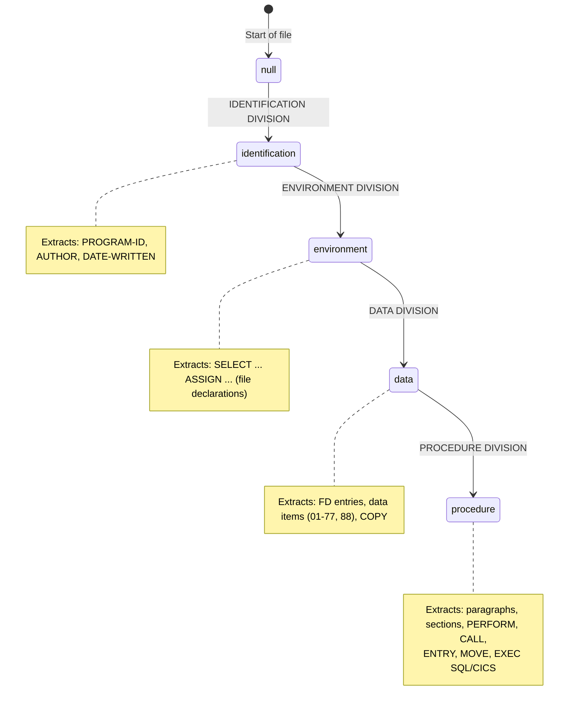
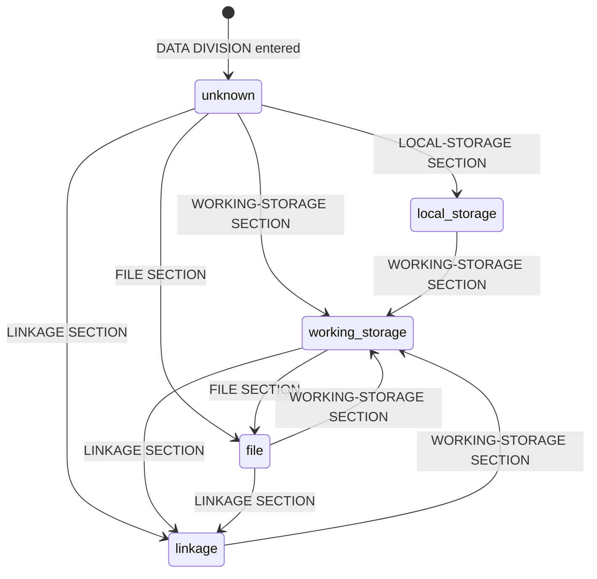
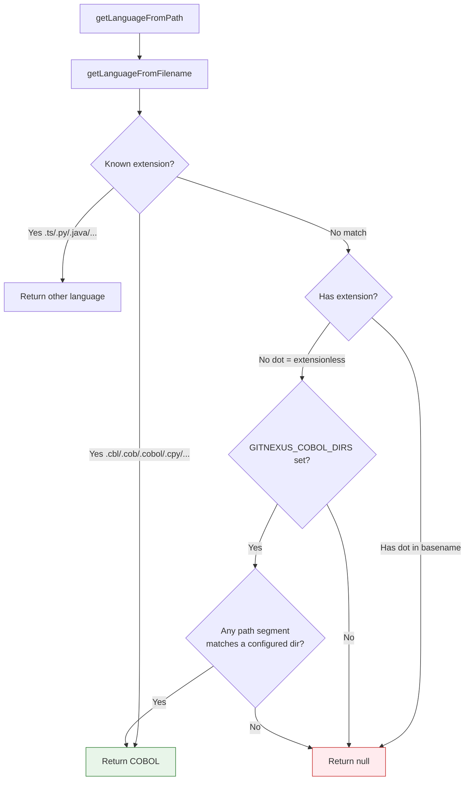
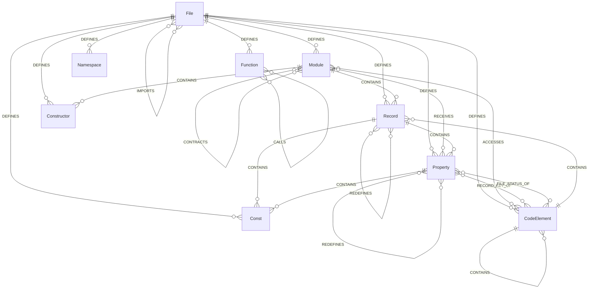
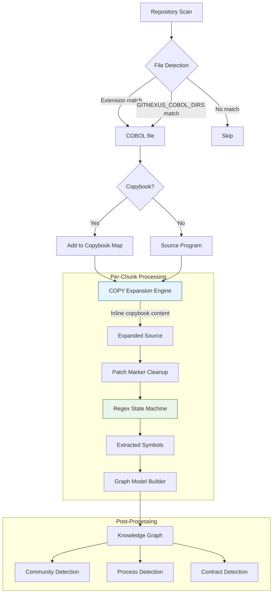
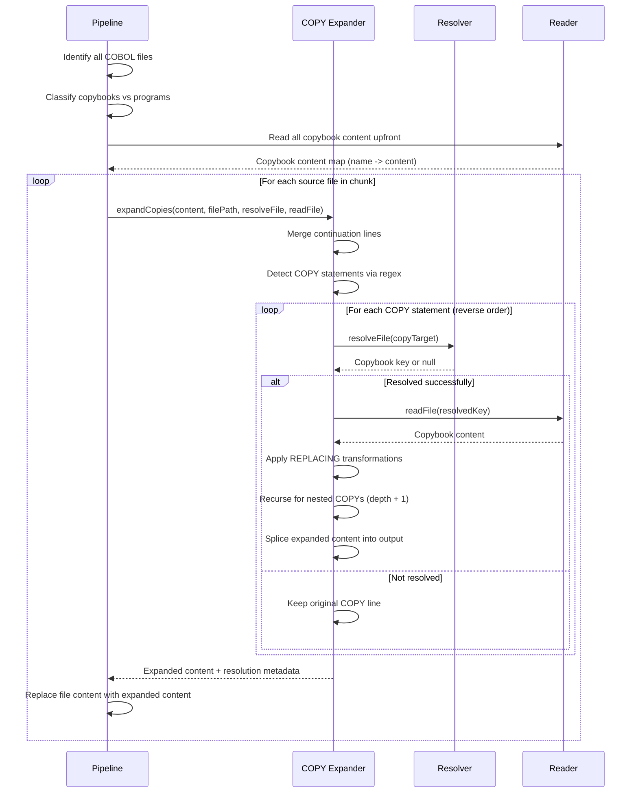

# Missing Repo Summary Source: abhigyanpatwari/GitNexus

- URL: https://github.com/abhigyanpatwari/GitNexus
- Local Path: core-platform/data/brain_assets/repos/github_stars_missing/abhigyanpatwari__GitNexus
- Clone Status: cloned
- Language: TypeScript
- Stars: 37994
- Topics: 
- Description: GitNexus: The Zero-Server Code Intelligence Engine -       GitNexus is a client-side knowledge graph creator that runs entirely in your browser. Drop in a GitHub repo or ZIP file, and get an interactive knowledge graph wit a built in Graph RAG Agent. Perfect for code exploration

## Extracted README / Docs / Examples


# FILE: README.md

# GitNexus
**⚠️ Important Notice:** GitNexus has NO official cryptocurrency, token, or coin. Any token/coin using the GitNexus name on Pump.fun or any other platform is **not affiliated with, endorsed by, or created by** this project or its maintainers. Do not purchase any cryptocurrency claiming association with GitNexus.

<div align="center">

  <a href="https://trendshift.io/repositories/19809" target="_blank">
    
  </a>

  <h2>Join the official Discord to discuss ideas, issues etc!</h2>

  <a href="https://discord.gg/MgJrmsqr62">
    
  </a>
  <a href="https://www.npmjs.com/package/gitnexus">
    
  </a>
  <a href="https://polyformproject.org/licenses/noncommercial/1.0.0/">
    
  </a>
  <a href="https://securityscorecards.dev/viewer/?uri=github.com/abhigyanpatwari/GitNexus">
    
  </a>

  <p><strong>Enterprise (SaaS & Self-hosted)</strong> - <a href="https://akonlabs.com">akonlabs.com</a></p>

</div>

**Building nervous system for agent context.**

Indexes any codebase into a knowledge graph — every dependency, call chain, cluster, and execution flow — then exposes it through smart tools so AI agents never miss code.


https://github.com/user-attachments/assets/172685ba-8e54-4ea7-9ad1-e31a3398da72


> *Like DeepWiki, but deeper.* DeepWiki helps you *understand* code. GitNexus lets you *analyze* it — because a knowledge graph tracks every relationship, not just descriptions.

**TL;DR:** The **Web UI** is a quick way to chat with any repo. The **CLI + MCP** is how you make your AI agent actually reliable — it gives Cursor, Claude Code, Codex, and friends a deep architectural view of your codebase so they stop missing dependencies, breaking call chains, and shipping blind edits. Even smaller models get full architectural clarity, making it compete with Goliath models.

---

## Star History

[](https://www.star-history.com/#abhigyanpatwari/GitNexus&type=date&legend=top-left)


## Two Ways to Use GitNexus

|                   | **CLI + MCP**                                            | **Web UI**                                             |
| ----------------- | -------------------------------------------------------------- | ------------------------------------------------------------ |
| **What**    | Index repos locally, connect AI agents via MCP                 | Visual graph explorer + AI chat in browser                   |
| **For**     | Daily development with Cursor, Claude Code, Codex, Windsurf, OpenCode | Quick exploration, demos, one-off analysis                   |
| **Scale**   | Full repos, any size                                           | Limited by browser memory (~5k files), or unlimited via backend mode |
| **Install** | `npm install -g gitnexus`                                    | No install — [gitnexus.vercel.app](https://gitnexus.vercel.app) |
| **Storage** | LadybugDB native (fast, persistent)                               | LadybugDB WASM (in-memory, per session)                         |
| **Parsing** | Tree-sitter native bindings                                    | Tree-sitter WASM                                             |
| **Privacy** | Everything local, no network                                   | Everything in-browser, no server                             |

> **Bridge mode:** `gitnexus serve` connects the two — the web UI auto-detects the local server and can browse all your CLI-indexed repos without re-uploading or re-indexing.

---

## Enterprise

GitNexus is available as an **enterprise offering** - either as a fully managed **SaaS** or a **self-hosted** deployment. Also available for **commercial use** of the OSS version with proper licensing.

Enterprise includes:
- **PR Review** - automated blast radius analysis on pull requests
- **Auto-updating Code Wiki** - always up-to-date documentation (Code Wiki is also available in OSS)
- **Auto-reindexing** - knowledge graph stays fresh automatically
- **Multi-repo support** - unified graph across repositories
- **OCaml support** - additional language coverage
- **Priority feature/language support** - request new languages or features

**Upcoming:**
- Auto regression forensics
- End-to-end test generation

👉 Learn more at [akonlabs.com](https://akonlabs.com)

💬 For commercial licensing or enterprise inquiries, ping us on [Discord](https://discord.gg/AAsRVT6fGb) or drop an email at founders@akonlabs.com

---

## Development

- [ARCHITECTURE.md](ARCHITECTURE.md) — packages, index → graph → MCP flow, where to change code
- [RUNBOOK.md](RUNBOOK.md) — analyze, embeddings, stale index, MCP recovery, CI snippets
- [GUARDRAILS.md](GUARDRAILS.md) — safety rules and operational “Signs” for contributors and agents
- [CONTRIBUTING.md](CONTRIBUTING.md) — license, setup, commits, and pull requests
- [TESTING.md](TESTING.md) — test commands for `gitnexus` and `gitnexus-web`

## CLI + MCP (recommended)

The CLI indexes your repository and runs an MCP server that gives AI agents deep codebase awareness.

### Quick Start

```bash
# Index your repo (run from repo root)
npx gitnexus analyze
```

That's it. This indexes the codebase, installs agent skills, registers Claude Code hooks, and creates `AGENTS.md` / `CLAUDE.md` context files — all in one command.

To configure MCP for your editor, run `npx gitnexus setup` once — or set it up manually below.

> **Faster install (no C++ toolchain needed):** set `GITNEXUS_SKIP_OPTIONAL_GRAMMARS=1` before `npm install -g gitnexus` to skip the native `tree-sitter-dart` and `tree-sitter-proto` builds. Dart/Proto files won't be parsed, but install completes in seconds without `python3`/`make`/`g++`. Strict `=1` only — any other value falls through to the rebuild.

### MCP Setup

`gitnexus setup` auto-detects your editors and writes the correct global MCP config. You only need to run it once.

### Editor Support

| Editor                | MCP | Skills | Hooks (auto-augment) | Support        |
| --------------------- | --- | ------ | -------------------- | -------------- |
| **Claude Code** | Yes | Yes    | Yes (PreToolUse + PostToolUse) | **Full** |
| **Cursor**      | Yes | Yes    | Yes (postToolUse, [manual install](gitnexus-cursor-integration/README.md#hook-install)) | **Full** |
| **Codex**       | Yes | Yes    | —                   | MCP + Skills   |
| **Windsurf**    | Yes | —     | —                   | MCP            |
| **OpenCode**    | Yes | Yes    | —                   | MCP + Skills   |

> **Claude Code** gets the deepest integration: MCP tools + agent skills + PreToolUse hooks that enrich searches with graph context + PostToolUse hooks that detect a stale index after commits and prompt the agent to reindex.

## Community Integrations

Built by the community — not officially maintained, but worth checking out.

| Project | Author | Description |
|---------|--------|-------------|
| [pi-gitnexus](https://github.com/tintinweb/pi-gitnexus) | [@tintinweb](https://github.com/tintinweb) | GitNexus plugin for [pi](https://pi.dev) — `pi install npm:pi-gitnexus` |
| [gitnexus-stable-ops](https://github.com/ShunsukeHayashi/gitnexus-stable-ops) | [@ShunsukeHayashi](https://github.com/ShunsukeHayashi) | Stable ops & deployment workflows (Miyabi ecosystem) |

> Have a project built on GitNexus? Open a PR to add it here!

If you prefer manual configuration:

> **Recommended for fastest startup:** install gitnexus globally (`npm i -g gitnexus`) and run `gitnexus setup` — this writes an absolute-path MCP config that bypasses `npx` entirely. The pinned-`npx` snippets below are a quickstart fallback; on a cold cache the `npx` install can exceed Claude Code's `MCP_TIMEOUT` default (~30s).

**Claude Code** (full support — MCP + skills + hooks):

```bash
# macOS / Linux
claude mcp add gitnexus -- npx -y gitnexus@latest mcp

# Windows
claude mcp add gitnexus -- cmd /c npx -y gitnexus@latest mcp
```

**Codex** (full support — MCP + skills):

```bash
codex mcp add gitnexus -- npx -y gitnexus@latest mcp
```

**Cursor** (`~/.cursor/mcp.json` — global, works for all projects):

```json
{
  "mcpServers": {
    "gitnexus": {
      "command": "npx",
      "args": ["-y", "gitnexus@latest", "mcp"]
    }
  }
}
```

**OpenCode** (`~/.config/opencode/config.json`):

```json
{
  "mcp": {
    "gitnexus": {
      "type": "local",
      "command": ["gitnexus", "mcp"]
    }
  }
}
```

**Codex** (`~/.codex/config.toml` for system scope, or `.codex/config.toml` for project scope):

```toml
[mcp_servers.gitnexus]
command = "npx"
args = ["-y", "gitnexus@latest", "mcp"]
```

### CLI Commands

```bash
gitnexus setup                   # Configure MCP for your editors (one-time)
gitnexus analyze [path]          # Index a repository (or update stale index)
gitnexus analyze --force         # Force full re-index
gitnexus analyze --skills        # Generate repo-specific skill files from detected communities
gitnexus analyze --skip-embeddings  # Skip embedding generation (faster)
gitnexus analyze --skip-agents-md  # Preserve custom AGENTS.md/CLAUDE.md gitnexus section edits
gitnexus analyze --skip-git        # Index folders that are not Git repositories
gitnexus analyze --embeddings    # Enable embedding generation (slower, better search)
gitnexus analyze --verbose       # Log skipped files when parsers are unavailable
gitnexus analyze

# FILE: docs/plans/2026-03-26-feat-cobol-full-language-coverage-plan.md

---
title: "feat: Complete COBOL language feature coverage for maximum knowledge graph value"
type: feat
status: active
date: 2026-03-26
origin: Feature audit from v3-integration-architect agent (session 8642401e)
---

## Enhancement Summary

**Deepened on:** 2026-03-26
**Research agents used:** COBOL expert (Phase 1+2), graph value analyst, codebase explorer
**Sections enhanced:** Phase 1 (5 features), Phase 2 (4 features), graph value ranking

### Key Improvements from Research
1. **CALL USING** is the #1 highest-value edge type (9.2/10) — fixes ~40% of missing caller references
2. **EXEC DLI** requires dual-interface support (EXEC DLI + CBLTDLI CALL) for full IMS coverage
3. **DECLARATIVES** is lowest-risk Phase 2 item — existing section/paragraph detection already captures structure
4. **SET TO TRUE** accounts for 80-90% of all SET statements — prioritize this form
5. **INSPECT** needs multi-line accumulator (like SORT) — can span 5+ continuation lines
6. **Graph value ranking**: cobol-call-using (9.2) > cobol-error-handler (9.0) > dli-gu (8.2) > cobol-string (6.2)

### New Edge Cases Discovered
- CALL USING supports mixed modes: `USING BY REFERENCE WS-A BY CONTENT WS-B BY VALUE WS-C`
- CALL USING `ADDRESS OF` and `OMITTED` must be filtered from parameter lists
- EXEC DLI can have multiple SEGMENT levels in hierarchical retrieval (use matchAll)
- DECLARATIVES can have multiple USE sections (one per file + catch-all for INPUT/OUTPUT/I-O/EXTEND)
- INSPECT TALLYING can have multiple counters in a single statement
- STRING/UNSTRING can span multiple lines (need accumulator pattern)

---

# Complete COBOL Language Feature Coverage

## Overview

Implement the remaining 25 unhandled COBOL language features and fix 10 partial features to achieve ~95% coverage (up from 71.9%). The goal is to build the richest possible knowledge graph from COBOL codebases, enabling a future `modernize` MCP command (out of scope for this plan) that would use the graph to assist with COBOL-to-modern-language migration.

## Problem Statement

The COBOL processor currently handles 54 of 89 applicable language features (71.9%). The 25 unhandled features represent real data loss in the knowledge graph:
- **Cross-program data flow** is invisible (CALL ... USING parameters not extracted)
- **IMS/DB programs** produce empty graphs (EXEC DLI not recognized)
- **String transformation logic** is invisible (STRING/UNSTRING/INSPECT not tracked)
- **SQL copybook dependencies** are missing (EXEC SQL INCLUDE not mapped)
- **Error handling flows** are lost (DECLARATIVES/USE AFTER not captured)

## Proposed Solution

Implement features in 4 phases, ordered by graph value density (edges created per LOC of implementation). Each phase is independently shippable and testable.

## Technical Approach

### Phase 1: High-Value Data Flow Edges (~150 LOC, ~8 new edge types)

The highest-ROI features: they create new ACCESSES and IMPORTS edges that directly improve impact analysis.

**Critical research finding**: Multi-line statement accumulation is the dominant challenge. CALL USING, STRING/UNSTRING, and multi-line data item clauses all span multiple lines in production COBOL. The free-format path processes each line independently — these features need statement accumulators (like SORT/SELECT) or the free-format path needs multi-line awareness. Estimated LOC increased from 110 to 150 to account for accumulator infrastructure.

#### 1.1 EXEC SQL INCLUDE -> IMPORTS edges
- **File:** `cobol-preprocessor.ts` (parseExecSqlBlock)
- **What:** Detect `INCLUDE` as the operation, extract member name, emit as a `copies[]` entry
- **Graph:** IMPORTS edge from File to included copybook/SQLCA with reason `sql-include`
- **Tests:** Unit test for `EXEC SQL INCLUDE SQLCA END-EXEC` and `EXEC SQL INCLUDE CUSTCOPY END-EXEC`

**Research insights (EXEC SQL INCLUDE):**
- DB2 member names can contain underscores: `EXEC SQL INCLUDE CUST_TBL_DCL END-EXEC` — regex must use `[A-Z][A-Z0-9_-]+`
- Quoted literal form: `EXEC SQL INCLUDE 'DBRMLIB.MEMBER' END-EXEC` (z/OS PDS qualified name)
- SQLCA/SQLDA are DB2 builtins — won't resolve to repo files. Emit unresolved IMPORTS edge (still valuable)
- No REPLACING support on EXEC SQL INCLUDE (unlike COPY)
- Add `INCLUDE` to `OP_MAP` in `parseExecSqlBlock`; extract member via `RE_SQL_INCLUDE = /^INCLUDE\s+(?:'([^']+)'|"([^"]+)"|([A-Z][A-Z0-9_-]+))/i`

#### 1.2 CALL ... USING parameter extraction -> ACCESSES edges (Graph value: 9.2/10)
- **File:** `cobol-preprocessor.ts` (processLogicalLine CALL section)
- **What:** After capturing CALL target, scan for USING clause. Extract parameter names (reuse USING_KEYWORDS filter). Store as `calls[].parameters: string[]`
- **Interface:** Add `parameters?: string[]` to calls array type in CobolRegexResults
- **File:** `cobol-processor.ts` (CALL edge block)
- **Graph:** For each USING parameter, create ACCESSES edge from caller to data item Property node with reason `cobol-call-using`
- **Tests:** `CALL 'AUDITLOG' USING CUST-ID WS-AMOUNT` -> 2 ACCESSES edges

**Research insights (CALL USING forms):**
- Mixed modes: `CALL 'PGM' USING BY REFERENCE WS-A BY CONTENT WS-B BY VALUE WS-C`
- Pointer passing: `CALL 'PGM' USING ADDRESS OF WS-A`
- Placeholder: `CALL 'PGM' USING OMITTED WS-B`
- Filter keywords: add `ADDRESS`, `OMITTED`, `LENGTH` to USING_KEYWORDS (already has BY/VALUE/REFERENCE/CONTENT)
- **Impact tool enhancement:** CALL-USING edges enable BFS traversal through parameter data flow — single most impactful edge type for COBOL impact analysis

#### 1.3 STRING/UNSTRING data flow -> ACCESSES edges
- **File:** `cobol-preprocessor.ts` (new section in extractProcedure)
- **What:** Accumulate multi-line STRING/UNSTRING until period or END-STRING/END-UNSTRING. Extract sources and INTO targets.
- **Interface:** Add `strings: Array<{ sources: string[]; target: string; type: 'string' | 'unstring'; line: number; caller: string | null }>` to CobolRegexResults
- **Graph:** read-ACCESSES on sources, w

# FILE: docs/guides/microservices-grpc.md

# Using GitNexus across gRPC microservices

## When to use this guide

This guide is for teams whose product lives in **several separate Git repositories** — one per service — and whose services talk to each other over **gRPC** (possibly alongside HTTP and message topics). GitNexus indexes each repo independently, then a _group_ stitches the per-repo indexes into a single cross-repo view that the `impact`, `query`, and `context` tools can traverse. If your services live in one monorepo, much of this still applies — set each service as a member of a group and use the `service` prefix to scope queries — but the walkthrough assumes the harder multi-repo case.

## Mental model

- Each repository has its own `.gitnexus/` index (a LadybugDB graph of symbols, relationships, processes). `gitnexus analyze` in each repo produces that index completely independently.
- A **group** is a higher-level construct stored at `~/.gitnexus/groups/<group>/` that references the per-repo indexes by their registry name.
- Sync-time extractors walk each member repo and emit **contracts** — provider or consumer records keyed by a canonical `contractId` (`grpc::auth.AuthService/Login`, `http::GET::/orders`, etc.).
- The sync step matches providers and consumers that share a `contractId` and writes **cross-links** to `<groupDir>/contracts.json`. Those cross-links are what lets `impact({repo: "@<group>", target: "X"})` hop from one repo into another.
- Contracts come from three places: automatic contract extractors (`grpc-extractor`, `http-route-extractor`, `topic-extractor`), a manifest escape hatch (`config.links` in `group.yaml`), and — for same-name symbol matches where no contract is declared — the exact-match matching cascade in [`matching.ts`](../../gitnexus/src/core/group/matching.ts).
- Each repo stays editable and re-indexable on its own. Re-run `gitnexus analyze` in a repo when it changes, then `gitnexus group sync <group>` to refresh `contracts.json`. `gitnexus group status` reports which members are stale.

## Prerequisites

- GitNexus installed and runnable as `gitnexus` or `npx gitnexus` (see the root [README.md](../../README.md)).
- Each service repository checked out locally. No requirement that they share a parent directory — the group references them by registry name.
- Write access to `~/.gitnexus/` (the default gitnexus home; see `getDefaultGitnexusDir` in [`storage.ts`](../../gitnexus/src/core/group/storage.ts)).

## Step-by-step walkthrough

The example uses three services — a TypeScript API gateway, a Go orders service, and a Python inventory service — with gRPC between them. The gateway is an `orders` consumer; the orders service is both an `orders` provider and an `inventory` consumer; the inventory service is an `inventory` provider.

### 1. Index each repository

Run `analyze` from inside each service repo (or pass the path). The CLI surface lives in [`gitnexus/src/cli/analyze.ts`](../../gitnexus/src/cli/analyze.ts) and is wired in [`gitnexus/src/cli/index.ts`](../../gitnexus/src/cli/index.ts).

```bash
cd ~/code/gateway && npx gitnexus analyze
cd ~/code/orders  && npx gitnexus analyze
cd ~/code/inventory && npx gitnexus analyze
```

Useful flags:

- `--force` — reindex even if up to date.
- `--embeddings` — generate embedding vectors (needed only if you want semantic search; the exact-match cross-repo cascade does **not** need them).
- `--name <alias>` — register the repo under a specific alias when two repos share a basename (e.g. two `api/` folders).
- `--skip-git` — index a checkout that isn't a git repo.

Each run writes a `.gitnexus/` folder in the repo and registers the repo in `~/.gitnexus/registry.json`. Confirm with `npx gitnexus list`.

### 2. Author `group.yaml`

Create the group directory and edit the config. Either use the CLI scaffolder or write the file directly — both produce the same shape consumed by [`config-parser.ts`](../../gitnexus/src/core/group/config-parser.ts).

```bash
npx gitnexus group create payments-platform
# or manually:
mkdir -p ~/.gitnexus/groups/payments-platform
$EDITOR   ~/.gitnexus/groups/payments-platform/group.yaml
```

Minimal working `group.yaml`:

```yaml
version: 1
name: payments-platform
description: Gateway + orders + inventory (gRPC)

repos:
  gateway: gateway
  orders: orders
  inventory: inventory

# Only add explicit links when the automatic extractors miss something —
# see "When automatic extraction isn't enough" below.
links: []

packages: {}

detect:
  http: true
  grpc: true
  topics: true
  shared_libs: true
  embedding_fallback: false

matching:
  bm25_threshold: 0.7
  embedding_threshold: 0.65
  max_candidates_per_step: 3
  # Exclude noisy paths from cross-link matching (contracts are still extracted)
  exclude_links_paths: [/ping, /health, /healthcheck]
  exclude_links_param_only_paths: true
```

Field notes (schema in [`types.ts`](../../gitnexus/src/core/group/types.ts)):

- `version` — must be `1`. The parser rejects anything else.
- `name` — required; used for the group directory name and all CLI / MCP calls.
- `repos` — a mapping from **group path** (a logical name you choose; can be a hierarchy like `backend/orders`) to **registry name** (the name shown by `npx gitnexus list`). Both sides appear throughout the tooling: contract rows use the group path; `@<group>/<groupPath>` routes tools to a single member.
- `links` — optional manifest escape hatch, one entry per explicit cross-repo contract. Validated by the parser: `from` and `to` must be known repo paths, `type` must be one of `http | grpc | topic | lib | custom`, and `role` must be `provider | consumer`.
- `detect` — toggles per extractor family. Defaults (set in `config-parser.ts`) turn `http`, `grpc`, `topics`, and `shared_libs` on; disable the ones you don't use to speed up sync.
- `matching` — thresholds for the matching cascade. The exact match is always run; other strategies depend on indexer state. Two optional fields reduce false-positive cross-links in large gr

# FILE: docs/guides/microservices-thrift.md

# Using GitNexus across Apache Thrift microservices

## When to use this guide

Use this guide when several repositories communicate through Apache Thrift and you want GitNexus to trace impact across provider and consumer boundaries. The walkthrough assumes each service is indexed on its own, then joined through a GitNexus group.

This is not a framework integration guide. GitNexus reads portable Thrift IDL and common Java generated-code shapes. Framework-specific wiring, service discovery, deployment metadata, and private annotations belong outside the open-source core.

## Mental model

- `.thrift` files define the canonical service contract. A method in an IDL service becomes a stable contract id in the form `thrift::<namespace>.<Service>/<Method>`.
- Service wildcard ids in the form `thrift::<namespace>.<Service>/*` are supported as manifest and matching fallback forms when a service-level link is needed.
- Java generated-code usage points GitNexus toward implementation and call sites. Providers commonly implement generated `Service.Iface`; consumers commonly hold or construct generated service interfaces or clients.
- Group sync matches provider and consumer contracts with the same id, then cross-repo impact can hop through those links.
- Framework-specific wiring should be modeled by extractor plugins, manifest links, or downstream integrations rather than hard-coded into core Thrift support.

## Fictional IDL

```thrift
namespace java billing.v1

struct PlaceOrderRequest {
  1: string orderId
  2: double amount
}

struct PlaceOrderResponse {
  1: bool accepted
}

struct GetOrderRequest {
  1: string orderId
}

struct GetOrderResponse {
  1: string orderId
  2: string status
}

service OrderService {
  PlaceOrderResponse PlaceOrder(1: PlaceOrderRequest request)
  GetOrderResponse GetOrder(1: GetOrderRequest request)
}
```

The service methods above produce canonical ids:

- `thrift::billing.v1.OrderService/PlaceOrder`
- `thrift::billing.v1.OrderService/GetOrder`
- `thrift::billing.v1.OrderService/*` as a service-level manifest or matching fallback form

## Java provider example

Generated Java code usually exposes an `Iface` interface for the service. A provider implementation can be detected when it implements that generated interface.

```java
package example.billing;

import billing.v1.GetOrderRequest;
import billing.v1.GetOrderResponse;
import billing.v1.OrderService;
import billing.v1.PlaceOrderRequest;
import billing.v1.PlaceOrderResponse;

public final class OrderServiceHandler implements OrderService.Iface {
  @Override
  public PlaceOrderResponse PlaceOrder(PlaceOrderRequest request) {
    return new PlaceOrderResponse(true);
  }

  @Override
  public GetOrderResponse GetOrder(GetOrderRequest request) {
    return new GetOrderResponse(request.getOrderId(), "CREATED");
  }
}
```

With the IDL available, GitNexus can connect the implementation to `thrift::billing.v1.OrderService/PlaceOrder` and `thrift::billing.v1.OrderService/GetOrder`.

## Java consumer examples

Consumers are strongest when Java usage can be tied back to the IDL namespace and service.

```java
package example.checkout;

import billing.v1.OrderService;
import billing.v1.PlaceOrderRequest;

public final class CheckoutWorkflow {
  private final OrderService.Iface orders;

  public CheckoutWorkflow(OrderService.Iface orders) {
    this.orders = orders;
  }

  public void submit(String orderId) throws Exception {
    orders.PlaceOrder(new PlaceOrderRequest(orderId, 42.0));
  }
}
```

Some generated-code styles use the generated service type directly while keeping enough IDL context through imports and method calls.

```java
package example.reporting;

import billing.v1.GetOrderRequest;
import billing.v1.OrderService;

public final class OrderLookup {
  private final OrderService.Client client;

  public OrderLookup(OrderService.Client client) {
    this.client = client;
  }

  public String status(String orderId) throws Exception {
    return client.GetOrder(new GetOrderRequest(orderId)).getStatus();
  }
}
```

When IDL context is missing, GitNexus may still emit a weaker consumer signal for generated `Iface` or `Client` shapes, but confidence is lower.

## Group configuration

New group configs enable Thrift contract detection by default. Keep `detect.thrift: true`
when a group should scan for Thrift contracts, or set it to `false` to skip Thrift
extraction for that group.

```yaml
version: 1
name: billing-platform
description: Fictional services connected by Apache Thrift

repos:
  checkout: checkout-service
  billing: billing-service

links: []

detect:
  http: true
  grpc: false
  thrift: true
  topics: false
  shared_libs: true
```

To disable Thrift extraction explicitly:

```yaml
detect:
  thrift: false
```

After indexing each member repository, run group sync to extract contracts and write cross-repo links:

```bash
npx gitnexus group sync billing-platform
```

## Manifest escape hatch

Use manifest links when automatic extraction cannot see a provider or consumer, or when generated code is wrapped behind an abstraction. Write the contract without the `thrift::` prefix; GitNexus canonicalizes it to the full Thrift contract id.

```yaml
links:
  - from: checkout
    to: billing
    type: thrift
    contract: billing.v1.OrderService/PlaceOrder
    role: consumer
```

GitNexus canonicalizes that manifest entry to `thrift::billing.v1.OrderService/PlaceOrder` and uses it to connect the two repositories.

## Known limitations

- Java detection currently targets v1 generated-code patterns.
- Maven and POM dependency coordinates are not used for inference.
- Framework-specific annotations and service discovery metadata are ignored by open-source Thrift extraction.
- Ambiguous same-name services are skipped instead of guessed.
- Java consumers without IDL context are lower confidence and limited to generated `Iface` and `Client` shapes.


# FILE: docs/code-indexing/cobol/deep-indexing.md

# COBOL Deep Indexing

Beyond basic symbol extraction (program name, paragraphs, CALL, PERFORM, COPY), GitNexus performs deep indexing of COBOL-specific constructs: data items, EXEC SQL/CICS blocks, file declarations, FD entries, ENTRY points, and MOVE statements.

## Data Items

### Level Numbers

| Level Range | Meaning | Graph Node Type |
|-------------|---------|-----------------|
| 01 | Record (group item) | `Record` |
| 02-49 | Elementary/group items | `Property` |
| 66 | RENAMES | `Property` |
| 77 | Independent item | `Property` |
| 88 | Condition name | `Const` |

FILLER items are skipped (no useful name for the graph).

### Clauses Parsed

The `parseDataItemClauses()` function extracts these clauses from the trailing text of a data item declaration:

| Clause | Pattern | Example |
|--------|---------|---------|
| `PIC` / `PICTURE` | `\bPIC(?:TURE)?\s+(?:IS\s+)?(\S+)` | `PIC X(30)`, `PICTURE IS 9(5)V99` |
| `USAGE` | `\bUSAGE\s+(?:IS\s+)?(COMP\|BINARY\|...)` | `USAGE IS COMP-3`, `BINARY` |
| `REDEFINES` | `\bREDEFINES\s+([A-Z][A-Z0-9-]+)` | `REDEFINES WK-DATE-NUM` |
| `OCCURS` | `\bOCCURS\s+(\d+)` | `OCCURS 12 TIMES` |

Standalone COMP variants (without the `USAGE` keyword) are also detected: `COMP`, `COMP-1` through `COMP-6`, `COMP-X`, `BINARY`, `PACKED-DECIMAL`.

### Data Hierarchy

Data items form a hierarchical structure based on level numbers. The extractor uses a **stack algorithm**:

```
Processing order:
  01 WK-RECORD          -> push {01, WK-RECORD}   -> parent: Module
  05 WK-NAME            -> push {05, WK-NAME}     -> parent: WK-RECORD (01 < 05)
  10 WK-FIRST           -> push {10, WK-FIRST}    -> parent: WK-NAME (05 < 10)
  10 WK-LAST            -> pop WK-FIRST, push      -> parent: WK-NAME (05 < 10)
  05 WK-CODE            -> pop WK-LAST, WK-NAME    -> parent: WK-RECORD (01 < 05)
  88 WK-ACTIVE          -> (88 handled separately)  -> parent: WK-CODE
```

The stack maintains items where each entry's level is strictly less than the next. When a new item arrives with a level <= the top of stack, items are popped until the stack top has a smaller level. A `CONTAINS` edge is created from the stack top to the new item.

For 88-level condition names, the parent is the immediately preceding non-88 data item (found by scanning backwards).

### Annotated Example

```cobol
       01  WK-EMPLOYEE.
           05  WK-EMP-ID          PIC 9(6).
           05  WK-EMP-NAME        PIC X(30).
           05  WK-EMP-STATUS      PIC X(01).
               88  WK-ACTIVE      VALUE "A".
               88  WK-INACTIVE    VALUE "I".
           05  WK-SALARY          PIC 9(7)V99 COMP-3.
           05  WK-DEPT            PIC X(04) OCCURS 3 TIMES.
```

Produces:
- `Record` node: `WK-EMPLOYEE` (level 01, section: working-storage)
- `Property` nodes: `WK-EMP-ID`, `WK-EMP-NAME`, `WK-EMP-STATUS`, `WK-SALARY`, `WK-DEPT`
- `Const` nodes: `WK-ACTIVE` (values: `A`), `WK-INACTIVE` (values: `I`)
- `CONTAINS` edges: `WK-EMPLOYEE -> WK-EMP-ID`, `WK-EMPLOYEE -> WK-EMP-NAME`, etc.
- `CONTAINS` edges: `WK-EMP-STATUS -> WK-ACTIVE`, `WK-EMP-STATUS -> WK-INACTIVE`

### Data Item Cap

A maximum of **500 data items per file** (`MAX_DATA_ITEMS_PER_FILE`) are processed. Some COBOL programs (especially after COPY expansion) can have 10,000+ data items, which would cause graph bloat and push the V8 relationship Map past its 16.7M entry limit across thousands of files.

The cap applies after extraction: the first 500 items in source order are kept. Since 01-level records appear first, critical top-level structure is preserved.

## EXEC SQL

EXEC SQL blocks are accumulated across lines between `EXEC SQL` and `END-EXEC`, then parsed as a unit.

### Operation Classification

The first SQL keyword determines the operation:

| First Keyword | Operation |
|---------------|-----------|
| `SELECT` | SELECT |
| `INSERT` | INSERT |
| `UPDATE` | UPDATE |
| `DELETE` | DELETE |
| `DECLARE` | DECLARE |
| `OPEN` | OPEN |
| `CLOSE` | CLOSE |
| `FETCH` | FETCH |
| *(anything else)* | OTHER |

### Table Extraction

Tables are extracted from SQL clauses:

| Clause Pattern | Example |
|----------------|---------|
| `FROM <table>` | `SELECT * FROM EMPLOYEES` |
| `INSERT INTO <table>` | `INSERT INTO EMPLOYEES` |
| `UPDATE <table>` | `UPDATE EMPLOYEES SET ...` |
| `JOIN <table>` | `LEFT JOIN DEPARTMENTS ON ...` |

Note: The `INTO` pattern is restricted to `INSERT INTO` to avoid false positives from `FETCH ... INTO :host-var` and `SELECT ... INTO :host-var` statements, where `INTO` introduces host variables rather than table names.

### Cursor Detection

```cobol
           EXEC SQL
               DECLARE C-EMPLOYEES CURSOR FOR
               SELECT EMP-ID, EMP-NAME FROM EMPLOYEES
               WHERE DEPT = :WK-DEPT
           END-EXEC
```

Extracts: cursor `C-EMPLOYEES`, table `EMPLOYEES`, host variable `WK-DEPT`.

### Host Variables

Host variables are COBOL variables referenced in SQL with a `:` prefix. The colon is stripped:

```sql
WHERE EMP-ID = :WK-EMP-ID AND DEPT = :WK-DEPT
```

Extracts: `WK-EMP-ID`, `WK-DEPT`.

### Graph Output

- `CodeElement` node per table, with description `sql-table op:{OP}`
- `CodeElement` node per cursor, with description `sql-cursor`
- `ACCESSES` edge from Module to each CodeElement
- Deduplication: if the same table appears in multiple SQL blocks, only one node is created

## EXEC CICS

EXEC CICS blocks are accumulated and parsed similarly to SQL blocks.

### Command Detection

Two-word commands are detected first (matched against the block start):

```
SEND MAP, RECEIVE MAP, SEND TEXT, SEND CONTROL, READ NEXT, READ PREV
```

If no two-word command matches, the first word is used (e.g., `LINK`, `XCTL`, `RETURN`, `READ`, `WRITE`).

### Extraction

| Element | Pattern | Example |
|---------|---------|---------|
| MAP name | `MAP('name')` or `MAP("name")` | `EXEC CICS SEND MAP('EMPMENU')` |
| PROGRAM name | `PROGRAM('name')` or `PROGRAM("name")` | `EXEC CICS LINK PROGRAM('BGTABUP')` |
| TRANSID | `TRANSID('na

# FILE: docs/code-indexing/cobol/regex-extraction.md

# COBOL Regex Extraction

The `extractCobolSymbolsWithRegex()` function in `cobol-preprocessor.ts` performs single-pass, state-machine-driven extraction of all COBOL symbols. This document describes the state machine, line processing flow, and every regex pattern used.

## State Machine: Division Tracking

The extractor tracks which COBOL division is currently being processed. Division transitions are detected by the `RE_DIVISION` pattern.



## State Machine: Data Section Tracking

Within the DATA DIVISION, a secondary state machine tracks the current section to tag data items with their origin.



Within the ENVIRONMENT DIVISION, the `currentEnvSection` tracks whether we are in `INPUT-OUTPUT` or `CONFIGURATION` section. SELECT statement accumulation only occurs in `INPUT-OUTPUT`.

## Line Processing Flow

Each raw source line goes through this pipeline:

```
Raw line
  |
  v
Length < 7? ---------> Skip (flush pending if any)
  |
  v
Indicator col 7
  |
  +-- '*' or '/' -----> Comment: skip entirely
  |
  +-- '-' ------------> Continuation: append to pending line
  |
  +-- other ----------> Normal: flush pending, strip inline comments (|),
                        buffer as new pending logical line
```

After all lines are processed, the final pending line is flushed, along with any accumulated SELECT statement, SORT/MERGE accumulator, and any open EXEC block (truncated file without `END-EXEC`).

### Inline Comment Stripping

Enterprise COBOL (particularly Italian dialect) uses the pipe character `|` as an inline comment marker. The `stripInlineComment()` helper is **quote-aware**: it tracks whether the scan position is inside a single- or double-quoted string and only treats `|` as a comment marker when outside quotes. Pipe characters inside string literals are preserved.

Free-format `*>` inline comment stripping uses the same quote-aware approach: the scanner walks character by character, toggling quote state, and only recognizes `*>` as a comment marker when not inside a quoted string.

### Patch Marker Handling

The `preprocessCobolSource()` function (run before extraction in the worker) replaces non-standard content in columns 1-6. Standard COBOL expects spaces or digit sequence numbers in this area. If any letter or `#` character is found, the entire sequence area is replaced with 6 spaces:

```
Before: mzADD MOVE WK-AMT TO WK-TOTAL
After:        MOVE WK-AMT TO WK-TOTAL
```

This preserves exact line count for position mapping.

## Regex Pattern Reference

All patterns are compiled once as module-level constants and reused across calls.

### Division and Section Detection

| Constant | Pattern | Purpose | Example Match |
|----------|---------|---------|---------------|
| `RE_DIVISION` | `\b(IDENTIFICATION\|ENVIRONMENT\|DATA\|PROCEDURE)\s+DIVISION\b` | Division boundary | `PROCEDURE DIVISION` |
| `RE_SECTION` | `\b(WORKING-STORAGE\|LINKAGE\|FILE\|LOCAL-STORAGE\|INPUT-OUTPUT\|CONFIGURATION)\s+SECTION\b` | Section boundary | `WORKING-STORAGE SECTION` |

### IDENTIFICATION DIVISION

| Constant | Pattern | Purpose | Example Match |
|----------|---------|---------|---------------|
| `RE_PROGRAM_ID` | `\bPROGRAM-ID\.\s*([A-Z][A-Z0-9-]*)` | Program name | `PROGRAM-ID. BGTABFL` |
| `RE_AUTHOR` | `^\s+AUTHOR\.\s*(.+)` | Author metadata | `AUTHOR. D. Smith` |
| `RE_DATE_WRITTEN` | `^\s+DATE-WRITTEN\.\s*(.+)` | Date metadata | `DATE-WRITTEN. 2024-01-15` |

### ENVIRONMENT DIVISION

| Constant | Pattern | Purpose | Example Match |
|----------|---------|---------|---------------|
| `RE_SELECT_START` | `\bSELECT\s+(?:OPTIONAL\s+)?([A-Z][A-Z0-9-]+)` | File SELECT start (with optional `SELECT OPTIONAL` support) | `SELECT MASTER-FILE`, `SELECT OPTIONAL TRANS-FILE` |

SELECT statements are accumulated across multiple lines until a period terminator is found, then parsed for ASSIGN, ORGANIZATION, ACCESS, RECORD KEY, and FILE STATUS clauses.

### DATA DIVISION

| Constant | Pattern | Purpose | Example Match |
|----------|---------|---------|---------------|
| `RE_FD` | `^\s+FD\s+([A-Z][A-Z0-9-]+)` | File description | `FD MASTER-FILE` |
| `RE_DATA_ITEM` | `^\s+(\d{1,2})\s+([A-Z][A-Z0-9-]+)\s*(.*)` | Data item (01-77) | `05 WK-NAME PIC X(30)` |
| `RE_ANONYMOUS_REDEFINES` | `^\s+(\d{1,2})\s+REDEFINES\s+([A-Z][A-Z0-9-]+)` | Anonymous REDEFINES | `01 REDEFINES WK-REC` |
| `RE_88_LEVEL` | `^\s+88\s+([A-Z][A-Z0-9-]+)\s+VALUES?\s+(?:ARE\s+)?(.+)` | Condition name | `88 WK-ACTIVE VALUE "Y"` |

The trailing clauses of `RE_DATA_ITEM` are parsed by `parseDataItemClauses()` for PIC, USAGE, OCCURS, and REDEFINES.

### PROCEDURE DIVISION

| Constant | Pattern | Purpose | Example Match |
|----------|---------|---------|---------------|
| `RE_PROC_SECTION` | `^       ([A-Z][A-Z0-9

# FILE: docs/code-indexing/cobol/file-detection.md

# COBOL File Detection

GitNexus detects COBOL files through two mechanisms: extension-based mapping and directory-based override for extensionless files. This document covers both, plus the copybook/program classification logic.

## Extension Mapping

### Program Extensions

| Extension | Type |
|-----------|------|
| `.cbl` | COBOL program |
| `.cob` | COBOL program |
| `.cobol` | COBOL program |

### Copybook Extensions

| Extension | Type | Notes |
|-----------|------|-------|
| `.cpy` | Copybook | Standard |
| `.copy` | Copybook | Standard |
| `.gnm` / `.GNM` | Copybook | Enterprise (GnuCOBOL naming) |
| `.fd` / `.FD` | Copybook | File Description fragment |
| `.wrk` / `.WRK` | Copybook | Working-Storage fragment |
| `.sel` / `.SEL` | Copybook | SELECT clause fragment |
| `.open` / `.OPEN` | Copybook | File OPEN fragment |
| `.close` / `.CLOSE` | Copybook | File CLOSE fragment |
| `.ini` / `.INI` | Copybook | Initialization fragment |
| `.def` / `.DEF` | Copybook | Definition fragment |

All extension matching is case-sensitive in `getLanguageFromFilename` (the extensions above are matched as written, including uppercase variants like `.GNM`).

## Extensionless File Detection: `GITNEXUS_COBOL_DIRS`

Many enterprise COBOL repositories use extensionless files -- the filename alone identifies the program (e.g., `s/BGTABFL` is the source for program `BGTABFL`). GitNexus handles this via the `GITNEXUS_COBOL_DIRS` environment variable.

### Configuration

Set `GITNEXUS_COBOL_DIRS` to a comma-separated list of directory names:

```bash
# Files in s/, c/, and wfproc/ directories (at any depth) are treated as COBOL
export GITNEXUS_COBOL_DIRS=s,c,wfproc
```

The matching is **case-insensitive** and checks all path segments:

- `/repo/s/BGTABFL` -- matches segment `s` -- COBOL
- `/repo/src/c/CPSESP` -- matches segment `c` -- COBOL
- `/repo/wfproc/WF001` -- matches segment `wfproc` -- COBOL
- `/repo/docs/README` -- no matching segment -- skipped

### Decision Tree



### Implementation Detail

The `GITNEXUS_COBOL_DIRS` value is parsed once (on first call) and cached in a `Set<string>`:

```typescript
// From gitnexus/src/core/ingestion/utils.ts
const getCobolDirs = (): Set<string> => {
  if (_cobolDirs) return _cobolDirs;
  const raw = process.env.GITNEXUS_COBOL_DIRS;
  _cobolDirs = raw
    ? new Set(raw.split(',').map(d => d.trim().toLowerCase()))
    : new Set();
  return _cobolDirs;
};
```

The path segment check splits the full path on `/` and tests each segment against the cached set.

## Copybook vs Program Classification

After a file is identified as COBOL, it must be classified as either a **program** (to be parsed for symbols) or a **copybook** (to be loaded into the copybook map for COPY expansion).

### Classification Rules

A COBOL file is classified as a **copybook** if ANY of these conditions is true:

1. It has a recognized copybook extension (`.cpy`, `.copy`, `.gnm`, `.fd`, `.wrk`, `.sel`, `.open`, `.close`, `.ini`, `.def`)
2. It is an extensionless file whose path contains a directory segment matching one of: `c`, `copy`, `copybooks`, `copylib`, `cpy`

A file is classified as a **program** if:

1. It has a program extension (`.cbl`, `.cob`, `.cobol`), OR
2. It is extensionless and does NOT match any copybook directory pattern

### Copybook Name Resolution

Copybook names are derived from the filename:

- Strip the extension (if any)
- Convert to uppercase

Examples:
- `c/CPSESP` -- name: `CPSESP`
- `copy/workgrid.cpy` -- name: `WORKGRID`
- `c/ANAZI.GNM` -- name: `ANAZI`

This name is used to resolve `COPY CPSESP.` statements during expansion.

## Source Files

- `gitnexus/src/core/ingestion/utils.ts` -- `getLanguageFromPath()`, `getLanguageFromFilename()`, `getCobolDirs()`
- `gitnexus/src/core/ingestion/pipeline.ts` -- `isCobolCopybook()`, `getCopybookName()`, `COPYBOOK_EXTENSIONS`, `COBOL_PROGRAM_EXTENSIONS`


# FILE: docs/code-indexing/cobol/performance.md

# COBOL Performance and Tuning

This document covers real-world benchmarks, worker pool configuration, memory management, known limitations, and troubleshooting for COBOL indexing.

## PROJECT-NAME Benchmark

The PROJECT-NAME project is a large Italian payroll system written in COBOL. It serves as the primary benchmark for COBOL indexing performance.

### Input

| Metric                      | Value                                                                        |
| --------------------------- | ---------------------------------------------------------------------------- |
| Paths scanned               | 14,217                                                                       |
| Parseable files             | 13,129                                                                       |
| Total source size           | 224 MB                                                                       |
| Chunks                      | 12 (at 20 MB budget)                                                         |
| Copybooks loaded            | 2,976                                                                        |
| Copybooks used in expansion | 2,955                                                                        |
| Key directories             | `s/` (7773 programs), `c/` (3036 copybooks), `wfproc/` (1973 workflow files) |

### Output

| Metric                 | Value  |
| ---------------------- | ------ |
| Graph nodes            | 2.79M  |
| Graph edges            | 5.67M  |
| Clusters (communities) | 16,679 |
| Execution flows        | 300    |

### Timing

| Phase                           | Duration          |
| ------------------------------- | ----------------- |
| Total                           | ~251s             |
| KuzuDB write                    | 132s              |
| Full-text search indexing       | 6.7s              |
| Regex extraction (avg per file) | ~1ms              |
| COPY expansion + deep indexing  | Remainder (~112s) |

### Indexing Command

```bash
cd /path/to/PROJECT-NAME
GITNEXUS_COBOL_DIRS=s,c,wfproc GITNEXUS_VERBOSE=1 node --max-old-space-size=8192 \
  /path/to/gitnexus/dist/cli/index.js analyze --force
```

## Open-Source Benchmarks

### CardDemo (AWS)

| Metric | Value |
| ------ | ----- |
| Graph nodes | 12,323 |
| Graph edges | 8,893 |
| Total time | 7.4s |

### ACAS

| Metric | Value |
| ------ | ----- |
| Graph nodes | 14,016 |
| Graph edges | 15,452 |
| Total time | 9.3s |

### Micro-Benchmark (Single-File Extraction)

| Metric | Value |
| ------ | ----- |
| Per-iteration | 0.65ms |
| Throughput | ~382K lines/sec |

## Worker Pool Tuning

### Sub-Batch Size

The worker pool splits each worker's chunk into sub-batches to bound peak memory per `postMessage` serialization. COBOL repos use a smaller sub-batch size than the default:

| Parameter             | Default     | COBOL Mode          |
| --------------------- | ----------- | ------------------- |
| Sub-batch size        | 1,500 files | 200 files           |
| Per sub-batch timeout | 120s        | 120s (configurable) |

**Why 200?** COBOL regex extraction + preprocessing takes ~1ms per file on average, but with COPY expansion and deep indexing the effective time is ~150ms per file. At sub-batch size 1500, that would be ~225s per sub-batch, exceeding the 120s timeout.

COBOL mode is activated automatically when `GITNEXUS_COBOL_DIRS` is set:

```typescript
// From pipeline.ts
const cobolSubBatch = process.env.GITNEXUS_COBOL_DIRS ? 200 : undefined;
workerPool = createWorkerPool(workerUrl, undefined, cobolSubBatch);
```

### Worker Count

Workers default to `min(8, cpus - 1)`. For COBOL repos, this is usually sufficient since regex extraction is CPU-bound but fast. The bottleneck is typically KuzuDB write, not extraction.

### Timeout Configuration

| Environment Variable                 | Default         | Purpose                                             |
| ------------------------------------ | --------------- | --------------------------------------------------- |
| `GITNEXUS_WORKER_TIMEOUT_MS`         | 120,000 (2 min) | Per sub-batch processing timeout                    |
| `GITNEXUS_WORKER_STARTUP_TIMEOUT_MS` | 60,000 (1 min)  | Worker initialization timeout (tree-sitter loading) |

For COBOL-only repos, worker startup is faster because tree-sitter native modules are loaded lazily (skipped entirely if only COBOL files are present).

## Data Item Cap

### Configuration

```typescript
const MAX_DATA_ITEMS_PER_FILE = 500;
```

This constant appears in both `parse-worker.ts` (worker path) and `parsing-processor.ts` (sequential fallback).

### Rationale

Some COBOL programs, especially after COPY expansion, can have 10,000+ data items. At that scale:

- The in-memory relationship Map (for CONTAINS, REDEFINES, etc.) approaches the V8 16.7M entry limit across thousands of files
- KuzuDB write time increases linearly with edge count
- Most deep-nested items (level 20+) are rarely queried individually

### Impact

The cap truncates data items beyond the 500th in source order. Since 01-level Records appear first in COBOL source, the cap preserves:

- All 01-level record definitions
- The most important 02-49 level items (those closest to the record root)
- 88-level conditions associated with early items

To increase the cap for specific needs, modify the `MAX_DATA_ITEMS_PER_FILE` constant in both files.

## Memory Management

### COPY Expansion Breadth Guard

A per-file `MAX_TOTAL_EXPANSIONS = 500` limit prevents exponential blowup from diamond-shaped COPY graphs (e.g., N copybooks each containing N COPY statements). Once the limit is reached, further COPY statements in that file are left unexpanded. See [copy-expansion.md](copy-expansion.md) for details.

### COPY Expansion Memory

All copybook content is loaded upfront into a Map before chunk processing begins. For PROJECT-NAME:

- 2,976 copybooks, typically under 100MB total
- The Map is shared (read-only) across chunk iteration

# FILE: docs/code-indexing/cobol/graph-model.md

# COBOL Graph Model

This document describes the graph nodes and edges that GitNexus creates for COBOL codebases. The COBOL graph model is richer than most tree-sitter languages because it captures domain-specific constructs: file declarations, FD entries, data hierarchies, SQL tables, CICS maps, and cross-program contracts.

## Entity-Relationship Diagram



## Node Types

| Node Type | COBOL Concept | Created From | Example |
|-----------|--------------|--------------|---------|
| `Module` | PROGRAM-ID | `PROGRAM-ID. BGTABFL` | Name: `BGTABFL`, description may include author and date |
| `Function` | Paragraph | `PROCESS-RECORD.` at column 8 | Name: `PROCESS-RECORD` |
| `Namespace` | Procedure section | `MAIN-LOGIC SECTION.` at column 8 | Name: `MAIN-LOGIC` |
| `Record` | 01-level data item | `01 WK-EMPLOYEE.` | Description: `level:01 section:working-storage` |
| `Property` | 02-49/66/77 data item | `05 WK-NAME PIC X(30).` | Description: `level:05 pic:X(30) section:working-storage` |
| `Const` | 88-level condition | `88 WK-ACTIVE VALUE "A".` | Description: `level:88 values:A` |
| `CodeElement` | SELECT, FD, SQL table, CICS map, cursor, transid | Various | Description varies by subtype |
| `Constructor` | ENTRY point | `ENTRY "SUBPROG" USING WK-DATA` | Description: `entry params:WK-DATA` |

### CodeElement Subtypes

CodeElement is used for multiple COBOL constructs, distinguished by their description prefix:

| Subtype | ID Pattern | Description Format | Example |
|---------|-----------|-------------------|---------|
| File SELECT | `CodeElement:{path}:SELECT:{name}` | `select org:INDEXED access:DYNAMIC ...` | `SELECT MASTER-FILE` |
| FD entry | `CodeElement:{path}:FD:{name}` | `fd record:{recordName}` | `FD MASTER-FILE` |
| SQL table | `CodeElement:{path}:sql-table:{name}` | `sql-table op:SELECT` | Table `EMPLOYEES` |
| SQL cursor | `CodeElement:{path}:sql-cursor:{name}` | `sql-cursor` | Cursor `C-EMPLOYEES` |
| CICS map | `CodeElement:{path}:cics-map:{name}` | `cics-map cmd:SEND MAP` | Map `EMPMENU` |
| CICS transid | `CodeElement:{path}:cics-transid:{name}` | `cics-transid cmd:START` | Transid `EMP1` |

## Edge Types

| Edge Type | Source | Target | Created By | Confidence | Example |
|-----------|--------|--------|-----------|------------|---------|
| `DEFINES` | File | any node | File defines its symbols | 1.0 | File -> Module `BGTABFL` |
| `CALLS` | Function | Function | `PERFORM X [THRU Y]` | (via call-processor) | `PROCESS-RECORD` -> `CALC-TAX` |
| `CALLS` | Module | Module | `CALL "BGTABUP"` | (via call-processor) | `BGTABFL` -> `BGTABUP` |
| `CALLS` | Module | Module | `EXEC CICS LINK PROGRAM('X')` | (via call-processor) | `BGTABFL` -> `BGTABUP` |
| `IMPORTS` | File | File | `COPY copybook` | (via import-processor) | Source file -> Copybook file |
| `CONTAINS` | Module | Record | Data hierarchy root | 1.0 | `BGTABFL` -> `WK-EMPLOYEE` |
| `CONTAINS` | Record | Property | Data hierarchy | 1.0 | `WK-EMPLOYEE` -> `WK-NAME` |
| `CONTAINS` | Property | Property | Nested data items | 1.0 | `WK-ADDRESS` -> `WK-CITY` |
| `CONTAINS` | Record/Property | Const | 88-level parent | 1.0 | `WK-STATUS` -> `WK-ACTIVE` |
| `CONTAINS` | CodeElement (FD) | Record | FD record link | 1.0 | `FD:MASTER-FILE` -> `MASTER-RECORD` |
| `CONTAINS` | CodeElement (SELECT) | CodeElement (FD) | SELECT-FD link | 0.9 | `SELECT:MASTER-FILE` -> `FD:MASTER-FILE` |
| `CONTAINS` | Module | Constructor | ENTRY in module | 1.0 | `BGTABFL` -> `SUBPROG` |
| `REDEFINES` | Record | Record | `01 X REDEFINES Y` | 1.0 | `WK-DATE-NUM` -> `WK-DATE-ALPHA` |
| `REDEFINES` | Property | Property | `05 X REDEFINES Y` | 1.0 | `WK-CODE-NUM` -> `WK-CODE-ALPHA` |
| `RECORD_KEY_OF` | Property | CodeElement (SELECT) | `RECORD KEY IS field` | 0.8 | `WK-EMP-ID` -> `SELECT:MASTER-FILE` |
| `FILE_STATUS_OF` | Property | CodeElement (SELECT) | `FILE STATUS IS field` | 0.8 | `WK-FS` -> `SELECT:MASTER-FILE` |
| `ACCESSES` | Module | CodeElement | EXEC SQL/CICS | 0.9 | `BGTABFL` -> `sql-table:EMPLOYEES` |
| `RECEIVES` | Module | Property | `PROCEDURE USING` | 0.8 | `BGTABFL` -> `WK-INPUT-REC` |
| `CONTRACTS` | Module | Module | Shared copybook detection | 0.9 | `BGTABFL` -> `BGTABUP` (via `CPSESP`) |

## Full Annotated Example

Given this COBOL program:

```cobol
       IDENTIFICATION DIVISION.
       PROGRAM-ID. EMPMAINT.
       AUTHOR. Development Team.

       ENVIRONMENT DIVISION.
       INPUT-OUTPUT SECTION.
       FILE-CONTROL.
           SELECT EMP-FILE
               ASSIGN TO "EMPLOYEE.DAT"
               ORGANIZATION IS INDEXED
               ACCESS MODE IS DYNAMIC
               RECORD KEY IS EMP-ID
               FILE STATUS IS WS-FILE-STATUS.

       DATA DIVISION.
       FILE SECTION.
       FD  EMP-FILE.
       01  EMP-RECORD.
           05  EMP-ID             PIC 9(6).
           05  EMP-NAME           PIC X(30).

       WORKING-STORAGE SECTION.
       01  WS-FLAGS.
           05  WS-FILE-STATUS     PIC X(02).
           05  WS-EOF-FLAG

# FILE: docs/code-indexing/cobol/README.md

# COBOL Code Indexing

GitNexus indexes COBOL codebases using a **regex-only extraction** strategy, bypassing tree-sitter entirely. This document explains why, how the pipeline works, and links to detailed sub-documents.

## Why Regex-Only?

The tree-sitter-cobol grammar (v0.0.1) has three critical limitations that make it unusable for production indexing:

| Issue | Impact | Severity |
|-------|--------|----------|
| External scanner hangs on ~5% of files | No timeout mechanism exists for the C scanner; the process blocks indefinitely | **Blocking** |
| Only ~15% of paragraph headers detected | Most procedure-division paragraphs are invisible to the grammar | High |
| Patch markers in cols 1-6 cause parse errors | Enterprise COBOL uses non-standard sequence area content (e.g., `mzADD`, `estero`, `#FIX`) | High |

Because the external scanner hang cannot be interrupted (there is no `setTimeoutMicros` equivalent for tree-sitter), using tree-sitter-cobol would hang the indexing pipeline on a non-trivial fraction of real-world files.

The regex-only approach provides:

- **Speed**: ~1ms per file average extraction time
- **Reliability**: zero hangs, zero crashes across 13,000+ files
- **Coverage**: captures all critical symbols -- program name, paragraphs, sections, CALL, PERFORM, COPY, data items (01-77, 88-level), file declarations, FD entries, EXEC SQL/CICS blocks, ENTRY points, and MOVE statements

## Architecture



## COBOL vs Tree-Sitter Languages

| Feature | COBOL (Regex) | Tree-Sitter Languages |
|---------|--------------|----------------------|
| Parser | Single-pass regex state machine | tree-sitter grammar + queries |
| Speed | ~1ms/file | ~5ms/file |
| AST available | No | Yes |
| COPY expansion | Yes (pre-processing step) | N/A |
| Deep indexing | Data items, SQL, CICS, FD, ENTRY | Type annotations, generics, etc. |
| Call extraction | PERFORM (intra-file) + CALL (cross-program) | AST-based call site detection |
| Import extraction | COPY statements | `import`/`require`/`use`/`#include` |
| Coverage | All critical symbols | Language-dependent query coverage |
| Failure mode | Never hangs | External scanner can hang (COBOL only) |

## Sub-Documents

| Document | Description |
|----------|-------------|
| [File Detection](./file-detection.md) | Extension mapping, `GITNEXUS_COBOL_DIRS`, copybook classification |
| [COPY Expansion](./copy-expansion.md) | Copybook inlining, REPLACING transformations, cycle detection |
| [Regex Extraction](./regex-extraction.md) | State machine, regex patterns, line processing |
| [Deep Indexing](./deep-indexing.md) | Data items, EXEC SQL/CICS, file declarations, FD, ENTRY, MOVE |
| [Graph Model](./graph-model.md) | COBOL-specific node types, edge types, full annotated example |
| [Performance](./performance.md) | Benchmarks, worker pool tuning, caps, troubleshooting |

## Key Source Files

| File | Purpose |
|------|---------|
| `gitnexus/src/core/ingestion/cobol-preprocessor.ts` | Patch marker cleanup + regex extraction engine |
| `gitnexus/src/core/ingestion/cobol-copy-expander.ts` | COPY statement expansion with REPLACING |
| `gitnexus/src/core/ingestion/utils.ts` | `getLanguageFromPath`, `getLanguageFromFilename` |
| `gitnexus/src/core/ingestion/pipeline.ts` | `isCobolCopybook`, `expandCobolCopies`, `detectCrossProgamContracts` |
| `gitnexus/src/core/ingestion/workers/parse-worker.ts` | `processCobolRegexOnly` -- graph model builder |
| `gitnexus/src/core/ingestion/workers/worker-pool.ts` | Configurable sub-batch size for COBOL |


# FILE: docs/code-indexing/cobol/copy-expansion.md

# COBOL COPY Expansion

The COPY statement is COBOL's include mechanism -- analogous to `#include` in C or `import` in modern languages. GitNexus expands COPY statements **before** regex extraction so that symbols defined inside copybooks (data items, paragraphs, etc.) are visible in the program's extracted graph.

## Supported Syntax

### Basic COPY

```cobol
COPY CPSESP.
COPY "WORKGRID.CPY".
```

Inlines the content of the named copybook, replacing the COPY line(s).

### COPY with REPLACING

```cobol
COPY CPSESP REPLACING "ANAZI-KEY" BY "LK-KEY".
COPY CPSESP REPLACING LEADING "ESP-" BY "LK-ESP-"
                       LEADING "KPSESPL" BY "LK-KPSESPL".
COPY LINKAGE REPLACING TRAILING "-IN" BY "-OUT".
```

Three REPLACING types are supported:

| Type         | Syntax                               | Behavior                                | Example                          |
| ------------ | ------------------------------------ | --------------------------------------- | -------------------------------- |
| **EXACT**    | `REPLACING "OLD" BY "NEW"`           | Replace exact identifier matches        | `ANAZI-KEY` becomes `LK-KEY`     |
| **LEADING**  | `REPLACING LEADING "PFX-" BY "NEW-"` | Replace prefix on all COBOL identifiers | `ESP-NAME` becomes `LK-ESP-NAME` |
| **TRAILING** | `REPLACING TRAILING "-IN" BY "-OUT"` | Replace suffix on all COBOL identifiers | `DATA-IN` becomes `DATA-OUT`     |

Multiple REPLACING clauses can appear in a single COPY statement. They are applied in order to each COBOL identifier in the copybook content.

### Multi-Line COPY

COPY statements can span multiple lines (standard COBOL continuation rules apply):

```cobol
       COPY CPSESP REPLACING
      -    LEADING "ESP-" BY "LK-ESP-"
      -    LEADING "KPSESPL" BY "LK-KPSESPL".
```

Continuation lines (indicator `-` in column 7) are merged before COPY statement scanning.

## Expansion Flow



The return type `CopyExpansionResult` contains `expandedContent` and `copyResolutions`. The `expansionDepth` field has been removed from the return type (it was unused by callers).

COPY statement line numbers in `CopyResolution` are 1-based (consistent with the preprocessor's line numbering). The splice operation that replaces COPY lines with expanded content adjusts for 0-based array indexing internally.

## Cycle Detection

Circular COPY references (e.g., copybook A includes copybook B which includes copybook A) are detected and handled:

1. Each expansion chain maintains a `visited` set of resolved copybook paths
2. If a copybook path is already in the visited set, the expansion is skipped
3. A `warnedCircular` set (internal to `expandCopies()`, not a parameter) deduplicates warning messages within a single file expansion

Known circular copybooks in PROJECT-NAME: `ANAZI`, `ANDIP`, `QDIPE` (self-referential includes).

## Max Depth

Nested COPY expansion is limited to **10 levels** (`DEFAULT_MAX_DEPTH`). If a COPY chain exceeds this depth, a warning is logged and the remaining COPY statements are left unexpanded.

## Max Total Expansions

A breadth amplification guard caps the total number of COPY expansions across all branches within a single file to **500** (`MAX_TOTAL_EXPANSIONS`). This prevents exponential blowup from diamond-shaped COPY graphs where N copybooks each include N other copybooks. Once the limit is reached, further COPY statements in that file are left unexpanded and a single warning is logged.

## REPLACING Application Detail

The REPLACING engine works by scanning all COBOL identifiers (matching `\b[A-Z][A-Z0-9-]*\b`) in the copybook content and applying each replacement rule:

```
Original copybook content:
       05  ESP-NAME          PIC X(30).
       05  ESP-CODE          PIC X(10).
       05  KPSESPL-FLAG      PIC X(01).

After REPLACING LEADING "ESP-" BY "LK-ESP-" LEADING "KPSESPL" BY "LK-KPSESPL":
       05  LK-ESP-NAME       PIC X(30).
       05  LK-ESP-CODE       PIC X(10).
       05  LK-KPSESPL-FLAG   PIC X(01).
```

For LEADING replacements, the engine checks if each identifier starts with the `from` prefix (case-insensitive) and replaces only the prefix portion, preserving the rest of the identifier.

For TRAILING replacements, the same logic applies to suffixes.

For EXACT replacements, only identifiers that match the `from` value exactly (case-insensitive) are replaced.

## Copybook Resolution

The resolver tries multiple strategies to match a COPY target name to a copybook file:

1. **Exact match**: `COPY CPSESP` resolves to copybook named `CPSESP`
2. **Strip extension**: `COPY WORKGRID.CPY` s

# FILE: docs/superpowers/plans/2026-04-02-pr626-high-fixes.md

# PR #626 HIGH-Priority Fixes Implementation Plan

> **For agentic workers:** REQUIRED SUB-SKILL: Use superpowers:subagent-driven-development (recommended) or superpowers:executing-plans to implement this plan task-by-task. Steps use checkbox (`- [ ]`) syntax for tracking.

**Goal:** Fix 4 HIGH-priority issues from PR #626 code review before merge.

**Architecture:** Minimal targeted fixes — each task is independent. TDD: tests first, then implementation. No refactoring beyond what's needed.

**Tech Stack:** TypeScript, Vitest, Node.js fs/path APIs

**Spec:** `docs/superpowers/specs/2026-04-02-pr626-high-fixes-design.md`

**Paths:** All file paths are relative to the monorepo root (`GitNexus/`). Git commands run from the root. The `gitnexus/` prefix is a package subdirectory, not a separate repo.

---

### Task 1: Path Traversal — Validate Group Name

**Files:**
- Modify: `gitnexus/src/core/group/storage.ts:17-19` (getGroupDir) and `:63-68` (createGroupDir)
- Test: `gitnexus/test/unit/group/storage.test.ts`

- [ ] **Step 1: Write failing tests for validateGroupName**

In `gitnexus/test/unit/group/storage.test.ts`, add `createGroupDir` and `validateGroupName` to the existing import from `'../../../src/core/group/storage.js'` (line 6-11). Then add these describe blocks at the end of the outer `describe('Group storage', ...)`:

```typescript
  describe('validateGroupName', () => {
    it('test_validateGroupName_traversal_path_throws', () => {
      expect(() => validateGroupName('../../evil')).toThrow(/Invalid group name/);
    });

    it('test_validateGroupName_slash_in_name_throws', () => {
      expect(() => validateGroupName('foo/bar')).toThrow(/Invalid group name/);
    });

    it('test_validateGroupName_empty_string_throws', () => {
      expect(() => validateGroupName('')).toThrow(/Invalid group name/);
    });

    it('test_validateGroupName_starts_with_dash_throws', () => {
      expect(() => validateGroupName('-leading-dash')).toThrow(/Invalid group name/);
    });

    it('test_validateGroupName_starts_with_underscore_throws', () => {
      expect(() => validateGroupName('_leading')).toThrow(/Invalid group name/);
    });

    it('test_validateGroupName_dots_throws', () => {
      expect(() => validateGroupName('com.example')).toThrow(/Invalid group name/);
    });

    it('test_validateGroupName_valid_alphanumeric_passes', () => {
      expect(() => validateGroupName('my-group_01')).not.toThrow();
    });

    it('test_validateGroupName_single_char_passes', () => {
      expect(() => validateGroupName('A')).not.toThrow();
    });

    it('test_validateGroupName_all_digits_passes', () => {
      expect(() => validateGroupName('123')).not.toThrow();
    });
  });

  describe('getGroupDir rejects invalid names', () => {
    it('test_getGroupDir_traversal_throws', () => {
      expect(() => getGroupDir(tmpDir, '../../etc')).toThrow(/Invalid group name/);
    });

    it('test_getGroupDir_valid_name_returns_path', () => {
      const dir = getGroupDir(tmpDir, 'company');
      expect(dir).toBe(path.join(tmpDir, 'groups', 'company'));
    });
  });

  describe('createGroupDir rejects invalid names', () => {
    it('test_createGroupDir_traversal_throws', async () => {
      await expect(createGroupDir(tmpDir, '../evil')).rejects.toThrow(/Invalid group name/);
    });
  });
```

- [ ] **Step 2: Run tests to verify they fail**

Run: `cd gitnexus && npx vitest run test/unit/group/storage.test.ts`
Expected: FAIL — `validateGroupName` is not exported, `getGroupDir` does not throw.

- [ ] **Step 3: Implement validateGroupName and wire into getGroupDir and createGroupDir**

In `gitnexus/src/core/group/storage.ts`, add the validation function before `getGroupDir` and call it:

```typescript
const GROUP_NAME_RE = /^[a-zA-Z0-9][a-zA-Z0-9_-]*$/;

export function validateGroupName(name: string): void {
  if (!GROUP_NAME_RE.test(name)) {
    throw new Error(
      `Invalid group name "${name}". Names must start with a letter or digit and contain only [a-zA-Z0-9_-].`,
    );
  }
}

export function getGroupDir(gitnexusDir: string, groupName: string): string {
  validateGroupName(groupName);
  return path.join(gitnexusDir, 'groups', groupName);
}
```

`createGroupDir` already calls `getGroupDir` at line 68, so it inherits validation automatically. No change needed in `createGroupDir`.

- [ ] **Step 4: Run tests to verify they pass**

Run: `cd gitnexus && npx vitest run test/unit/group/storage.test.ts`
Expected: ALL PASS

- [ ] **Step 5: Commit**

```bash
cd gitnexus && git add src/core/group/storage.ts test/unit/group/storage.test.ts
git commit -m "fix(group): validate group name to prevent path traversal

Add validateGroupName() with regex [a-zA-Z0-9][a-zA-Z0-9_-]*.
Called in getGroupDir (defense in depth) which covers all CLI entry
points: create, add, remove, status, sync.

Addresses PR #626 review item 1 (HIGH).

Co-Authored-By: Claude Opus 4.6 (1M context) <noreply@anthropic.com>"
```

---

### Task 2: Directory Exclusions in Service Boundary Detector

**Files:**
- Modify: `gitnexus/src/core/group/service-boundary-detector.ts:24-51` (add constant), `:78` (walkForBoundaries), `:130` (hasSourceFilesInSubdirs)
- Test: `gitnexus/test/unit/group/service-boundary-detector.test.ts`

- [ ] **Step 1: Write failing tests for excluded directories**

Add this describe block inside the existing `detectServiceBoundaries` describe in `gitnexus/test/unit/group/service-boundary-detector.test.ts`:

```typescript
    it('test_detect_skips_vendor_directory', async () => {
      writeFile('services/auth/package.json', '{}');
      writeFile('services/auth/src/index.ts', '');
      // vendor should be skipped — its contents should not create a boundary
      writeFile('vendor/some-dep/package.json', '{}');
      writeFile('vendor/some-dep/src/lib.go', '');

      const boundaries = await detectServiceBoundaries(tmpDir);

      const paths = boundaries.map((b) => b.servicePath);
      expect(paths).toContain('service

# FILE: docs/superpowers/specs/2026-04-02-pr626-high-fixes-design.md

# PR #626 HIGH-Priority Fixes Design

**Date:** 2026-04-02
**PR:** abhigyanpatwari/GitNexus#626 — Intra-repo service communication tracking
**Scope:** 4 HIGH-priority issues identified by abhigyanpatwari and xkonjin
**Approach:** Minimal targeted fixes (option A) — no refactoring, no scope creep

---

## Fix 1: Path Traversal via Group Name

**File:** `gitnexus/src/core/group/storage.ts`
**Risk:** A group name like `../../etc` creates directories outside the intended path.

### Solution

Add `validateGroupName(name: string): void` that enforces `/^[a-zA-Z0-9][a-zA-Z0-9_-]*$/`.

- Call in `createGroupDir` (primary entry point)
- Call in `getGroupDir` (defense in depth)
- Throw descriptive error on invalid names

**Legacy:** Groups already on disk with names outside this pattern are not auto-renamed; only new `create` / resolved paths are validated.

### Why regex over path.resolve + startsWith

- abhigyanpatwari explicitly requested `[a-zA-Z0-9_-]`
- Stricter: disallows spaces, dots, Unicode edge cases
- Simpler to reason about

### Tests

- `../../evil` throws
- `foo/bar` throws
- Empty string throws
- `my-group_01` passes
- `A` (single char) passes
- CLI smoke: one integration test that hits `getGroupDir` / `createGroupDir` (e.g. `group create` or `group add`) with an invalid name proves wiring for every subcommand that resolves a group through storage

### CLI/API entry points accepting groupName

All paths flow through `getGroupDir` (which validates), so coverage is implicit. For reference:

| Command | Entry | Calls |
|---------|-------|-------|
| `group create` | `cli/group.ts` action | `createGroupDir` -> `getGroupDir` |
| `group add` | `cli/group.ts` action | `getGroupDir` |
| `group remove` | `cli/group.ts` action | `getGroupDir` |
| `group list` | `cli/group.ts` action | reads `groups/` dir directly — no traversal risk (reads, not writes) |
| `group status` | `cli/group.ts` action | `getGroupDir` |
| `group sync` | `cli/group.ts` action | `getGroupDir` |

**`listGroups`:** Reads directory names from disk without validation. Not a write path, so no traversal risk. May surface manually-created directories with non-conforming names — accepted as-is, not in scope.

---

## Fix 2: gRPC Proto Regex -> Brace-Depth Counter

**File:** `gitnexus/src/core/group/extractors/grpc-extractor.ts`
**Risk:** `serviceRe = /service\s+(\w+)\s*\{([^}]*)}/gs` stops at first `}`. Proto services with `google.api.http` annotations inside RPCs contain nested `{ }` blocks.

### Solution

Replace `serviceRe` regex with `extractServiceBlocks(content: string): Array<{ name: string; body: string }>`:

1. Use regex only to find `service <Name> {` start positions (regex consumes the opening `{`)
2. Initialise depth to 1 immediately after the opening `{`
3. Scan forward char by char: `{` -> depth++, `}` -> depth--; collect into body
4. Stop when depth reaches 0 (the matching closing `}`)
5. Return name + body pairs

Inner `rpcRe` regex remains unchanged — it operates on the already-extracted body.

**Malformed input:** If EOF is reached before `depth` returns to 0, skip the incomplete service (do not add to results). Lock this in the test.

**Scope limitation (v1):** Brace-depth only — no lexer for string literals or comments containing `{`/`}`. Sufficient for `google.api.http` annotations. Known false positive: braces inside `//` comments or quoted strings within proto options. Accepted for v1; a proper proto lexer is out of scope.

### Tests

- Proto with single service, no nesting (regression)
- Proto with `google.api.http` nested braces inside RPC options
- Proto with multiple services
- Proto with nested `option` blocks inside RPC (e.g. `google.api.http`)
- Malformed proto with unclosed brace (graceful handling)

---

## Fix 3: Directory Exclusions in Service Boundary Detector

**File:** `gitnexus/src/core/group/service-boundary-detector.ts`
**Risk:** Walks entire repo tree, only skipping dotfiles and `node_modules`. Extremely slow on repos with `vendor/`, `target/`, `__pycache__/`, `.venv/`.

### Solution

Create `EXCLUDED_DIRS` as a `Set<string>` (alongside existing `SERVICE_MARKERS`, `SOURCE_EXTENSIONS`), for example:

```text
node_modules, vendor, target, build, dist,
__pycache__, .venv, venv, .tox, .mypy_cache,
.gradle, .mvn, out, bin
```

(Implement as `new Set([...])` — the list above is the membership, not a string literal.)

Apply in both:
- `walkForBoundaries` (line 77-78) — replace current inline `=== 'node_modules'` check with `EXCLUDED_DIRS.has(entry.name)`
- `hasSourceFilesInSubdirs` (line 130) — replace `entry.name !== 'node_modules'` with `!EXCLUDED_DIRS.has(entry.name)`

Note: remove the old `=== 'node_modules'` literal from both locations — it is covered by `EXCLUDED_DIRS`.
Dotfile exclusion (`.` prefix) remains as a separate check since it's a pattern, not a name.
Exclusions apply only to `isDirectory()` entries — file names are never checked against `EXCLUDED_DIRS`.

**Tradeoff:** Rare layouts that keep source under names like `out/` or `bin/` will be skipped; accepted for performance on typical monorepos.

**Case sensitivity:** `Set.has` is case-sensitive (matches current `=== 'node_modules'` behavior). Windows case-insensitive FS not handled — accepted as-is, consistent with existing code.

### Tests

- Directory named `vendor/` is skipped
- Directory named `target/` is skipped
- Directory named `__pycache__/` is skipped
- Regular source directories are NOT skipped
- Dotfile directories still skipped (regression)

---

## Fix 4: Double-Close of LadybugDB Pools

**Files:**
- `gitnexus/src/core/group/sync.ts` (lines 155-157) — per-id cleanup (KEEP)
- `gitnexus/src/cli/group.ts` (line 188) — blanket `closeLbug()` (REMOVE)

**Risk:** In MCP server context, `closeLbug()` without arguments tears down ALL active pools, including ones from unrelated operations.

### Solution

Remove the `closeLbug()` call (no arguments) from `cli/group.ts` finally block. The per-id cleanup in `sync.ts` is suffic
