# Missing Repo Summary Source: emcie-co/parlant

- URL: https://github.com/emcie-co/parlant
- Local Path: core-platform/data/brain_assets/repos/github_stars_missing/emcie-co__parlant
- Clone Status: cloned
- Language: Python
- Stars: 18069
- Topics: ai-agents, ai-alignment, customer-service, customer-success, gemini, genai, hacktoberfest, llama3, llm, openai, python
- Description: Build reliable customer-facing AI agents with Parlant: an interaction control harness optimized for controlled, consistent, and predictable LLM interactions.

## Extracted README / Docs / Examples


# FILE: README.md

<div align="center">

<picture>
  <source media="(prefers-color-scheme: dark)" srcset="https://github.com/emcie-co/parlant/blob/develop/docs/LogoTransparentLight.png?raw=true">
  
</picture>

### The interaction control harness for customer-facing AI agents

<p>
  <a href="https://pypi.org/project/parlant/"></a>
  
  <a href="https://opensource.org/licenses/Apache-2.0"></a>
  <a href="https://discord.gg/duxWqxKk6J"></a>
  
</p>

<p>
  <a href="https://www.parlant.io/" target="_blank">Website</a> &bull;
  <a href="https://www.parlant.io/docs/quickstart/installation" target="_blank">Quick Start</a> &bull;
  <a href="https://www.parlant.io/docs/quickstart/examples" target="_blank">Examples</a> &bull;
  <a href="https://discord.gg/duxWqxKk6J" target="_blank">Discord</a>
</p>

<p>
  <a href="https://zdoc.app/de/emcie-co/parlant">Deutsch</a> |
  <a href="https://zdoc.app/es/emcie-co/parlant">Español</a> |
  <a href="https://zdoc.app/fr/emcie-co/parlant">français</a> |
  <a href="https://zdoc.app/ja/emcie-co/parlant">日本語</a> |
  <a href="https://zdoc.app/ko/emcie-co/parlant">한국어</a> |
  <a href="https://zdoc.app/pt/emcie-co/parlant">Português</a> |
  <a href="https://zdoc.app/ru/emcie-co/parlant">Русский</a> |
  <a href="https://zdoc.app/zh/emcie-co/parlant">中文</a>
</p>

<a href="https://trendshift.io/repositories/12768" target="_blank">
  
</a>

</div>

&nbsp;

> **Looking for an open-source alternative to Ada, Decagon, or Sierra?**

**Parlant is production-ready. It streamlines the development and maintenance of enterprise-grade B2C (business-to-consumer) and sensitive B2B interactions that need to be consistent, compliant, on-brand, and comprehensively traceable.**

## Why Parlant?

Conversational context engineering is hard because real-world interactions are diverse, nuanced, and non-linear.

### ❌ The Problem: What you've probably tried and couldn't get to work at scale
**System prompts** work until production complexity kicks in. The more instructions you add to a prompt, the faster your agent stops paying attention to any of them.

**Routed graphs** solve the prompt-overload problem, but the more routing you add, the more fragile it becomes when faced with the chaos of natural interactions.

### 🔑 The Solution: Context engineering, optimized for conversational control
Parlant is an agentic harness offering optimized [context engineering](https://www.gartner.com/en/articles/context-engineering) for conversational use cases: getting the right context, no more and no less, into the prompt at the right time. You define rules, knowledge, and tools once, while the engine narrows the context down in real-time to what's immediately relevant to each turn of the conversation.


### How is Parlant different from LangGraph or DSPy?
Parlant focuses on conversational governance and behavioral control and consistency, while LangGraph is ideal for workflow automation, and DSPy is ideal for low-level prompt optimization.

## Design goals

Parlant is built around three goals that shape every decision in the framework:

### 1. Maximum control over the conversation experience

Parlant was designed around a simple idea: developers should be able to control the agent's behavior with precision. In customer-facing conversations, small details matter, like tone, timing, edge cases, policy constraints, and brand voice. So we chose a design that makes these aspects easily configurable and manageable. That approach adds complexity, but it gives teams tighter control over how the agent behaves in real conversations.

### 2. Maximum prevention of unwanted behaviors

Parlant treats misalignment as a core design problem. It builds on [research into model accuracy and consistency](https://arxiv.org/abs/2503.03669#:~:text=We%20present%20Attentive%20Reasoning%20Queries%20%28ARQs%29%2C%20a%20novel,in%20Large%20Language%20Models%20through%20domain-specialized%20reasoning%20blueprints.) so that it is structurally harder for the agent to behave outside its intended boundaries, and easier to detect and correct when it does. Rather than bolting guardrails onto the output, Parlant applies constraints and control points into how your LLMs are used in the first place to produce safe and correct output.

### 3. Fastest path from product feedback to implementation

Parlant seeks to allow those responsible for the agent's conversational experience  to shape its behavior in an intuitive manner, enabling a rapid feedback cycle that engineers can accomodate. Parlant is designed to allow you to incorporate ongoing product feedback as quickly as possible, without manual rewiring of graphs or fine-tuning of models, ensuring that valuable engineering time is only needed for deeper changes, not minor adjustments.

## Getting started

```bash
pip install parlant
```

```python
import parlant.sdk as p

async with p.Server():
    agent = await server.create_agent(
        name="Customer Support",
        description="Handles customer inquiries for an airline",
    )

    # Evaluate and call tools only under the right conditions
    expert_customer = await agent.create_observation(
        condition="customer uses financial terminology like DTI or amortization",
        tools=[research_deep_answer],
    )

    # When the expert observation holds, always respond
    # with depth. Set the guideline to automatically match
    # whenever the observation it depends on holds...
    expert_answers = await agent.create_guideline(
        matcher=p.MATCH_ALWAYS,
        action="respond with technical depth",
        dependencies=[expert_customer],
    )

    beginner_answers = await agent.create_guideline(
        condition="customer seems new to the topic",
        action="simplify and use concrete examples",
    )

    # When both match, beginners wins. Neither expert-level
    # tool-data nor instructions can enter the agent's context.
    await beginner_answers.exclude(expert_customer)
```

Follow the **[5-minute quickstart](https://www.parlant.io/docs/quickstart/installation)** for a full walkthrough.

## Parlant at a glance

You define your agent's behavior in code (not prompts), and the engine dynamically narrows the context on each turn to only what's immediately relevant, so the LLM stays focused and your agent stays aligned.

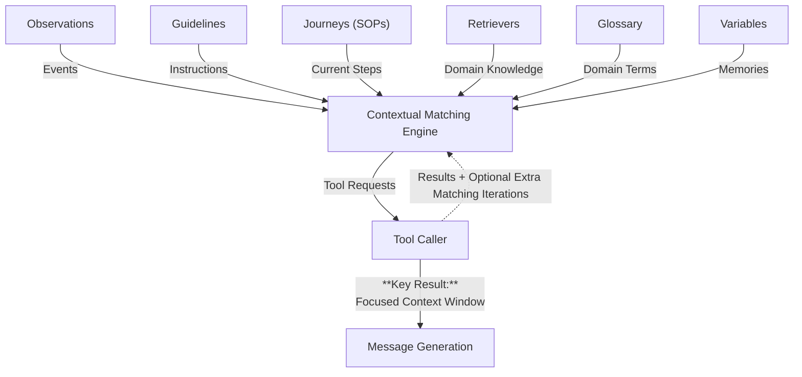

Instead of sending a large system prompt followed by a raw conversation to the model, Parlant first assembles a focused context — matching only the instructions and tools relevant to each conversational turn — then generates a response from that narrowed context.

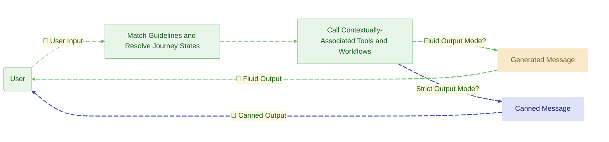

In this way, adding more rules makes the agent smarter, not more confused — because the engine filters context relevance, not the LLM.

## Is Parlant for you?

Parlant is built for teams that need their AI agent to behave reliably in front of real customers. It's a good fit if:

- You're building a **customer-facing agent** — support, sales, onboarding, advisory — where tone, accuracy, and compliance matter.
- You have **dozens or hundreds of behavioral rules** and your system prompt is buckling under the weight.
- You're in a **regulated or high-stakes domain** (finance, insurance, healthcare, telecom) where every response needs to be explainable and auditable.

**_Parlant is deployed in production at the most stringent organizations, including banks._**

> _Parlant isn't just a framework. It's a high-level software that solves the conversational modeling problem head-on._
> — **Sarthak Dalabehera**, Pr

# FILE: docs/interactions.md

# Interaction Flow

## Motivation

The first thing that's important to understand about the design of the Human/AI interface in Parlant is that it's meant to facilitate conversations that aren't only natural in content, but also in their flow.

Most traditional chatbot systems (and most LLM interfaces) rely on a request-reply mechanism based on a single last message.

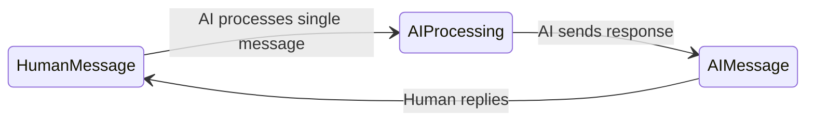

However, these days we know that a natural text interface must allow for a few things that are unsupported by that traditional model:

1. A human often expresses themselves in more than a single message event, before they're fully ready for a reply from the other party.
1. Information regarding their intent needs to be captured from not only their last N messages, but from the conversation as a whole.

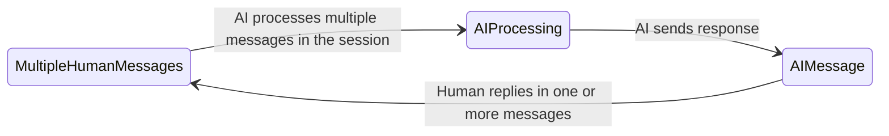

Moreover, the agent may need to respond not just when triggered by a human message; for example, when it needs to follow-up with the user to ensure their message was received, to try another engagement tactic, or to buy time before replying with further information, e.g., "Let me check that and get back to you in a minute."

## Solution

Parlant's API and engine is meant to work in an asynchronous fashion with respect to the interaction session. In simple terms, this means that both the human customer and the AI agent are free to add events (messages) to the session at any point in time, and in any number—just like in a real IM App conversation between two people.

### Sending Messages

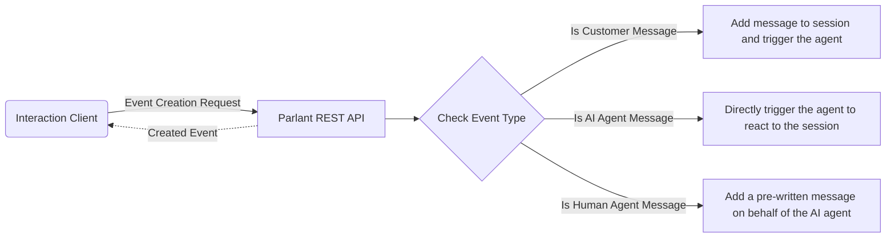

The diagram above shows the API flows for initiating changes to a session.
1. **Customer Message:** This request adds a new message to a session on behalf of the customer, and triggers the AI agent to respond asynchronously. This means that the *Created Event* does not in fact contain the agent's reply—that will come in time—but rather the ID (and other details) of the created and persisted customer event.
1. **AI Agent Message:** This request directly activates the full reaction engine. The agent will match and activate the relevant guidelines and tools, and produce a reply. The *Created Event* here, however, is not the agent's message, since that may take some time. Instead, it returns a *status event* containing the same *Trace ID* as the eventual agent's message event. It's important to note here that, in most frontend clients, this created event is usually ignored, and is provided mainly for diagnostic purposes.
1. **Human Agent Message:** Sometimes it makes sense for a human (perhaps a  developer) to manually add messages on behalf of the AI agent. This request allows you to do that. The *Created Event* here is the created and persisted manually-written agent message.

### Receiving Messages

Since messages are sent asyncrhonously, and potentially simultaneously, receiving them must be done in asynchronous fashion as well. In essence, we are to always wait for new messages, which may arrive at any time, from any party.

Parlant implements this functionality with a long-polling, timeout-restricted API endpoint for listing new events. This is what it does behind the scenes:

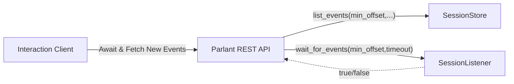

When it receives a request for new messages, that request generally has 2 important components: 1) The session ID; and 2) The minimum event offset to return. Normally, when making a request to this endpoint, the frontend client is expected to pass the session ID at hand, and *1 + the offset of its last-known event*. This will make this endpoint return only when *new* messages arrive. It's normal to run this long-polling request in a loop, timing-out every 60 seconds or so and renewing the request while the session is open on the UI. It's this loop that continuously keeps your UI updated with the latest messages, regardless of when they arrive or what caused them to arrive.

In summary, Parlant implements a flexible conversational API that supports natural, modern Human/AI interactions.


# FILE: docs/advanced/explainability.md

# Enforcement & Explainability

Let's dive into how Parlant enforces the conversation model consistently and provides visibility into your agent's situational understanding and decision-making process.

In this section, you'll learn:

1. How _Attentive Reasoning Queries (ARQs)_ enforce the conversation model
1. How to use ARQ artifacts to troubleshoot and improve behavior

### Understanding Runtime Enforcement

During message generation, Parlant ensures guidelines are followed consistently in real-time conversations through our [Attentive Reasoning Queries](https://arxiv.org/abs/2503.03669#:~:text=We%20present%20Attentive%20Reasoning%20Queries%20%28ARQs%29%2C%20a%20novel,in%20Large%20Language%20Models%20through%20domain-specialized%20reasoning%20blueprints.) prompting method. Rather than simply adding guidelines to prompts and hoping for the best, Parlant employes explicit techniques to maximize the LLM's ability and likelihood to adhere to your guidelines.

Attentive Reasoning Queries (ARQs) are essentially structured reasoning blueprints built into prompts that guide LLMs through specific thinking patterns when making decisions or solving problems. Rather than hoping an AI agent naturally considers all important factors, ARQs explicitly outline reasoning steps for different domains—like having specialized mental checklists to go through.

What makes ARQs effective for behavioral enforcement is that they force attention on critical considerations that might otherwise be overlooked. The model must work through predetermined reasoning stages (like context assessment, solution exploration, critique, and decision formation), ensuring it consistently evaluates important constraints before taking action.


**Figure:** Illustration of ARQs (taken from the [research paper](https://arxiv.org/abs/2503.03669#:~:text=We%20present%20Attentive%20Reasoning%20Queries%20%28ARQs%29%2C%20a%20novel,in%20Large%20Language%20Models%20through%20domain-specialized%20reasoning%20blueprints.))

Besides increasing accuracy and conformance to instructions, this process creates, as a byproduct, transparent, auditable reasoning paths that help maintain alignment with desired behaviors.

ARQs are flexible enough to adapt to different contexts and risk levels, with reasoning blueprints that can be tailored to specific domains or regulatory requirements. While there's some computational overhead to this more deliberate thinking process, carefully designed ARQs can beat Chain-of-Thought reasoning in both accuracy and latency.

Parlant uses different sets of ARQs for each of its components (e.g., guideline matching, tool-calling, or message composition), and dynamically specializes the ARQs to the specific entity it's evaluating, whether it's a particular guideline, tool, or conversational context.

Here's an illustrated example from the `GuidelineMatcher`'s logs:

```json
{
  "guideline_id": "fl00LGUyZX",
  "condition": "the customer wants to return an item",
  "condition_application_rationale": "The customer explicitly stated that they need to return a sweater that doesn't fit, indicating a desire to return an item.",
  "condition_applies": true,
  "action": "get the order number and item name and them help them return it",
  "action_application_rationale": [
    {
      "action_segment": "Get the order number and item name",
      "rationale": "I've yet to get the order number and item name from the customer."
    },
    {
      "action_segment": "Help them return it",
      "rationale": "I've yet to offer to help the customer in returning the item."
    }
  ],
  "applies_score": 9
}
```

### Explaining and Troubleshooting Agent Behavior
Message generation in Parlant goes through quite a lot of quality assurance. As mentioned above, ARQs produce artifacts that can help explain how the agent interpreted circumstances and instructions.

When you run into issues, you can inspect these artifacts to better understand why the agent responded the way it did, and whether it correctly interpreted your intentions.

Over time, this feedback loop helps you build more precise and effective sets of guidelines.


# FILE: docs/advanced/custom-llms.md

# Custom NLP Models

Once you've understood the basic of setting up [engine extensions](https://parlant.io/docs/advanced/engine-extensions), you can integrate other NLP models into Parlant.

> **A Note on Custom Models**
>
> Parlant was optimized to work with the built-in LLMs, so using other models may require additional configuration and testing.
>
> In particular, please note that Parlant uses some complex output JSON schemas in its operation. This means that you either need a powerful model that can handle complex outputs, or, alternatively, that you use a smaller model (SLM) that has been fine-tuned on Parlant data specifically, using a larger model as a teacher.
>
> Using smaller models is actually a great way to reduce costs, latency—and sometimes even accuracy—in production environments.

## Understanding `NLPService`
Whether you want to use a different model from a supported built-in provider, or an entirely different provider, you can do so by creating a custom `NLPService` implementation.

An `NLPService` has 3 key components:
1. **Schematic Generators**: These are used to generate structured content based on prompts.
2. **Embedders**: These are used to create vector representations of text for semantic retrieval.
3. **Moderation Service**: This is used to filter out harmful or inappropriate user input in conversations.

> **Reference Example**
>
> You can take a look at the official [`OpenAIService`](https://github.com/emcie-co/parlant/blob/main/src/parlant/adapters/nlp/openai_service.py) for a production-ready reference implementation of an `NLPService`.

### Schematic Generation
Throughout the Parlant engine, you'll find references to `SchematicGenerator[T]` objects. These are objects that generate [Pydantic](https://docs.pydantic.dev/latest/) models using instructions in a provided prompt. Behind the scenes, they always use LLMs to generate JSON schemas that in turn are converted to Pydantic models.

All LLM requests in Parlant are actually made using these schematic generators, which means that, whatever model you use, it must be able to generate valid JSON schemas consistently. This is the only requirement for a model in Parlant.

Let's now look at a few important interfaces that you need to implement in your custom NLP service.

#### Estimating Tokenizers
The `EstimatingTokenizer` interface is used to estimate the number of tokens in a prompt. This is important for managing costs and rate limits when using LLM APIs. It's also used in embedding models, where Parlant needs to chunk the input text into smaller parts to fit within the model's context window.

The reason it's called "estimating" is because not all model APIs provide exact token counts.

```python
class EstimatingTokenizer(ABC):
    """An interface for estimating the token count of a prompt."""

    @abstractmethod
    async def estimate_token_count(self, prompt: str) -> int:
        """Estimate the number of tokens in the given prompt."""
        ...
```

For example, with `OpenAI`, you can implement this to use the `tiktoken` library to get accurate token counts for GPT models, or estimated token counts for other popular models.

#### Schematic Generators
Now let's look at the `SchematicGenerator[T]` interface itself, which is used to generate structured content based on a prompt.

Each generation result from a `SchematicGenerator[T]` contains not just the generated object, but also additional metadata about the generation process. Here's what it looks like:
```python
@dataclass(frozen=True)
class SchematicGenerationResult(Generic[T]):
    content: T  # The generated schematic content (a Pydantic model instance)
    info: GenerationInfo  # Metadata about the generation process


@dataclass(frozen=True)
class GenerationInfo:
    schema_name: str  # The name of the Pydantic schema used for the generated content
    model: str  # The name of the model used for generation
    duration: float  # Time taken for the generation in seconds
    usage: UsageInfo  # Token usage information


@dataclass(frozen=True)
class UsageInfo:
    input_tokens: int
    output_tokens: int
    extra: Optional[Mapping[str, int]] = None  # May contain metrics like cached input tokens
```

Now let's look at the `SchematicGenerator[T]` interface itself, which you'd need to implement for your custom model:

```python
class SchematicGenerator(ABC, Generic[T]):
    """An interface for generating structured content based on a prompt."""

    @abstractmethod
    async def generate(
        self,
        # The prompt (or PromptBuilder) containing instructions for the generation.
        prompt: str | PromptBuilder,
        # Hints are a good way to provide additional context or parameters for the generation,
        # such as temperature, top P, logit bias, and things of that nature.
        hints: Mapping[str, Any] = {},
    ) -> SchematicGenerationResult[T]:
        """Generate content based on the provided prompt and hints."""
        # Implement this method to generate content using your own model.
        ...

    @property
    @abstractmethod
    def id(self) -> str:
        """Return a unique identifier for the generator."""
        # Normally, this would be the model name or ID used in the LLM API.
        ...

    @property
    @abstractmethod
    def max_tokens(self) -> int:
        """Return the maximum number of tokens in the underlying model's context window."""
        # Return the maximum number of tokens that can be processed by your model.
        ...

    @property
    @abstractmethod
    def tokenizer(self) -> EstimatingTokenizer:
        """Return a tokenizer that approximates that of the underlying model."""
        # This tokenizer should be able to estimate token counts for prompts for this model.
        ...

    @cached_property
    def schema(self) -> type[T]:
        """Return the schema type for the generated content.

        This is useful for derived classes, allowing them to access the concrete
        schema t

# FILE: docs/advanced/contributing.md

# Contributing to Parlant

We use the Linux-standard Developer Certificate of Origin ([DCO.md](https://github.com/emcie-co/parlant/blob/develop/DCO.md)), so that, by contributing, you confirm that you have the rights to submit your contribution under the Apache 2.0 license (i.e., the code you're contributing is truly yours to share with the project).

Please consult [CONTRIBUTING.md](https://github.com/emcie-co/parlant/blob/develop/CONTRIBUTING.md) for more details.

Want to start getting involved right now? Join us on [Discord](https://discord.gg/duxWqxKk6J) and let's discuss how you can help shape Parlant. We're excited to work with contributors directly while we set up our formal processes.

Otherwise, feel free to start a discussion or open an issue on [GitHub](https://github.com/emcie-co/parlant).


# FILE: docs/advanced/engine-extensions.md

# Engine Extensions

Working with an external framework and adapting it to your needs isn’t always simple, especially when you need it to behave in ways its original design didn’t anticipate.
Modifying the framework’s source code is a treacherous path—not just because it requires deeper expertise, but also because it leads to divergences between your locally-modified version and upstream updates.

So how do you get a pre-built framework to work differently? The idea is to be able to run a system or software that includes your code customizations without breaking its fundamental assumptions.

The [Open/Closed Principle](https://en.wikipedia.org/wiki/Open%E2%80%93closed_principle) states that software should be open for extension, but closed for modification, such that it can allow its behavior to be extended without modifying its source code. Parlant is carefully designed to abide by this principle, allowing you to achieve extreme extensibility by hooking into its structure.

With extensions, you are free to build exactly what you need without waiting for updates or modifying core engine components. This is a good time to remind you that you can join our [Discord](https://discord.gg/duxWqxKk6J) community to ask questions.

## Engine Hooks
Every time an agent needs to respond to a customer, the engine goes through a series of steps to generate the response. You can hook into these steps to modify the behavior of the engine. This is easily done by registering hook functions.

While there are many hooks you can utilize, here's a simple example that:
1. Overrides the entire engine's response generation process if we detect that the customer only greeted the agent.
1. Inspects the agent's message for compliance breaches (using a custom checker) before sending it to the customer.

```python
import asyncio
from typing import Any
import parlant.sdk as p

async def intercept_message_generation_with_greeting(
    ctx: p.LoadedContext, payload: Any, exc: Exception | None
) -> p.EngineHookResult:
    if await is_only_greeting(ctx.interaction.last_customer_message):
        await ctx.session_event_emitter.emit_message_event(
            trace_id=ctx.tracer.trace_id,
            data="Hello! How can I help you today?",
        )
        return p.EngineHookResult.BAIL  # Intercept the rest of the process
    else:
        return p.EngineHookResult.CALL_NEXT  # Continue with the normal process

async def check_message_compliance(
    ctx: p.LoadedContext, payload: Any, exc: Exception | None
) -> p.EngineHookResult:
    generated_message = payload

    if not await is_compliant(generated_message):
        ctx.logger.warning(f"Prevented sending a non-compliant message: '{generated_message}'.")
        return p.EngineHookResult.BAIL  # Do not send this message

    return p.EngineHookResult.CALL_NEXT  # Continue with the normal process

async def configure_hooks(hooks: p.EngineHooks) -> p.EngineHooks:
    hooks.on_acknowledged.append(intercept_message_generation_with_greeting)
    hooks.on_message_generated.append(check_message_compliance)

    return hooks

async def main():
    async with p.Server(
        configure_hooks=configure_hooks,
    ) as server:
        # Your logic here
        ...
```

## Dependency Injection
In order to extend the engine without modifying its source code, Parlant uses a [dependency injection](https://en.wikipedia.org/wiki/Dependency_injection) system. This allows you to inject your own implementations of various components or even the processing engine itself (say, if you wanted to optimize the entire pipeline for particular use cases).

For simplicity, we'll take a look at some basic extension mechanics, as well as common use cases for extension.

However, if you need help with something that isn't covered here, please reach out to us on [Discord](https://discord.gg/duxWqxKk6J), [GitHub Discussions](https://github.com/emcie-co/parlant/discussions), or simply using the [Contact Page](https://parlant.io/contact) and we'll get back to you.

### Working with the Container
Let's see how to work with Parlant's dependency injection container. The container is a central place where all components are registered, and you can use it to retrieve or register your own components.

There are two things you might want to do with respect to the container:

1. **Register your own components**: You can add your own implementations of various components to the container, making them available for injection throughout the application.
1. **Adjust the behavior of existing components**: You can retrieve instances of components from the container, allowing you to use them in your own code.

#### Registering Components
Registering components lets you override nearly every aspect of how Parlant works. You can access the container during its registration phase by passing a `configure_container` hook to the server.

This hook accepts a baseline state of the container, and returns a modified version of it before the server starts.

```python
import asyncio
import parlant.sdk as p

async def configure_container(container: p.Container) -> p.Container:
    # Register your own components here
    # ...
    return container

async def main():
    async with p.Server(
        configure_container=configure_container,
    ) as server:
        # Your logic here
        ...
```

#### Adjusting Existing Components
If you want to adjust the behavior of built-in components, you can retrieve them from the container and modify their behavior. This is useful for debugging or extending existing functionality without replacing the entire component.

This hook is called `initialize_container`, and it allows you to modify components within the container after all of the classes have been registered and determined—but before the server actually starts to use them.

This hook accepts the final state of the container, and returns `None`, as the container is only provided for _accessing_ registered components.

```python
impo

# FILE: docs/quickstart/examples.md

# Healthcare Agent Example

This page walks you through using Parlant to design and build a healthcare agent with two customer journeys.
1. **Schedule an appointment**: The agent helps the patient find a time for their appointment.
1. **Lab results**: The agent retrieves the patient's lab results and explains them.


You'll learn how to:
- Align your agent with basic domain knowledge.
- Define **journeys** with **states** and **transitions**.
- Use **guidelines** to control the agent's behavior in conversational edge cases.
- Use **tools** to connect your agent to real actions and data.
- Disambiguate vague user queries.

While this section is by no means a comprehensive guide to Parlant's features, it will give you a solid idea of what the basics look like, and how to think about building your own agents with Parlant. Let's get started!

> **Info: The Art of Behavior Modeling**
>
> Building complex and reliable customer-facing AI agents is a challenging task. Don't let the hype-machine tell you otherwise.
>
> It isn't just about having the right framework. When we automate conversations, we are automating the complex semantics of human conversations. In very real terms, this means we need to design our instructions and behavior models carefully. They need to be clear, and be at the right level of specificity, to ensure that the agent truly behaves as we expect it to.
>
> While Parlant gives you the tools to express and enforce your instructions, _designing them_ is an art in itself, requiring practice to get right. But once you do, you can build agents that are not only functional and reliable, but also engaging and effective.


## Preparing the Environment
Before getting started, make sure you've
1. [Installed](https://parlant.io/docs/quickstart/installation) Parlant and have a Python environment set up.
1. Chosen your NLP provider and connected it to your server (also on the [installation page](https://parlant.io/docs/quickstart/installation)).

> **Tip: Download the Code**
>
> The runnable code for this fully worked example can be found in the `examples/` folder of [Parlant's GitHub repository](https://github.com/emcie-co/parlant).

## Overview

We'll implement the agent in the following steps:

1. Create the baseline program with a simple agent description.
1. Add the **scheduling** journey, with states, transitions, and tools.
1. Add the **lab results** journey in a similar way.

## Getting Started
We'll implement the entire program in a single file, `healthcare.py`, but in real-world use cases you would likely want to split it into multiple files for better organization. A good approach in those cases is to have a file per journey.

But now let's get to creating our initial agent.

```python
# healthcare.py

import parlant.sdk as p
import asyncio

async def add_domain_glossary(agent: p.Agent) -> None:
  await agent.create_term(
    name="Office Phone Number",
    description="The phone number of our office, at +1-234-567-8900",
  )

  await agent.create_term(
    name="Office Hours",
    description="Office hours are Monday to Friday, 9 AM to 5 PM",
  )

  await agent.create_term(
    name="Charles Xavier",
    synonyms=["Professor X"],
    description="The renowned doctor who specializes in neurology",
  )

  # Add other specific terms and definitions here, as needed...

async def main() -> None:
    async with p.Server() as server:
        agent = await server.create_agent(
            name="Healthcare Agent",
            description="Is empathetic and calming to the patient.",
        )

        await add_domain_glossary(agent)


if __name__ == "__main__":
    asyncio.run(main())
```

## Creating the Scheduling Journey
To understand how journeys work in Parlant, please check out the [Journeys documentation](https://parlant.io/docs/concepts/customization/journeys). Here, we'll jump straight into it, but it's recommended to review their documentation first.

### Adding Tools
First, add the tools we need to support this journey.

```python
from datetime import datetime

@p.tool
async def get_upcoming_slots(context: p.ToolContext) -> p.ToolResult:
  # Simulate fetching available times from a database or API
  return p.ToolResult(data=["Monday 10 AM", "Tuesday 2 PM", "Wednesday 1 PM"])

@p.tool
async def get_later_slots(context: p.ToolContext) -> p.ToolResult:
  # Simulate fetching later available times
  return p.ToolResult(data=["November 3, 11:30 AM", "November 12, 3 PM"])

@p.tool
async def schedule_appointment(context: p.ToolContext, datetime: datetime) -> p.ToolResult:
  # Simulate scheduling the appointment
  return p.ToolResult(data=f"Appointment scheduled for {datetime}")
```

> **Tip: Tools in Parlant**
>
> Parlant has a more intricate tool system than most agentic frameworks, since it is optimized for conversational, sensitive customer-facing use cases. We highly recommend perusing the documentation in the [Tools section](https://parlant.io/docs/concepts/customization/tools) to learn its power.

### Building the Journey
We'll now create the journey according to the following diagram:

```mermaid
stateDiagram-v2
    [*] --> DetermineVisitReason
    DetermineVisitReason --> GetUpcomingSlots
    GetLaterSlots --> ListLaterAvailableTimes
    ListAvailableTimes --> ConfirmDetails : The patient picks a time
    GetUpcomingSlots --> ListAvailableTimes
    ListLaterAvailableTimes --> ConfirmDetails : The patient picks a time
    ListLaterAvailableTimes --> CallOffice : None of those times work for the patient either
    ListAvailableTimes --> GetLaterSlots : None of those times work for the patient
    ConfirmDetails --> BookAppointment: The patient confirms the details
    BookAppointment --> ConfirmBooking : Appointment confirmed
    ConfirmBooking --> [*]
    CallOffice --> [*]

    style GetUpcomingSlots fill:#ffeecc,stroke:#333,stroke-width:1px
    style GetLaterSlots fill:#ffeecc,stroke:#333,s

# FILE: docs/quickstart/motivation.md

# Motivation

Let's say you downloaded some agent framework and built an AI agent—that's great! However, when you actually test it, you see it's not handling many customer interactions properly. Your business experts are displeased with it. Your prompts are turning into a mess. What do you do?

Enter the world of **Agentic Behavior Modeling (ABM)**: a new powerful approach to controlling how your agents interact with your users.

A behavior model is a structured, custom-tailored set of principles, actions, objectives, and ground-truths that orientates an agent to a particular domain or use case.

```mermaid
%%{init: { "theme": "neutral" }}%%
mindmap
  root((Behavior Model))
    Guidelines
    Journeys
    Tools
    Capabilities
    Glossary
    Variables
    Semantic Relationships
    Canned Responses
```

#### Why Behavior Modeling?

The problem of getting an LLM agent to say and do what _you_ want it to is a hard one, experienced by virtually anyone building customer-facing agents. Here's how ABM compares to other approaches to solving this problem.

- **Flow engines**, in which you build turn-by-turn conversational flowcharts, _force_ the user to interact according to predefined scripts. This rigid approach tends to lead to poor user engagement and trust. In contrast, an **ABM engine** dynamically _adapts_ to a user's natural interaction patterns while conforming to your business rules.

- **Free-form prompt engineering**, be it with graph-based orchestration or system prompts, frequently leads to _inconsistent and unreliable behavioral conformance_, failing to uphold requirements and expectations. Conversely, an **ABM engine** leverages clear semantical structures and annotations to facilitate conformance to business rules.

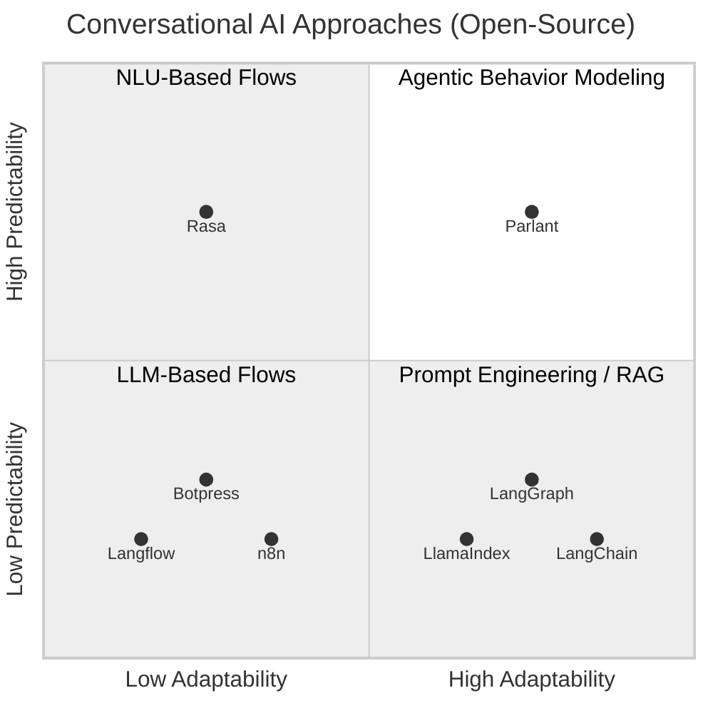

## What is Parlant?

Parlant is an open-source **ABM Engine** for LLM agents, which means that you can use it to precisely control how your LLM agent interacts with users in different scenarios.

Parlant is a full-fledged framework, prebuilt with numerous proven features to help you ramp up quickly with customer-facing agents and make the behavior modeling process as easy as possible.

## Why Parlant?

Many conversational AI use cases require strict conformance to business rules when interacting with users. However, until now this has been exceedingly difficult to achieve with LLMs—at least when consistency is a concern.

Parlant was built to solve this challenge. By implementing a structured, developer-friendly approach to modeling conversational behavior, through carefully designed rules, entities, and relationships, Parlant allows you to define, enforce, track, and reason about agent decisions in a simple and elegant manner.

## Behavior Modeling 101: Granular Guidelines

The most basic yet powerful modeling entity in a Behavior Model is the **guideline**. In Parlant, instead of defining your guidelines in free-form fashion (as you might do in a system prompt), you define them in **granular** fashion, where each guideline adds an individual **clarification** that nudges your AI agent on how to approach a particular situation.

To ensure your agent stays focused and consistent conformant to your guidelines, Parlant automatically filters and selects the most relevant set of guidelines for it to apply in any given situation, out of all of the guidelines you provide it. It does this by looking both at a guideline's _condition_ (which describes the circumstances in which it should apply) and its _action_ (describing what it should do).

Finally, it applies enforcement to ensure that the matched guidelines are actually followed, and provides you with explanations for your agent's interpretation of situations and guidelines at every turn.

Working iteratively, adding guidelines wherever you find the need, you can get your LLM agent to approach and handle various different circumstances according to your exact needs and expectations.

```python
await agent.create_guideline(
  condition="you have suggested a solution that did not work for the user",
  action="ask if they'd prefer to talk to a human agent, or continue troubleshooting with you",
)`,
```

Much of what Parlant does behind the scenes is understanding when a guideline should be applied. This is trickier than it may seem. For example, Parlant automatically keeps track of whether a guideline has already been applied in a conversation, so that it doesn't repeat itself unnecessarily. It also distinguishes between guidelines that are _always_ applicable, and those that are only applicable _once_ in a conversation. And it does this while minimizing cost and latency.

> **AI Behavior Explainability**
>
> Once guidelines are installed, you can get clear feedback regarding their evaluation at every turn by inspecting Parlant's logs.
>
> Learn more about this in the section on how Parlant implements [enforcement & explainability](https://parlant.io/docs/advanced/explainability).

## Understanding the Pain Point

By now, while most people building AI agents know hallucinations are an important challenge, still too few are aware of the practical alignment ch

# FILE: docs/quickstart/installation.md

# Installation


**Parlant** is an open-source **Agentic Behavior Modeling Engine** for LLM agents, built to help developers quickly create customer-engaging, business-aligned conversational agents with control, clarity, and confidence.

It gives you all the structure you need to build customer-facing agents that behave exactly as your business requires:

- **[Journeys](https://parlant.io/docs/concepts/customization/journeys)**:
  Define clear customer journeys and how your agent should respond at each step.

- **[Behavioral Guidelines](https://parlant.io/docs/concepts/customization/guidelines)**:
  Easily craft agent behavior; Parlant will match the relevant elements contextually.

- **[Tool Use](https://parlant.io/docs/concepts/customization/tools)**:
  Attach external APIs, data fetchers, or backend services to specific interaction events.

- **[Domain Adaptation](https://parlant.io/docs/concepts/customization/glossary)**:
  Teach your agent domain-specific terminology and craft personalized responses.

- **[Canned Responses](https://parlant.io/docs/concepts/customization/canned-responses)**:
  Use response templates to eliminate hallucinations and guarantee style consistency.

- **[Explainability](https://parlant.io/docs/advanced/explainability)**:
  Understand why and when each guideline was matched and followed.

## Installation
Parlant is available on both [GitHub](https://github.com/emcie-co/parlant) and [PyPI](https://pypi.org/project/parlant/) and works on multiple platforms (Windows, Mac, and Linux).

Please note that [Python 3.10](https://www.python.org/downloads/release/python-3105/) and up is required for Parlant to run properly.

```bash
pip install parlant
```

If you're feeling adventurous and want to try out new features, you can also install the latest development version directly from GitHub.

```bash
pip install git+https://github.com/emcie-co/parlant@develop
```

## Creating Your First Agent

Once installed, you can use the following code to spin up an initial, sample agent. You'll flesh out its behavior later.

```python
# main.py

import asyncio
import parlant.sdk as p

async def main():
  async with p.Server() as server:
    agent = await server.create_agent(
        name="Otto Carmen",
        description="You work at a car dealership",
    )

asyncio.run(main())
```

You'll notice Parlant follows the asynchronous programming paradigm with `async` and `await`. This is a powerful feature of Python that lets you to write code that can handle many tasks at once, allowing your agent to handle more concurrent requests in production.

If you're new to async programming, check out the [official Python documentation](https://docs.python.org/3/library/asyncio.html) for a quick introduction.

Parlant uses OpenAI as the default NLP provider, so you need to ensure you have `OPENAI_API_KEY` set in your environment.

Then, run the program!
```bash
export OPENAI_API_KEY="<YOUR_API_KEY>"
python main.py
```

Parlant supports multiple LLM providers by default, accessible via the `p.NLPServices` class. You can also add your own provider by implementing the `p.NLPService` interface, which you can learn how to do in the [Custom NLP Models](https://parlant.io/docs/advanced/custom-llms) section.

To use one of the built-in-providers, you can specify it when creating the server. For example:

```python
async with p.Server(nlp_service=p.NLPServices.cerebras) as server:
  ...
```

Note that you may need to install an additional "extra" package for some providers. For example, to use the Cerebras NLP service:

```bash
pip install parlant[cerebras]
```

Having said that, Parlant is observed to work best with [OpenAI](https://openai.com) and [Anthropic](https://www.anthropic.com) models, as these models are highly consistent in generating high-quality completions with valid JSON schemas—so we recommend using one of those if you're just starting out.

## Testing Your Agent

To test your installation, head over to [http://localhost:8800](http://localhost:8800) and start a new session with the agent.


## Creating Your First Guideline

Guidelines are the core of Parlant's behavior model. They allow you to define how your agent should respond to specific user inputs or conditions. Parlant cleverly manages guideline context for you, so you can add as many guidelines as you need without worrying about context overload or other scale issues.

```python
# main.py

import asyncio
import parlant.sdk as p

async def main():
  async with p.Server() as server:
    agent = await server.create_agent(
        name="Otto Carmen",
        description="You work at a car dealership",
    )

    ##############################
    ##    Add the following:    ##
    ##############################
    await agent.create_guideline(
        # This is when the guideline will be triggered
        condition="the customer greets you",
        # This is what the guideline instructs the agent to do
        action="offer a refreshing drink",
    )

asyncio.run(main())
```

Now re-run the program:
```bash
python main.py
```

Refresh [http://localhost:8800](http://localhost:8800), start a new session, and greet the agent. You should expect to be offered a drink!

## Using the Official React Widget

If your frontend project is built with React, the fastest and easiest way to start is to use the official Parlant React widget to integrate with the server.

Here's a basic code example to get started:

```jsx
import React from 'react';
import ParlantChatbox from 'parlant-chat-react';

function App() {
  return (
    <div>
      <h1>My Application</h1>
      <ParlantChatbox
        server="PARLANT_SERVER_URL"
        agentId="AGENT_ID"
      />
    </div>
  );
}

export default App;
```

For more documentation and customization, see the **GitHub repo:** https://github.com/emcie-co/parlant-chat-react.


# FILE: docs/concepts/sessions.md

# Sessions

A session represents a continuous interaction between an [agent](https://parlant.io/docs/concepts/entities/agents) and a [customer](https://parlant.io/docs/concepts/entities/customers).

Sessions are the stage for your conversational model, allowing agents to engage with customers in a structured and persistent manner. They encapsulate all the interactions that occur between an agent and a customer, including messages, status updates, frontend events, and tool call results.

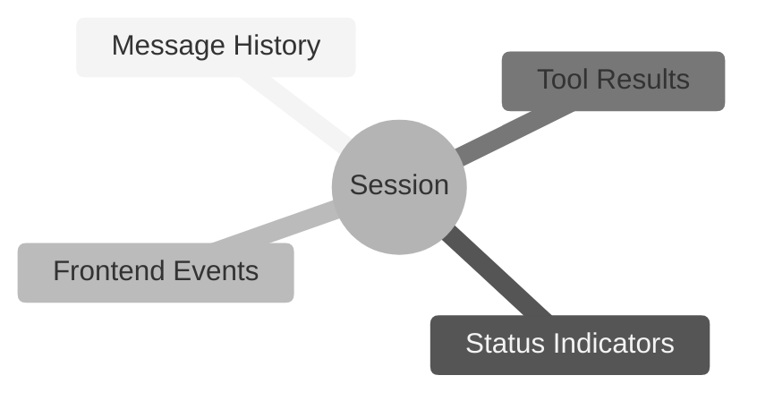

> **Agent Memory?**
>
> What some frameworks call "memory" is already built-in into sessions in Parlant. An agent is constantly aware of everything that has happened in the session, using this information to apply the right instructions and generate appropriate responses.

## A Modern Interaction Model

Parlant views interaction sessions in a different manner than most Conversational AI frameworks.

In the past few decades, virtually all forms of conversational AI have assumed that an interaction occurs on a turn-by-turn basis, where a customer sends a message, and the agent responds to it.

Yet this is not how real conversations work. People often send each other multiple subsequent messages to communicate their thoughts. In addition, an agent may say something, put the customer on hold for a moment, and then return to the conversation with a follow-up message.

**Rigid Interaction Model**

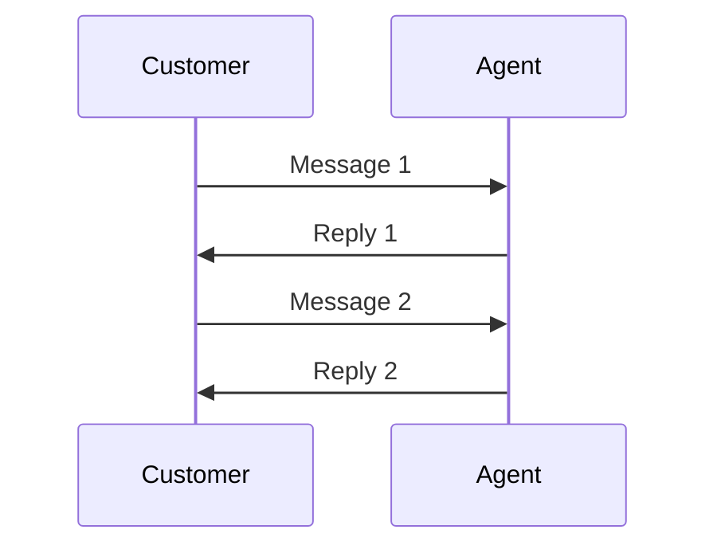

**Modern Interaction Model**

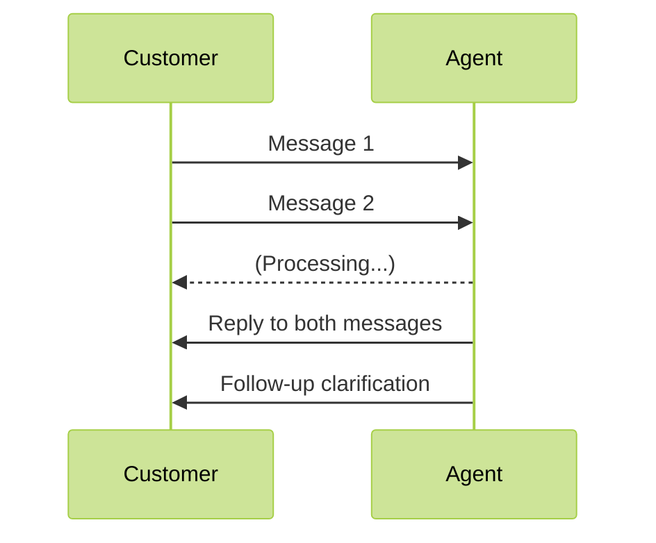

Since this is how real conversations work, Parlant provides built-in support for it from the ground up.

> **Multi-Participant Sessions**
>
> A requested feature on Parlant's development roadmap, this will allow you to have multiple agents interact with the customer, or with each other. Another use case for this is transferring the customer to another AI agent.

## Configuring Session Storage

You can choose where you store sessions.

By default, Parlant does not persist sessions, meaning that they are stored in memory and will be lost when the server restarts. This is useful for testing and development purposes.

If you want to persist sessions, you can configure Parlant to use a database of your choice. For local persistence, we recommend using the integrated JSON file storage, as there's zero setup required. For production use, you can use MongoDB, which comes built-in, or another database.

### Persisting to Local Storage
This will save sessions under `$PARLANT_HOME/sessions.json`.

```python
import asyncio
import parlant.sdk as p

async def main():
    async with p.Server(session_store="local") as server:
        # ...

asyncio.run(main())
```

### Persisting to MongoDB
Just specify the connection string to your MongoDB database when starting the server:

```python
import asyncio
import parlant.sdk as p

async def main():
    async with p.Server(session_store="mongodb://path.to.your.host:27017") as server:
        # ...

asyncio.run(main())
```

## Event Driven Communication

Think of a session in Parlant as a timeline of everything that's happened in a conversation.

Each moment in this timeline—whether it's someone speaking, a status update, or a tool call result—is captured as an event. These events line up one after another, each with its own position number (called its _offset_), starting from 0.

When a conversation unfolds, it creates a sequence of events. A customer might start the session by saying _"Hello"_—that's event 0. The system then notes that the agent has acknowledged the message and is preparing a response by outputting a status event—that's event 1. The agent's _"Hi there!"_ becomes event 2, and so on. Each event, whether it's a message being exchanged, the agent typing, or even an error occurring, takes its place in this ordered sequence.

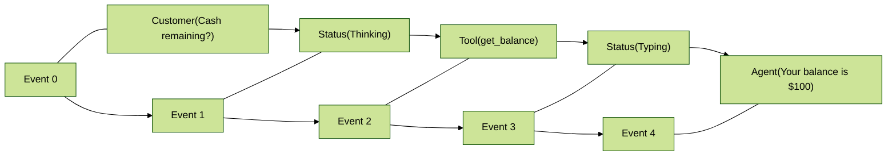

Every event in this sequence carries important information: what type of event it is (like a message or a status update), what actually happened (the data), and when it occurred. This creates a complete record of the conversation that helps us understand exactly how things unfolded, making it easy to track and review the conversation's state when needed.

Each event is also associated with a **trace ID**. This ID primarily helps to trace between AI-generated messages and the engine triggers that produced them, including any generated tool events that may have informed them. This lets us easily fetch and understand the data that went into each generated message. For example, by having your frontend client inspect a message's traced tool events, you can show relevant information in "footnotes" under the message.

## Interacting with an Agent

Once you have a Parlant server up and running, you can interact with its hosted agents through the [REST API](https://parlant.io/docs/api/create-session).

You have three options:
1. Use the official React widget to quickly and easily integrate with the server
2. Use the official client SDKs for Python or TypeScript to build a custom frontend application
3. Use t

# FILE: docs/production/agentic-design.md

# Agentic Design Methodology

Building AI agents takes a fundamental paradigm shift from traditional software development. This article explores the unique challenges, methodologies, and design principles needed to create effective customer-facing agents.

While Parlant provides the tools for reliable agent behavior, success depends on mastering the art of semantic design—learning how to articulate instructions that work consistently at scale while maintaining natural user interactions.

## Understanding Probabilistic Behavior

AI agents operate differently from traditional software systems. In conventional development, deterministic functions produce consistent outputs for the same inputs. AI agents, however, are built on statistical models where the same input can produce varied responses based on the model's learned patterns and probability distributions.

Naturally, when we're building on top of an inherently uncertain foundation, this requires a different approach to design and implementation. This is the first important thing to pause and come to terms with about agentic design.

### Instruction Interpretation Challenges

While traditional software executes explicit commands with predictable outcomes, LLMs interpret instructions contextually, filling in details and assumptions based on their varied training data. They _have_ to work like this.

Consider this guideline example:
```python
agent.create_guideline(
    condition="Customer is unhappy",
    action="Make them feel better"
)
```

Both the condition and instruction are too vague and could result in undesirable behaviors:
- Offering unauthorized discounts
- Making promises the company cannot fulfill
- Using inappropriate communication styles

> **Warning: Interpretation Variability**
>
> LLMs trained to be helpful will attempt to fulfill requests even when they lack sufficient context or specificity. This can lead to responses that seem appropriate to the model but violate business rules or expectations.

## The Challenge of Complete Control

It's important to understand that, while Parlant adds many compliance mechanisms on top of LLMs, the LLMs themselves cannot be fully constrained from discussing certain topics, for two fundamental reasons:

**1. Pattern Mimicking, Not Reasoning**: LLMs don't actually "reason" in the logical sense. Everything they produce is essentially mimicking patterns of expression observed during training. Think of an LLM as a powerful but wild horse—it has immense capability, but it takes skill and nuance to "ride" it effectively.

**2. Contextual Ambiguity**: Even carefully crafted conditions and actions can become ambiguous across different and variegated interaction contexts. What seems clear in one scenario may be interpreted differently in a different context.

### Strategies for Compliance

For agents that must meet compliance standards and expectations, you need a layered approach:

**The Minimum: Guidance-Based Boundaries**
With guidelines, you can:
1. Set clear boundaries for acceptable behavior
2. Provide deliberate nudges and instructions for handling specific scenarios in intended ways
```python
await agent.create_guideline(
    condition="Customer asks about topics outside your designated scope",
    action="Politely decline to discuss the topic and redirect to what you can help with"
)
```

```python
await agent.create_guideline(
    condition="The patient wants an analysis of their lab results",
    action="Never provide any interpretation of the results. Instead, tell them to "
        "call our office and ask to speak with their doctor for a detailed analysis",
)
```

**The Robust Solution: Canned Responses**
For truly critical interactions where unauthorized communication could cause problems, implement [canned responses](https://parlant.io/docs/concepts/customization/canned-responses) and set your agent's composition mode to `STRICT`:

```python
await agent.create_canned_response(
    template="I can help you with account questions, but I'll need to connect you "
        "with a specialist for policy details. Would you like me to transfer you?"
)
```

Canned responses ensure that in high-risk scenarios, your agent uses pre-approved language and content that eliminates the possibility of unauthorized statements. Yes, this requires more work, but you can add these iteratively. The key insight is building an agent you can trust not to create liability—not even one time in a million interactions.

This "defense in depth" approach acknowledges that working with LLMs means learning to guide, steer and constrain, rather than control completely. It also means that, _as long as the behavior of the agent is within acceptable bounds,_ we must allow for some degree of flexibility and variability in responses.

## Tool Calling Complexities

When agents need to interact with external systems, they use tools (functions that perform specific actions). However, LLMs face unique challenges when calling tools that don't exist in traditional software development.

### The Parameter Guessing Problem

LLMs must determine tool parameters based on conversational context rather than explicit specifications. This creates several common failure patterns:

1. **Missing Information**: Agents may call tools without all required parameters being present in context, encouraging them to guess or hallucinate values.
1. **Type Confusion**: An agent might pass an email address where a user ID is expected, or provide a string where an integer is needed.
1. **Context Misinterpretation**: When multiple entities exist in conversation context, agents may use the wrong one for a parameter.
1. **False Positive Bias**: When multiple tools seem applicable, agents may call the first one that seems relevant, even if it's not the best fit.

Consider a user saying: "Schedule a meeting with Sarah for next week." The agent must determine:
- Which Sarah (if multiple exist)
- What day/time "next week" means
- What type of meeting
- 

# FILE: docs/production/input-moderation.md

# User-Input Moderation

Adding content filtering to your AI agents helps achieve a more professional level of customer interactions. Here's why it matters.

### Understanding the Challenges

AI agents, being based on LLMs, are statistical pattern matchers that can be influenced by the nature of inputs they receive. Think of them like customer service representatives who benefit from clear boundaries about what conversations they should and shouldn't engage in.

#### Sensitive Topics

Some topics, like mental health or illicit activities, require professional human handling. While your agent might technically handle these topics, in practical use cases it's often better for it to avoid such conversations, or even redirect them to appropriate human resources.

#### Protection from Harassment

Customer interactions should remain professional, but some users might attempt to harass or abuse the agent (or others). This isn't just about maintaining decorum: LLMs (like humans) can in some cases be influenced by aggressive or inappropriate language, potentially affecting their responses.

To address such cases, Parlant integrates with moderation APIs, such as [OpenAI's Omni Moderation](https://openai.com/index/upgrading-the-moderation-api-with-our-new-multimodal-moderation-model/), to filter such interactions before they reach your agent.

### Enabling Input Moderation
To enable moderation, all you need to do is set a query parameter when creating events.

#### Python
```python
from parlant.client import ParlantClient

client = ParlantClient(base_url=SERVER_ADDRESS)

client.sessions.create_event(
    SESSION_ID,
    kind="message",
    source="customer",
    message=MESSAGE,
    moderation="auto",
)
```

#### TypeScript
```typescript
import { ParlantClient } from 'parlant-client';

const client = new ParlantClient({ environment: SERVER_ADDRESS });

await client.sessions.createEvent(SESSION_ID, {
     kind: "message",
     source: "customer",
     message: MESSAGE,
     moderation: "auto",
});
```

When customers send inappropriate messages, Parlant ensures that their content is not even visible to the agent; rather, all the agent sees is that a customer sent a message which has been "censored" for a some specific reason (e.g. harrassment, illicit behavior, etc.).

This integrates well with guidelines. For example, you may install a guideline such as:

> * **Condition:** the customer's last message is censored
> * **Action:** inform them that you can't help them with this query, and suggest they contact human support

From a UX perspective, this approach is superior to just "erroring out" when encountering such messages. Instead of seeing an error, the customer gets a polite and informative response. Better yet, the response can be controlled with guidelines and tools just as in any other situation.

## Jailbreak Protection

While your agent's guidelines aren't strictly security measures (as that's handled more robustly by backend permissions), maintaining presentable behavior is important even when some users might try to trick the agent into revealing its instructions or acting outside its intended boundaries.

Parlant's moderation system supports a special `paranoid` mode, which integrates with [Lakera Guard](https://www.lakera.ai/lakera-guard) (from the creators of the [Gandalf Challenge](https://gandalf.lakera.ai/baseline)) to prevent such manipulation attempts.

#### Python
```python
from parlant.client import ParlantClient

client = ParlantClient(base_url=SERVER_ADDRESS)

client.sessions.create_event(
    SESSION_ID,
    kind="message",
    source="customer",
    message=MESSAGE,
    moderation="paranoid",
)
```

#### TypeScript
```typescript
import { ParlantClient } from 'parlant-client';

const client = new ParlantClient({ environment: SERVER_ADDRESS });

await client.sessions.createEvent(SESSION_ID, {
     kind: "message",
     source: "customer",
     message: MESSAGE,
     moderation: "paranoid",
});
```

Note that to activate `paranoid` mode, you need to get an API key from Lakera and assign it to the environment variable `LAKERA_API_KEY` before starting the server.


# FILE: docs/production/custom-frontend.md

# Custom Frontend

The fastest way to integrate Parlant into your React application is using our official [`parlant-chat-react`](https://github.com/emcie-co/parlant-chat-react) widget. This component provides a complete chat interface that connects directly to your Parlant agents.

### Installation and Basic Setup

Install the widget via npm or yarn:

```bash
npm install parlant-chat-react
# or
yarn add parlant-chat-react
```

Then integrate it into your React application:

```jsx
import React from 'react';
import ParlantChatbox from 'parlant-chat-react';

function App() {
  return (
    <div>
      <h1>My Application</h1>
      <ParlantChatbox
        server="http://localhost:8800"  // Your Parlant server URL
        agentId="your-agent-id"         // Your agent's ID
      />
    </div>
  );
}

export default App;
```

### Configuration Options

The widget supports several configuration props:

```jsx
<ParlantChatbox
  // Required props
  server="http://localhost:8800"
  agentId="your-agent-id"

  // Optional props
  sessionId="existing-session-id"     // Continue existing session
  customerId="customer-123"           // Associate with specific customer
  float={true}                        // Display as floating popup
  titleFn={(session) => `Chat ${session.id}`}  // Dynamic title generation
/>
```

### Common Customizations

#### Styling with Custom Classes

Customize the appearance using CSS class overrides:

```jsx
<ParlantChatbox
  server="http://localhost:8800"
  agentId="your-agent-id"
  classNames={{
    chatboxWrapper: "my-chat-wrapper",
    chatbox: "my-chatbox",
    messagesArea: "my-messages",
    agentMessage: "my-agent-bubble",
    customerMessage: "my-customer-bubble",
    textarea: "my-input-field",
    popupButton: "my-popup-btn"
  }}
/>
```

#### Custom Component Replacement

Replace specific components with your own:

```jsx
<ParlantChatbox
  server="http://localhost:8800"
  agentId="your-agent-id"
  components={{
    popupButton: ({ toggleChatOpen }) => (
      <button
        onClick={toggleChatOpen}
        className="custom-chat-button"
      >
        💬 Chat with us
      </button>
    ),
    agentMessage: ({ message }) => (
      <div className="custom-agent-message">
        
        <p>{message.data.message}</p>
      </div>
    )
  }}
/>
```

#### Floating Chat Mode

Enable popup mode for a floating chat interface:

```jsx
<ParlantChatbox
  server="http://localhost:8800"
  agentId="your-agent-id"
  float={true}
  popupButton={<ChatIcon size={24} color="white" />}
/>
```

> **Reference Implementation**
>
> The parlant-chat-react widget is open source! You can [examine its implementation on GitHub](https://github.com/emcie-co/parlant-chat-react) as a reference for creating custom widgets in other UI frameworks like Vue, Angular, or vanilla JavaScript. The source code demonstrates best practices for session management, event handling, and UI state synchronization.

## Building a Custom Frontend

If you need more control than the React widget provides, or you're using a different framework, you can build a custom frontend using Parlant's client APIs directly.

### Step 1: Initialize the Parlant Client

Start by setting up the Parlant client to communicate with your server:

#### TypeScript

```typescript
import { ParlantClient } from 'parlant-client';

class ParlantChat {
  private client: ParlantClient;
  private sessionId: string | null = null;
  private lastOffset: number = 0;

  constructor(serverUrl: string) {
    this.client = new ParlantClient({
      environment: serverUrl
    });
  }
}
```

#### JavaScript

```javascript
import { ParlantClient } from 'parlant-client';

class ParlantChat {
  constructor(serverUrl) {
    this.client = new ParlantClient({
      environment: serverUrl
    });
    this.sessionId = null;
    this.lastOffset = 0;
  }
}
```

### Step 2: Create a Session

Initialize a conversation session with your agent:

#### TypeScript

```typescript
async createSession(agentId: string, customerId?: string): Promise<string> {
  try {
    const session = await this.client.sessions.create({
      agentId: agentId,
      customerId: customerId,
      title: `Chat Session ${new Date().toLocaleString()}`
    });

    this.sessionId = session.id;
    console.log('Session created:', this.sessionId);

    // Start monitoring for events
    this.startEventMonitoring();

    return this.sessionId;
  } catch (error) {
    console.error('Failed to create session:', error);
    throw error;
  }
}
```

#### JavaScript

```javascript
async createSession(agentId, customerId) {
  try {
    const session = await this.client.sessions.create({
      agentId: agentId,
      customerId: customerId,
      title: `Chat Session ${new Date().toLocaleString()}`
    });

    this.sessionId = session.id;
    console.log('Session created:', this.sessionId);

    // Start monitoring for events
    this.startEventMonitoring();

    return this.sessionId;
  } catch (error) {
    console.error('Failed to create session:', error);
    throw error;
  }
}
```

### Step 3: Send Customer Messages

Handle user input and send messages to the agent:

#### TypeScript

```typescript
async sendMessage(message: string): Promise<void> {
  if (!this.sessionId) {
    throw new Error('No active session');
  }

  try {
    await this.client.sessions.createEvent(this.sessionId, {
      kind: "message",
      source: "customer",
      message: message
    });

    // Message will appear in UI when it comes back from event monitoring
    console.log('Message sent:', message);
  } catch (error) {
    console.error('Failed to send message:', error);
    throw error;
  }
}
```

#### JavaScript

```javascript
async sendMessage(message) {
  if (!this.sessionId) {
    throw new Error('No active session');
  }

  try {
    await this.client.sessions.createEvent(this.sessionId, {
      kind: "message",
      source: "customer",
      message: m

# FILE: examples/travel_voice_agent.py

# travel_voice_agent.py

import parlant.sdk as p
import asyncio
from datetime import datetime


@p.tool
async def get_available_destinations(context: p.ToolContext) -> p.ToolResult:
    return p.ToolResult(
        [
            "Paris, France",
            "Tokyo, Japan",
            "Bali, Indonesia",
            "New York, USA",
        ]
    )


@p.tool
async def get_available_flights(context: p.ToolContext, destination: str) -> p.ToolResult:
    # Simulate fetching available flights from a booking system
    return p.ToolResult(
        data=[
            "Flight 123 - June 15, 9:00 AM, $850",
            "Flight 321 - June 16, 2:30 PM, $720",
            "Flight 987 - June 17, 6:45 PM, $680",
        ]
    )


@p.tool
async def get_alternative_flights(context: p.ToolContext, destination: str) -> p.ToolResult:
    # Simulate fetching alternative flights with different dates
    return p.ToolResult(
        data=[
            "Flight 485 - June 25, 11:00 AM, $920",
            "Flight 516 - July 2, 4:15 PM, $780",
        ]
    )


@p.tool
async def book_flight(context: p.ToolContext, flight_details: str) -> p.ToolResult:
    # Simulate booking the flight
    return p.ToolResult(
        data=f"Flight booked: {flight_details} for {p.Customer.current.name}. "
        f"Confirmation number: TRV-{datetime.now().strftime('%Y%m%d')}-001"
    )


@p.tool
async def get_booking_status(context: p.ToolContext, confirmation_number: str) -> p.ToolResult:
    # Simulate fetching booking status from a reservation system,
    # using the customer ID from the context.
    booking_info = {
        "status": "Confirmed",
        "details": "Flight to Paris on June 15, 9:00 AM. Seat 12A assigned.",
        "notes": "Check-in opens 24 hours before departure.",
    }

    return p.ToolResult(
        data={
            "status": booking_info["status"],
            "details": booking_info["details"],
            "notes": booking_info["notes"],
        }
    )


async def add_domain_glossary(agent: p.Agent) -> None:
    await agent.create_term(
        name="Office Phone Number",
        description="The phone number of our travel agency office, at +1-800-TRAVEL-1",
        synonyms=["contact number", "customer service number", "support line"],
    )

    await agent.create_term(
        name="Baggage Policy",
        description="This describes the rules and fees associated with checked and carry-on baggage.",
        synonyms=["luggage policy", "baggage rules", "carry-on policy"],
    )

    await agent.create_term(
        name="Cancellation Policy",
        description="This outlines the terms and conditions for cancelling a booking, including any fees or deadlines.",
        synonyms=["refund policy", "cancellation terms"],
    )

    await agent.create_term(
        name="Travel Insurance",
        description="An optional service that provides coverage for trip cancellations, medical emergencies, lost luggage, and other travel-related issues.",
        synon

# FILE: examples/healthcare.py

# healthcare.py

import parlant.sdk as p
import asyncio
from datetime import datetime


@p.tool
async def get_insurance_providers(context: p.ToolContext) -> p.ToolResult:
    return p.ToolResult(["Mega Insurance", "Acme Insurance"])


@p.tool
async def get_upcoming_slots(context: p.ToolContext) -> p.ToolResult:
    # Simulate fetching available times from a database or API
    return p.ToolResult(data=["Monday 10 AM", "Tuesday 2 PM", "Wednesday 1 PM"])


@p.tool
async def get_later_slots(context: p.ToolContext) -> p.ToolResult:
    # Simulate fetching later available times
    return p.ToolResult(data=["November 3, 11:30 AM", "November 12, 3 PM"])


@p.tool
async def schedule_appointment(context: p.ToolContext, datetime: datetime) -> p.ToolResult:
    # Simulate scheduling the appointment
    return p.ToolResult(data=f"Appointment scheduled for {datetime}")


@p.tool
async def get_lab_results(context: p.ToolContext) -> p.ToolResult:
    # Simulate fetching lab results from a database or API,
    # using the customer ID from the context.
    lab_results = {
        "report": "All tests are within the valid range",
        "prognosis": "Patient is healthy as a horse!",
    }

    return p.ToolResult(
        data={
            "report": lab_results["report"],
            "prognosis": lab_results["prognosis"],
        }
    )


async def add_domain_glossary(agent: p.Agent) -> None:
    await agent.create_term(
        name="Office Phone Number",
        description="The phone number of our office, at +1-234-567-8900",
    )

    await agent.create_term(
        name="Office Hours",
        description="Office hours are Monday to Friday, 9 AM to 5 PM",
    )

    await agent.create_term(
        name="Charles Xavier",
        synonyms=["Professor X"],
        description="The doctor who specializes in neurology and is available on Mondays and Tuesdays.",
    )

    # Add other specific terms and definitions here, as needed...


# <<Add this function>>
async def create_scheduling_journey(server: p.Server, agent: p.Agent) -> p.Journey:
    # Create the journey
    journey = await agent.create_journey(
        title="Schedule an Appointment",
        description="Helps the patient find a time for their appointment.",
        triggers=["The patient wants to schedule an appointment"],
    )

    # First, determine the reason for the appointment
    t0 = await journey.initial_state.transition_to(chat_state="Determine the reason for the visit")

    # Load upcoming appointment slots into context
    t1 = await t0.target.transition_to(tool_state=get_upcoming_slots)

    # Ask which one works for them
    # We will transition conditionally from here based on the patient's response
    t2 = await t1.target.transition_to(
        chat_state="List available times and ask which ones works for them"
    )

    # We'll start with the happy path where the patient picks a time
    t3 = await t2.target.transition_to(
        chat_state="Confirm the details with the pa
