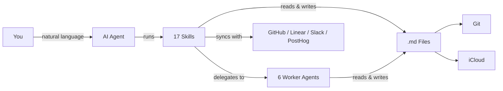
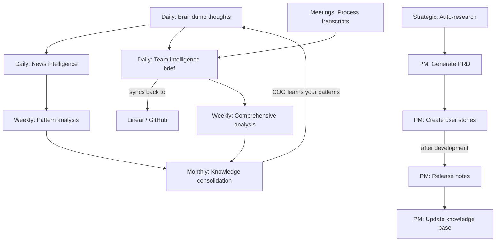

# Missing Repo Summary Source: huytieu/COG-second-brain

- URL: https://github.com/huytieu/COG-second-brain
- Local Path: core-platform/data/brain_assets/repos/github_stars_missing/huytieu__COG-second-brain
- Clone Status: cloned
- Language: Shell
- Stars: 419
- Topics: agentic, ai-agents, claude-code, cursor, garry-tan, gbrain, gstack, knowledge-management, obsidian, people-crm, productivity, second-brain, self-evolving, specialist-sessions, worker-agents
- Description: Self-evolving second brain with 17 AI skills, 6 worker agents, and people CRM — inspired by Garry Tan's gstack and gbrain. Works with Claude Code, Cursor, Kiro, Gemini CLI, Codex.

## Extracted README / Docs / Examples


# FILE: README.md

# COG: The Agentic Second Brain That Actually Self-Evolves

**Cognition + Obsidian + Git** — A self-evolving second brain powered by AI agents, markdown files, and version control. No database, no vendor lock-in — just `.md` files that think.

[Quick Start](#quick-start) | [Skills](#skills) | [Features](#features-at-a-glance) | [FAQ](#faq) | [SETUP.md](SETUP.md)

> Works with [Claude Code](https://claude.ai/download) &bull; [Cursor](https://cursor.com/) &bull; [Kiro](https://kiro.dev/) &bull; [Gemini CLI](https://github.com/google-gemini/gemini-cli) &bull; [OpenAI Codex](https://github.com/openai/codex) &bull; any AI that reads markdown
>
> Inspired by [Garry Tan's gstack](https://github.com/garrytan/gstack) and [gbrain](https://github.com/garrytan/gbrain)



> **New to COG?** Watch the [2-minute walkthrough](https://youtube.com/PLACEHOLDER) to see it in action.

## Quick Start

**1. Clone & enter the repo:**
```bash
git clone https://github.com/huytieu/COG-second-brain.git
cd COG-second-brain
```

**2. Run onboarding in your agent:**

| Agent | Command | How it finds skills |
|---|---|---|
| Claude Code | `code .` → "Run onboarding" | `.claude/skills/` |
| Cursor | Open folder → "Run onboarding" | `.cursor-plugin/` + `.cursorrules` |
| Kiro | Open folder → "setup COG" | `.kiro/powers/` |
| Gemini CLI | `gemini` → `/onboarding` | `GEMINI.md` + `.gemini/commands/` |
| OpenAI Codex | `codex` → "Run onboarding" | `AGENTS.md` |
| Other agents | Point at `AGENTS.md` → "Run onboarding" | `AGENTS.md` |

**Or install via [skills.sh](https://skills.sh):**
```bash
npx skills add huytieu/COG-second-brain
```

Done — COG is personalized and ready in ~2 minutes. See [SETUP.md](SETUP.md) for optional config (Git sync, iCloud, Obsidian Tasks, etc.).

## Agent Support Matrix

COG ships a **full Claude Code surface** plus **core native surfaces** for Kiro and Gemini CLI, with `AGENTS.md` as the universal fallback for Codex and other markdown-reading agents.

| Surface | Current support | Notes |
|---|---|---|
| Claude Code | 17 native skills + 6 worker agents | Full first-class surface |
| Cursor | Plugin manifest + rules | `.cursor-plugin/plugin.json` + `.cursorrules` |
| Kiro | 7 native powers | Core workflows today |
| Gemini CLI | 7 native commands | Core workflows today |
| `AGENTS.md` | 17 documented commands | Universal fallback for Codex and other agents |

Before publishing or updating framework files, run `./scripts/validate-agent-surface.sh` to catch drift between manifests, docs, and shipped files. See [docs/AGENT-SUPPORT.md](docs/AGENT-SUPPORT.md) for the detailed support matrix and contributor rules.

## Skills

### Core Skills (Personal Knowledge)

| Skill | What it does | Try saying... |
|---|---|---|
| **onboarding** | Personalize COG for your workflow (run first!) | "Run onboarding" |
| **braindump** | Capture raw thoughts with intelligent classification | "I need to braindump" |
| **daily-brief** | Verified news intelligence (7-day freshness) | "Give me my daily brief" |
| **url-dump** | Save URLs with auto-extracted insights | "Save this URL" |
| **weekly-checkin** | Cross-domain pattern analysis | "Weekly review" |
| **knowledge-consolidation** | Build frameworks from scattered notes | "Consolidate my knowledge" |
| **update-cog** | Update framework files without touching your content | "Update COG" |

### Team Intelligence Skills (for Product & Engineering Leads)

| Skill | What it does | Try saying... |
|---|---|---|
| **team-brief** | Cross-reference GitHub + Linear + Slack + PostHog into a daily team intelligence brief with two-way Linear sync-back | "Team brief" / "What did we ship?" |
| **meeting-transcript** | Process meeting recordings into structured decisions, action items, and team dynamics | "Process this meeting" |
| **comprehensive-analysis** | Deep 7-day analysis for weekly reviews, board prep, or strategic planning (~8-12 min) | "Weekly analysis" / "Board prep" |

### PM Workflow Skills (for Product Managers)

| Skill | What it does | Try saying... |
|---|---|---|
| **create-user-story** | Create user stories with duplicate checking across Linear, GitHub Issues, or Jira | "Create a user story for..." |
| **generate-prd** | Draft PRDs with approval gate before publishing to Confluence/Notion | "Generate a PRD for..." |
| **generate-release-notes** | Generate release notes from GitHub milestones, Linear cycles, or manual input | "Generate release notes for v2.1" |
| **export-open-issues** | Audit and export open issues from any tracker into a structured vault summary | "Export open issues" |
| **publish-to-confluence** | Publish any vault markdown file to Confluence | "Publish this to Confluence" |
| **update-knowledge-base** | Maintain product knowledge base from releases, features, and project changes | "Update the knowledge base with v2.1 changes" |

> **PM Workflow:** These skills form a complete product management lifecycle: **Research** (`/auto-research`) → **PRD** (`/generate-prd`) → **Stories** (`/create-user-story`) → Development → **Release Notes** (`/generate-release-notes`) → **Knowledge Base** (`/update-knowledge-base`). Use `/export-open-issues` for audits and `/publish-to-confluence` to share externally.

### Strategic Research

| Skill | What it does | Try saying... |
|---|---|---|
| **auto-research** | Deep strategic research engine — decomposes questions into parallel research threads with multiple agents | "Research the future of AI testing tools" |

### Worker Agents (Specialist Sessions)

COG uses a worker agent architecture inspired by [garrytan/gstack](https://github.com/garrytan/gstack) specialist sessions and [garrytan/gbrain](https://github.com/garrytan/gbrain) knowledge patterns. Workers handle data-heavy tasks cheaply (Sonnet) while the lead session does reasoning (Opus).

| Agent | What it does | Model |
|---|---|---|
| **worker-data-collector** | Structured extraction from GitHub, Slack, Jira, Linear | Sonnet |
| **worker-researcher** | Web research with source citations | Sonnet |
| **worker-file-ops** | Vault file operations, metadata, profiles | Sonnet |
| **worker-executor** | Pre-approved mutations (Jira, Linear, APIs) | Sonnet |
| **worker-publisher** | Publishing to Slack, Confluence, Notion | Sonnet |
| **brief-people-updater** | Batch-update people profiles from meetings/briefs | Sonnet |

> Workers write results to `/tmp/` files and return only a status + path. The lead reads the file for synthesis. This eliminates slow token generation in agent output.

### People CRM (Knowledge-Based Team Profiles)

Track the people you work with using progressive, evidence-based profiles in `05-knowledge/people/`. Profiles auto-escalate via tiered enrichment:

- **Tier 3 (Stub)** — 1 mention: name, role, one-line context
- **Tier 2 (Moderate)** — 3+ mentions: executive snapshot, working style, strengths
- **Tier 1 (Full)** — 8+ mentions or direct meeting: complete profile with all sections

Every observation includes a source citation with confidence level. See `05-knowledge/people/README.md` for details.

### Role Packs (Personalized Recommendations)

COG matches your role during onboarding to a **role pack** that prioritizes the most relevant skills and integrations for you. Available role packs: Product Manager, Engineering Lead, Engineer, Designer, Founder, Marketer — or create your own from the template.

> **New to team skills?** These require GitHub CLI (`gh`) and work best with Linear, Slack, and PostHog MCP integrations. They degrade gracefully — start with just GitHub and add integrations over time. See [SETUP.md](SETUP.md) for configuration.

## The Evolution Cycle



- **Daily capture** — braindump raw thoughts; COG classifies by domain and extracts action items
- **Daily intelligence** — personalized news briefings with verified, sourced news
- **Daily team brief** — cross-reference GitHub, Linear, Slack, PostHog, meetings into one brief with two-way sync
- **Meeting processing** — extract decisions, action items, and team dynamics from transcripts
- **Weekly reflection** — pattern analysis across all domains surfaces insights you'd miss
- **Weekly deep dive** — comprehensive analysis for board prep, retros, and strategic planning
- **Monthly synthesis** — scattered notes become consolidated frameworks and a knowledge base
- **Strategic research** — deep multi-agent investigation of strategic questions with real sources
- **PM workflow** — full product lifecycle from PRD to release notes to knowledge base updates

## Features at a Glance

| | | |
|---|---|---|
| **Self-Evolving** — Learns your patterns, auto-organizes content, builds frameworks | **Self-Healing** — Rename files or restructure; cross-references update automatically | **Verification-First** — Sources required, 7-day freshness, confidence levels on all analysis |
| **Privacy-First** — Local `.md` files, strict domain separation, no external servers | **Multi-Device** — iCloud sync to iPhone/iPad/Mac; Git for version history | **Obsidian Tasks** — `📅 YYYY-MM-DD` emoji format works with Tasks plugin dash

# FILE: docs/AGENT-SUPPORT.md

# COG Agent Support Matrix

COG intentionally ships **multiple agent surfaces**. They are not all identical.

This document is the packaging contract: it tells contributors and maintainers which surfaces are first-class today, which ones are partial, and what must stay in sync before publishing a release.

## Current Support Matrix

| Surface | Shipped format | Coverage | Status |
|---|---|---:|---|
| Claude Code | `.claude/skills/*/SKILL.md` | 17 skills | Full native surface |
| Universal agent docs | `AGENTS.md` | 17 commands | Full documented fallback |
| Kiro | `.kiro/powers/*/POWER.md` | 7 powers | Core workflows only |
| Gemini CLI | `.gemini/commands/*.toml` + `.gemini/skills/*.md` | 7 commands | Core workflows only |

## What “Full” vs “Core” Means

### Full surfaces
These surfaces should expose the complete public COG command set:
- `onboarding`
- `braindump`
- `daily-brief`
- `weekly-checkin`
- `knowledge-consolidation`
- `url-dump`
- `team-brief`
- `meeting-transcript`
- `comprehensive-analysis`
- `update-cog`
- `auto-research`
- `create-user-story`
- `generate-prd`
- `generate-release-notes`
- `export-open-issues`
- `publish-to-confluence`
- `update-knowledge-base`

Today, **Claude Code** and **`AGENTS.md`** are the full surfaces.

### Core surfaces
These surfaces intentionally cover the most common personal workflows first:
- `onboarding`
- `braindump`
- `daily-brief`
- `weekly-checkin`
- `knowledge-consolidation`
- `url-dump`
- `update-cog`

Today, **Kiro** and **Gemini CLI** are core surfaces.

## Packaging Rules

If you add, remove, rename, or materially change a public COG skill:

1. Update the **Claude skill** in `.claude/skills/`
2. Update **`AGENTS.md`** for the universal surface
3. Update **`.claude-plugin/plugin.json`** so marketplace metadata stays truthful
4. Update **README / SETUP / this file** if counts or support levels change
5. If the skill is supported natively in Kiro or Gemini, update those files too
6. Add new framework files to `FRAMEWORK_FILES` in `cog-update.sh`
7. Run `./scripts/validate-agent-surface.sh`

## Validation

Run this before tagging a release, opening a packaging PR, or after using `./cog-update.sh`:

```bash
./scripts/validate-agent-surface.sh
```

The validator checks:
- manifest JSON validity
- declared skill paths in `.claude-plugin/plugin.json`
- plugin skill count vs actual shipped Claude skills
- `AGENTS.md` coverage for all manifest skills
- common packaging drift like `agents.md` vs `AGENTS.md`

## Safe Update Workflow

Recommended maintainer flow:

```bash
./cog-update.sh --check
./cog-update.sh
./scripts/validate-agent-surface.sh
```

If you have local framework customizations, prefer interactive update mode so you can backup per-file before replacing anything.

