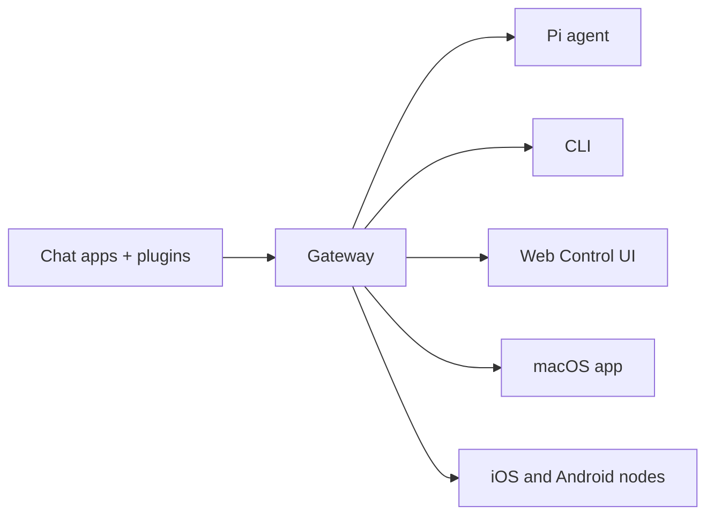

# Missing Repo Summary Source: openclaw/openclaw

- URL: https://github.com/openclaw/openclaw
- Local Path: core-platform/data/brain_assets/repos/github_stars_missing/openclaw__openclaw
- Clone Status: cloned
- Language: TypeScript
- Stars: 371302
- Topics: ai, assistant, crustacean, molty, openclaw, own-your-data, personal
- Description: Your own personal AI assistant. Any OS. Any Platform. The lobster way. 🦞 

## Extracted README / Docs / Examples


# FILE: README.md

# 🦞 OpenClaw — Personal AI Assistant

<p align="center">
    <picture>
        <source media="(prefers-color-scheme: light)" srcset="https://raw.githubusercontent.com/openclaw/openclaw/main/docs/assets/openclaw-logo-text-dark.svg">
        
    </picture>
</p>

<p align="center">
  <strong>EXFOLIATE! EXFOLIATE!</strong>
</p>

<p align="center">
  <a href="https://github.com/openclaw/openclaw/actions/workflows/ci.yml?branch=main"></a>
  <a href="https://github.com/openclaw/openclaw/releases"></a>
  <a href="https://discord.gg/clawd"></a>
  <a href="LICENSE"></a>
</p>

**OpenClaw** is a _personal AI assistant_ you run on your own devices.
It answers you on the channels you already use. It can speak and listen on macOS/iOS/Android, and can render a live Canvas you control. The Gateway is just the control plane — the product is the assistant.

If you want a personal, single-user assistant that feels local, fast, and always-on, this is it.

Supported channels include: WhatsApp, Telegram, Slack, Discord, Google Chat, Signal, iMessage, IRC, Microsoft Teams, Matrix, Feishu, LINE, Mattermost, Nextcloud Talk, Nostr, Synology Chat, Tlon, Twitch, Zalo, Zalo Personal, WeChat, QQ, WebChat.

[Website](https://openclaw.ai) · [Docs](https://docs.openclaw.ai) · [Vision](VISION.md) · [DeepWiki](https://deepwiki.com/openclaw/openclaw) · [Getting Started](https://docs.openclaw.ai/start/getting-started) · [Updating](https://docs.openclaw.ai/install/updating) · [Showcase](https://docs.openclaw.ai/start/showcase) · [FAQ](https://docs.openclaw.ai/help/faq) · [Onboarding](https://docs.openclaw.ai/start/wizard) · [Nix](https://github.com/openclaw/nix-openclaw) · [Docker](https://docs.openclaw.ai/install/docker) · [Discord](https://discord.gg/clawd)

New install? Start here: [Getting started](https://docs.openclaw.ai/start/getting-started)

Preferred setup: run `openclaw onboard` in your terminal.
OpenClaw Onboard guides you step by step through setting up the gateway, workspace, channels, and skills. It is the recommended CLI setup path and works on **macOS, Linux, and Windows (via WSL2; strongly recommended)**.
Works with npm, pnpm, or bun.

## Sponsors

<table>
  <tr>
    <td align="center" width="16.66%">
      <a href="https://openai.com/">
        <picture>
          <source media="(prefers-color-scheme: light)" srcset="https://raw.githubusercontent.com/openclaw/openclaw/main/docs/assets/sponsors/openai-light.svg">
          
        </picture>
      </a>
    </td>
    <td align="center" width="16.66%">
      <a href="https://github.com/">
        <picture>
          <source media="(prefers-color-scheme: light)" srcset="https://raw.githubusercontent.com/openclaw/openclaw/main/docs/assets/sponsors/github-light.svg">
          
        </picture>
      </a>
    </td>
    <td align="center" width="16.66%">
      <a href="https://www.nvidia.com/">
        <picture>
          <source media="(prefers-color-scheme: light)" srcset="https://raw.githubusercontent.com/openclaw/openclaw/main/docs/assets/sponsors/nvidia.svg">
          
        </picture>
      </a>
    </td>
    <td align="center" width="16.66%">
      <a href="https://vercel.com/">
        <picture>
          <source media="(prefers-color-scheme: light)" srcset="https://raw.githubusercontent.com/openclaw/openclaw/main/docs/assets/sponsors/vercel-light.svg">
          
        </picture>
      </a>
    </td>
    <td align="center" width="16.66%">
      <a href="https://blacksmith.sh/">
        <picture>
          <source media="(prefers-color-scheme: light)" srcset="https://raw.githubusercontent.com/openclaw/openclaw/main/docs/assets/sponsors/blacksmith-light.svg">
          
        </picture>
      </a>
    </td>
    <td align="center" width="16.66%">
      <a href="https://www.convex.dev/">
        <picture>
          <source media="(prefers-color-scheme: light)" srcset="https://raw.githubusercontent.com/openclaw/openclaw/main/docs/assets/sponsors/convex-light.svg">
          
        </picture>
      </a>
    </td>
  </tr>
</table>

**Subscriptions (OAuth):**

- **[OpenAI](https://openai.com/)** (ChatGPT/Codex)

Model note: while many providers and models are supported, prefer a current flagship model from the provider you trust and already use. See [Onboarding](https://docs.openclaw.ai/start/onboarding).

## Install (recommended)

Runtime: **Node 24 (recommended) or Node 22.16+**.

```bash
npm install -g openclaw@latest
# or: pnpm add -g openclaw@latest

openclaw onboard --install-daemon
```

OpenClaw Onboard installs the Gateway daemon (launchd/systemd user service) so it stays running.

## Quick start (TL;DR)

Runtime: **Node 24 (recommended) or Node 22.16+**.

Full beginner guide (auth, pairing, channels): [Getting started](https://docs.openclaw.ai/start/getting-started)

```bash
openclaw onboard --install-daemon

openclaw gateway --port 18789 --verbose

# Send a message
openclaw message send --target +1234567890 --message "Hello from OpenClaw"

# Talk to the assistant (optionally deliver back to any connected channel: WhatsApp/Telegram/Slack/Discord/Google Chat/Signal/iMessage/IRC/Microsoft Teams/Matrix/Feishu/LINE/Mattermost/Nextcloud Talk/Nostr/Synology Chat/Tlon/Twitch/Zalo/Zalo Personal/WeChat/QQ/WebChat)
openclaw agent --message "Ship checklist" --thinking high
```

Upgrading? [Updating guide](https://docs.openclaw.ai/install/updating) (and run `openclaw doctor`).

Models config + CLI: [Models](https://docs.openclaw.ai/concepts/models). Auth profile rotation + fallbacks: [Model failover](https://docs.openclaw.ai/concepts/model-failover).

## Security defaults (DM access)

OpenClaw connects to real messaging surfaces. Treat inbound DMs as **untrusted input**.

Full security guide: [Security](https://docs.openclaw.ai/gateway/security)

Default behavior on Telegram/WhatsApp/Signal/iMessage/Microsoft Teams/Discord/Google Chat/Slack:

- **DM pairing** (`dmPolicy="pairing"` / `channels.discord.dmPolicy="pairing"` / `channels.slack.dmPolicy="pairing"`; legacy: `channels.discord.dm.policy`, `channels.slack.dm.policy`): unknown senders receive a short pairing code and the bot does not process their message.
- Approve with: `openclaw pairing approve <channel> <code>` (then the sender is added to a local allowlist store).
- Public inbound DMs require an explicit opt-in: set `dmPolicy="open"` and include `"*"` in the channel allowlist (`allowFrom` / `channels.discord.allowFrom` / `channels.slack.allowFrom`; legacy: `channels.discord.dm.allowFrom`, `channels.slack.dm.allowFrom`).

Run `openclaw doctor` to surface risky/misconfigured DM policies.

## Highlights

- **[Local-first Gateway](https://docs.openclaw.ai/gateway)** — single control plane for sessions, channels, tools, and events.
- **[Multi-channel inbox](https://docs.openclaw.ai/channels)** — WhatsApp, Telegram, Slack, Discord, Google Chat, Signal, iMessage, IRC, Microsoft Teams, Matrix, Feishu, LINE, Mattermost, Nextcloud Talk, Nostr, Synology Chat, Tlon, Twitch, Zalo, Zalo Personal, WeChat, QQ, WebChat, macOS, iOS/Android.
- **[Multi-agent routing](https://docs.openclaw.ai/gateway/configuration)** — route inbound channels/accounts/peers to isolated agents (workspaces + per-agent sessions).
- **[Voice Wake](https://docs.openclaw.ai/nodes/voicewake) + [Talk Mode](https://docs.openclaw.ai/nodes/talk)** — wake words on macOS/iOS and continuous voice on Android (ElevenLabs + system TTS fallback).
- **[Live Canvas](https://docs.openclaw.ai/platforms/mac/canvas)** — agent-driven visual workspace with [A2UI](https://docs.openclaw.ai/platforms/mac/canvas#canvas-a2ui).
- **[First-class tools](https://docs.openclaw.ai/tools)** — browser, canvas, nodes, cron, sessions, and Discord/Slack actions.
- **[Companion apps](https://docs.openclaw.ai/platforms/macos)** — macOS menu bar app + iOS/Android [nodes](https://docs.openclaw.ai/nodes).
- **[Onboarding](https://docs.openclaw.ai/start/wizard) + [skills](https://docs.openclaw.ai/tools/skills)** — onboarding-driven setup with bundled/managed/workspace skills.

## Security model (important)

- Default: tools run on the host for the `main` session, so the agent has full access when it is just you.
- Group/channel safety: set `agents.defaults.sandbox.mode: "non-main"` to run non-`main` sessions inside sandboxes. Docker is the default sandbox backend; SSH and OpenShell backends are also available.
- Typical sandbox default: allow `bash`, `process`, `read`, `write`, `edit`, `sessions_list`, `sessions_history`, `sessions_send`, `sessions_spawn`; deny `browser`, `canvas`, `nodes`, `cron`, `discord`, `gate

# FILE: docs/date-time.md

---
summary: "Date and time handling across envelopes, prompts, tools, and connectors"
read_when:
  - You are changing how timestamps are shown to the model or users
  - You are debugging time formatting in messages or system prompt output
title: "Date and time"
---

OpenClaw defaults to **host-local time for transport timestamps** and **user timezone only in the system prompt**.
Provider timestamps are preserved so tools keep their native semantics (current time is available via `session_status`).

## Message envelopes (local by default)

Inbound messages are wrapped with a timestamp (minute precision):

```
[Provider ... 2026-01-05 16:26 PST] message text
```

This envelope timestamp is **host-local by default**, regardless of the provider timezone.

You can override this behavior:

```json5
{
  agents: {
    defaults: {
      envelopeTimezone: "local", // "utc" | "local" | "user" | IANA timezone
      envelopeTimestamp: "on", // "on" | "off"
      envelopeElapsed: "on", // "on" | "off"
    },
  },
}
```

- `envelopeTimezone: "utc"` uses UTC.
- `envelopeTimezone: "local"` uses the host timezone.
- `envelopeTimezone: "user"` uses `agents.defaults.userTimezone` (falls back to host timezone).
- Use an explicit IANA timezone (e.g., `"America/Chicago"`) for a fixed zone.
- `envelopeTimestamp: "off"` removes absolute timestamps from envelope headers.
- `envelopeElapsed: "off"` removes elapsed time suffixes (the `+2m` style).

### Examples

**Local (default):**

```
[WhatsApp +1555 2026-01-18 00:19 PST] hello
```

**User timezone:**

```
[WhatsApp +1555 2026-01-18 00:19 CST] hello
```

**Elapsed time enabled:**

```
[WhatsApp +1555 +30s 2026-01-18T05:19Z] follow-up
```

## System prompt: current date and time

If the user timezone is known, the system prompt includes a dedicated
**Current Date & Time** section with the **time zone only** (no clock/time format)
to keep prompt caching stable:

```
Time zone: America/Chicago
```

When the agent needs the current time, use the `session_status` tool; the status
card includes a timestamp line.

## System event lines (local by default)

Queued system events inserted into agent context are prefixed with a timestamp using the
same timezone selection as message envelopes (default: host-local).

```
System: [2026-01-12 12:19:17 PST] Model switched.
```

### Configure user timezone + format

```json5
{
  agents: {
    defaults: {
      userTimezone: "America/Chicago",
      timeFormat: "auto", // auto | 12 | 24
    },
  },
}
```

- `userTimezone` sets the **user-local timezone** for prompt context.
- `timeFormat` controls **12h/24h display** in the prompt. `auto` follows OS prefs.

## Time format detection (auto)

When `timeFormat: "auto"`, OpenClaw inspects the OS preference (macOS/Windows)
and falls back to locale formatting. The detected value is **cached per process**
to avoid repeated system calls.

## Tool payloads + connectors (raw provider time + normalized fields)

Channel tools return **provider-native timestamps** and add normalized fields for consistency:

- `timestampMs`: epoch milliseconds (UTC)
- `timestampUtc`: ISO 8601 UTC string

Raw provider fields are preserved so nothing is lost.

- Slack: epoch-like strings from the API
- Discord: UTC ISO timestamps
- Telegram/WhatsApp: provider-specific numeric/ISO timestamps

If you need local time, convert it downstream using the known timezone.

## Related docs

- [System Prompt](/concepts/system-prompt)
- [Timezones](/concepts/timezone)
- [Messages](/concepts/messages)


# FILE: docs/network.md

---
summary: "Network hub: gateway surfaces, pairing, discovery, and security"
read_when:
  - You need the network architecture + security overview
  - You are debugging local vs tailnet access or pairing
  - You want the canonical list of networking docs
title: "Network"
---

This hub links the core docs for how OpenClaw connects, pairs, and secures
devices across localhost, LAN, and tailnet.

## Core model

Most operations flow through the Gateway (`openclaw gateway`), a single long-running process that owns channel connections and the WebSocket control plane.

- **Loopback first**: the Gateway WS defaults to `ws://127.0.0.1:18789`.
  Non-loopback binds require a valid gateway auth path: shared-secret
  token/password auth, or a correctly configured non-loopback
  `trusted-proxy` deployment.
- **One Gateway per host** is recommended. For isolation, run multiple gateways with isolated profiles and ports ([Multiple Gateways](/gateway/multiple-gateways)).
- **Canvas host** is served on the same port as the Gateway (`/__openclaw__/canvas/`, `/__openclaw__/a2ui/`), protected by Gateway auth when bound beyond loopback.
- **Remote access** is typically SSH tunnel or Tailscale VPN ([Remote Access](/gateway/remote)).

Key references:

- [Gateway architecture](/concepts/architecture)
- [Gateway protocol](/gateway/protocol)
- [Gateway runbook](/gateway)
- [Web surfaces + bind modes](/web)

## Pairing + identity

- [Pairing overview (DM + nodes)](/channels/pairing)
- [Gateway-owned node pairing](/gateway/pairing)
- [Devices CLI (pairing + token rotation)](/cli/devices)
- [Pairing CLI (DM approvals)](/cli/pairing)

Local trust:

- Direct local loopback connects can be auto-approved for pairing to keep
  same-host UX smooth.
- OpenClaw also has a narrow backend/container-local self-connect path for
  trusted shared-secret helper flows.
- Tailnet and LAN clients, including same-host tailnet binds, still require
  explicit pairing approval.

## Discovery + transports

- [Discovery and transports](/gateway/discovery)
- [Bonjour / mDNS](/gateway/bonjour)
- [Remote access (SSH)](/gateway/remote)
- [Tailscale](/gateway/tailscale)

## Nodes + transports

- [Nodes overview](/nodes)
- [Bridge protocol (legacy nodes, historical)](/gateway/bridge-protocol)
- [Node runbook: iOS](/platforms/ios)
- [Node runbook: Android](/platforms/android)

## Security

- [Security overview](/gateway/security)
- [Gateway config reference](/gateway/configuration)
- [Troubleshooting](/gateway/troubleshooting)
- [Doctor](/gateway/doctor)

## Related

- [Gateway runbook](/gateway)
- [Remote access](/gateway/remote)


# FILE: docs/prose.md

---
summary: "OpenProse: .prose workflows, slash commands, and state in OpenClaw"
read_when:
  - You want to run or write .prose workflows
  - You want to enable the OpenProse plugin
  - You need to understand state storage
title: "OpenProse"
---

OpenProse is a portable, markdown-first workflow format for orchestrating AI sessions. In OpenClaw it ships as a plugin that installs an OpenProse skill pack plus a `/prose` slash command. Programs live in `.prose` files and can spawn multiple sub-agents with explicit control flow.

Official site: [https://www.prose.md](https://www.prose.md)

## What it can do

- Multi-agent research + synthesis with explicit parallelism.
- Repeatable approval-safe workflows (code review, incident triage, content pipelines).
- Reusable `.prose` programs you can run across supported agent runtimes.

## Install + enable

Bundled plugins are disabled by default. Enable OpenProse:

```bash
openclaw plugins enable open-prose
```

Restart the Gateway after enabling the plugin.

Dev/local checkout: `openclaw plugins install ./path/to/local/open-prose-plugin`

Related docs: [Plugins](/tools/plugin), [Plugin manifest](/plugins/manifest), [Skills](/tools/skills).

## Slash command

OpenProse registers `/prose` as a user-invocable skill command. It routes to the OpenProse VM instructions and uses OpenClaw tools under the hood.

Common commands:

```
/prose help
/prose run <file.prose>
/prose run <handle/slug>
/prose run <https://example.com/file.prose>
/prose compile <file.prose>
/prose examples
/prose update
```

## Example: a simple `.prose` file

```prose
# Research + synthesis with two agents running in parallel.

input topic: "What should we research?"

agent researcher:
  model: sonnet
  prompt: "You research thoroughly and cite sources."

agent writer:
  model: opus
  prompt: "You write a concise summary."

parallel:
  findings = session: researcher
    prompt: "Research {topic}."
  draft = session: writer
    prompt: "Summarize {topic}."

session "Merge the findings + draft into a final answer."
context: { findings, draft }
```

## File locations

OpenProse keeps state under `.prose/` in your workspace:

```
.prose/
├── .env
├── runs/
│   └── {YYYYMMDD}-{HHMMSS}-{random}/
│       ├── program.prose
│       ├── state.md
│       ├── bindings/
│       └── agents/
└── agents/
```

User-level persistent agents live at:

```
~/.prose/agents/
```

## State modes

OpenProse supports multiple state backends:

- **filesystem** (default): `.prose/runs/...`
- **in-context**: transient, for small programs
- **sqlite** (experimental): requires `sqlite3` binary
- **postgres** (experimental): requires `psql` and a connection string

Notes:

- sqlite/postgres are opt-in and experimental.
- postgres credentials flow into subagent logs; use a dedicated, least-privileged DB.

## Remote programs

`/prose run <handle/slug>` resolves to `https://p.prose.md/<handle>/<slug>`.
Direct URLs are fetched as-is. This uses the `web_fetch` tool (or `exec` for POST).

## OpenClaw runtime mapping

OpenProse programs map to OpenClaw primitives:

| OpenProse concept         | OpenClaw tool    |
| ------------------------- | ---------------- |
| Spawn session / Task tool | `sessions_spawn` |
| File read/write           | `read` / `write` |
| Web fetch                 | `web_fetch`      |

If your tool allowlist blocks these tools, OpenProse programs will fail. See [Skills config](/tools/skills-config).

## Security + approvals

Treat `.prose` files like code. Review before running. Use OpenClaw tool allowlists and approval gates to control side effects.

For deterministic, approval-gated workflows, compare with [Lobster](/tools/lobster).

## Related

- [Text-to-speech](/tools/tts)
- [Markdown formatting](/concepts/markdown-formatting)


# FILE: docs/vps.md

---
summary: "Run OpenClaw on a Linux server or cloud VPS — provider picker, architecture, and tuning"
read_when:
  - You want to run the Gateway on a Linux server or cloud VPS
  - You need a quick map of hosting guides
  - You want generic Linux server tuning for OpenClaw
title: "Linux server"
sidebarTitle: "Linux Server"
---

Run the OpenClaw Gateway on any Linux server or cloud VPS. This page helps you
pick a provider, explains how cloud deployments work, and covers generic Linux
tuning that applies everywhere.

## Pick a provider

<CardGroup cols={2}>
  <Card title="Railway" href="/install/railway">One-click, browser setup</Card>
  <Card title="Northflank" href="/install/northflank">One-click, browser setup</Card>
  <Card title="DigitalOcean" href="/install/digitalocean">Simple paid VPS</Card>
  <Card title="Oracle Cloud" href="/install/oracle">Always Free ARM tier</Card>
  <Card title="Fly.io" href="/install/fly">Fly Machines</Card>
  <Card title="Hetzner" href="/install/hetzner">Docker on Hetzner VPS</Card>
  <Card title="Hostinger" href="/install/hostinger">VPS with one-click setup</Card>
  <Card title="GCP" href="/install/gcp">Compute Engine</Card>
  <Card title="Azure" href="/install/azure">Linux VM</Card>
  <Card title="exe.dev" href="/install/exe-dev">VM with HTTPS proxy</Card>
  <Card title="Raspberry Pi" href="/install/raspberry-pi">ARM self-hosted</Card>
</CardGroup>

**AWS (EC2 / Lightsail / free tier)** also works well.
A community video walkthrough is available at
[x.com/techfrenAJ/status/2014934471095812547](https://x.com/techfrenAJ/status/2014934471095812547)
(community resource -- may become unavailable).

## How cloud setups work

- The **Gateway runs on the VPS** and owns state + workspace.
- You connect from your laptop or phone via the **Control UI** or **Tailscale/SSH**.
- Treat the VPS as the source of truth and **back up** the state + workspace regularly.
- Secure default: keep the Gateway on loopback and access it via SSH tunnel or Tailscale Serve.
  If you bind to `lan` or `tailnet`, require `gateway.auth.token` or `gateway.auth.password`.

Related pages: [Gateway remote access](/gateway/remote), [Platforms hub](/platforms).

## Harden admin access first

Before you install OpenClaw on a public VPS, decide how you want to administer
the box itself.

- If you want Tailnet-only admin access, install Tailscale first, join the VPS
  to your tailnet, verify a second SSH session over the Tailscale IP or
  MagicDNS name, then restrict public SSH.
- If you are not using Tailscale, apply the equivalent hardening for your SSH
  path before exposing more services.
- This is separate from Gateway access. You can still keep OpenClaw bound to
  loopback and use an SSH tunnel or Tailscale Serve for the dashboard.

Tailscale-specific Gateway options live in [Tailscale](/gateway/tailscale).

## Shared company agent on a VPS

Running a single agent for a team is a valid setup when every user is in the same trust boundary and the agent is business-only.

- Keep it on a dedicated runtime (VPS/VM/container + dedicated OS user/accounts).
- Do not sign that runtime into personal Apple/Google accounts or personal browser/password-manager profiles.
- If users are adversarial to each other, split by gateway/host/OS user.

Security model details: [Security](/gateway/security).

## Using nodes with a VPS

You can keep the Gateway in the cloud and pair **nodes** on your local devices
(Mac/iOS/Android/headless). Nodes provide local screen/camera/canvas and `system.run`
capabilities while the Gateway stays in the cloud.

Docs: [Nodes](/nodes), [Nodes CLI](/cli/nodes).

## Startup tuning for small VMs and ARM hosts

If CLI commands feel slow on low-power VMs (or ARM hosts), enable Node's module compile cache:

```bash
grep -q 'NODE_COMPILE_CACHE=/var/tmp/openclaw-compile-cache' ~/.bashrc || cat >> ~/.bashrc <<'EOF'
export NODE_COMPILE_CACHE=/var/tmp/openclaw-compile-cache
mkdir -p /var/tmp/openclaw-compile-cache
export OPENCLAW_NO_RESPAWN=1
EOF
source ~/.bashrc
```

- `NODE_COMPILE_CACHE` improves repeated command startup times.
- `OPENCLAW_NO_RESPAWN=1` avoids extra startup overhead from a self-respawn path.
- First command run warms the cache; subsequent runs are faster.
- For Raspberry Pi specifics, see [Raspberry Pi](/install/raspberry-pi).

### systemd tuning checklist (optional)

For VM hosts using `systemd`, consider:

- Add service env for a stable startup path:
  - `OPENCLAW_NO_RESPAWN=1`
  - `NODE_COMPILE_CACHE=/var/tmp/openclaw-compile-cache`
- Keep restart behavior explicit:
  - `Restart=always`
  - `RestartSec=2`
  - `TimeoutStartSec=90`
- Prefer SSD-backed disks for state/cache paths to reduce random-I/O cold-start penalties.

For the standard `openclaw onboard --install-daemon` path, edit the user unit:

```bash
systemctl --user edit openclaw-gateway.service
```

```ini
[Service]
Environment=OPENCLAW_NO_RESPAWN=1
Environment=NODE_COMPILE_CACHE=/var/tmp/openclaw-compile-cache
Restart=always
RestartSec=2
TimeoutStartSec=90
```

If you deliberately installed a system unit instead, edit
`openclaw-gateway.service` via `sudo systemctl edit openclaw-gateway.service`.

How `Restart=` policies help automated recovery:
[systemd can automate service recovery](https://www.redhat.com/en/blog/systemd-automate-recovery).

For Linux OOM behavior, child process victim selection, and `exit 137`
diagnostics, see [Linux memory pressure and OOM kills](/platforms/linux#memory-pressure-and-oom-kills).

## Related

- [Install overview](/install)
- [DigitalOcean](/install/digitalocean)
- [Fly.io](/install/fly)
- [Hetzner](/install/hetzner)


# FILE: docs/auth-credential-semantics.md

---
summary: "Canonical credential eligibility and resolution semantics for auth profiles"
title: "Auth credential semantics"
read_when:
  - Working on auth profile resolution or credential routing
  - Debugging model auth failures or profile order
---

This document defines the canonical credential eligibility and resolution semantics used across:

- `resolveAuthProfileOrder`
- `resolveApiKeyForProfile`
- `models status --probe`
- `doctor-auth`

The goal is to keep selection-time and runtime behavior aligned.

## Stable probe reason codes

- `ok`
- `excluded_by_auth_order`
- `missing_credential`
- `invalid_expires`
- `expired`
- `unresolved_ref`
- `no_model`

## Token credentials

Token credentials (`type: "token"`) support inline `token` and/or `tokenRef`.

### Eligibility rules

1. A token profile is ineligible when both `token` and `tokenRef` are absent.
2. `expires` is optional.
3. If `expires` is present, it must be a finite number greater than `0`.
4. If `expires` is invalid (`NaN`, `0`, negative, non-finite, or wrong type), the profile is ineligible with `invalid_expires`.
5. If `expires` is in the past, the profile is ineligible with `expired`.
6. `tokenRef` does not bypass `expires` validation.

### Resolution rules

1. Resolver semantics match eligibility semantics for `expires`.
2. For eligible profiles, token material may be resolved from inline value or `tokenRef`.
3. Unresolvable refs produce `unresolved_ref` in `models status --probe` output.

## Agent copy portability

Agent auth inheritance is read-through. When an agent has no local profile, it
can resolve profiles from the default/main agent store at runtime without
copying secret material into its own `auth-profiles.json`.

Explicit copy flows, such as `openclaw agents add`, use this portability policy:

- `api_key` profiles are portable unless `copyToAgents: false`.
- `token` profiles are portable unless `copyToAgents: false`.
- `oauth` profiles are not portable by default because refresh tokens can be
  single-use or rotation-sensitive.
- Provider-owned OAuth flows may opt in with `copyToAgents: true` only when
  copying refresh material across agents is known safe.

Non-portable profiles remain available through read-through inheritance unless
the target agent signs in separately and creates its own local profile.

## Config-only auth routes

`auth.profiles` entries with `mode: "aws-sdk"` are routing metadata, not stored
credentials. They are valid when the target provider uses
`models.providers.<id>.auth: "aws-sdk"` or the built-in Amazon Bedrock default
AWS SDK route. These profile ids may appear in `auth.order` and session
overrides even when no matching entry exists in `auth-profiles.json`.

Do not write `type: "aws-sdk"` into `auth-profiles.json`. If a legacy install
has such a marker, `openclaw doctor --fix` moves it to `auth.profiles` and
removes the marker from the credential store.

## Explicit auth order filtering

- When `auth.order.<provider>` or the auth-store order override is set for a
  provider, `models status --probe` only probes profile ids that remain in the
  resolved auth order for that provider.
- A stored profile for that provider that is omitted from the explicit order is
  not silently tried later. Probe output reports it with
  `reasonCode: excluded_by_auth_order` and the detail
  `Excluded by auth.order for this provider.`

## Probe target resolution

- Probe targets can come from auth profiles, environment credentials, or
  `models.json`.
- If a provider has credentials but OpenClaw cannot resolve a probeable model
  candidate for it, `models status --probe` reports `status: no_model` with
  `reasonCode: no_model`.

## External CLI credential discovery

- Runtime-only credentials owned by external CLIs are discovered only when the
  provider, runtime, or auth profile is in scope for the current operation, or
  when a stored local profile for that external source already exists.
- Auth-store callers should choose an explicit external-CLI discovery mode:
  `none` for persisted/plugin auth only, `existing` for refreshing already
  stored external CLI profiles, or `scoped` for a concrete provider/profile set.
- Read-only/status paths pass `allowKeychainPrompt: false`; they use file-backed
  external CLI credentials only and do not read or reuse macOS Keychain results.

## OAuth SecretRef Policy Guard

- SecretRef input is for static credentials only.
- If a profile credential is `type: "oauth"`, SecretRef objects are not supported for that profile credential material.
- If `auth.profiles.<id>.mode` is `"oauth"`, SecretRef-backed `keyRef`/`tokenRef` input for that profile is rejected.
- Violations are hard failures in startup/reload auth resolution paths.

## Legacy-Compatible Messaging

For script compatibility, probe errors keep this first line unchanged:

`Auth profile credentials are missing or expired.`

Human-friendly detail and stable reason codes may be added on subsequent lines.

## Related

- [Secrets management](/gateway/secrets)
- [Auth storage](/concepts/oauth)


# FILE: docs/pi-dev.md

---
summary: "Developer workflow for Pi integration: build, test, and live validation"
title: "Pi development workflow"
read_when:
  - Working on Pi integration code or tests
  - Running Pi-specific lint, typecheck, and live test flows
---

A sane workflow for working on the Pi integration in OpenClaw.

## Type checking and linting

- Default local gate: `pnpm check`
- Build gate: `pnpm build` when the change can affect build output, packaging, or lazy-loading/module boundaries
- Full landing gate for Pi-heavy changes: `pnpm check && pnpm test`

## Running Pi tests

Run the Pi-focused test set directly with Vitest:

```bash
pnpm test \
  "src/agents/pi-*.test.ts" \
  "src/agents/pi-embedded-*.test.ts" \
  "src/agents/pi-tools*.test.ts" \
  "src/agents/pi-settings.test.ts" \
  "src/agents/pi-tool-definition-adapter*.test.ts" \
  "src/agents/pi-hooks/**/*.test.ts"
```

To include the live provider exercise:

```bash
OPENCLAW_LIVE_TEST=1 pnpm test src/agents/pi-embedded-runner-extraparams.live.test.ts
```

This covers the main Pi unit suites:

- `src/agents/pi-*.test.ts`
- `src/agents/pi-embedded-*.test.ts`
- `src/agents/pi-tools*.test.ts`
- `src/agents/pi-settings.test.ts`
- `src/agents/pi-tool-definition-adapter.test.ts`
- `src/agents/pi-hooks/*.test.ts`

## Manual testing

Recommended flow:

- Run the gateway in dev mode:
  - `pnpm gateway:dev`
- Trigger the agent directly:
  - `pnpm openclaw agent --message "Hello" --thinking low`
- Use the TUI for interactive debugging:
  - `pnpm tui`

For tool call behavior, prompt for a `read` or `exec` action so you can see tool streaming and payload handling.

## Clean slate reset

State lives under the OpenClaw state directory. Default is `~/.openclaw`. If `OPENCLAW_STATE_DIR` is set, use that directory instead.

To reset everything:

- `openclaw.json` for config
- `agents/<agentId>/agent/auth-profiles.json` for model auth profiles (API keys + OAuth)
- `credentials/` for provider/channel state that still lives outside the auth profile store
- `agents/<agentId>/sessions/` for agent session history
- `agents/<agentId>/sessions/sessions.json` for the session index
- `sessions/` if legacy paths exist
- `workspace/` if you want a blank workspace

If you only want to reset sessions, delete `agents/<agentId>/sessions/` for that agent. If you want to keep auth, leave `agents/<agentId>/agent/auth-profiles.json` and any provider state under `credentials/` in place.

## References

- [Testing](/help/testing)
- [Getting Started](/start/getting-started)

## Related

- [Pi integration architecture](/pi)


# FILE: docs/index.md

---
summary: "OpenClaw is a multi-channel gateway for AI agents that runs on any OS."
read_when:
  - Introducing OpenClaw to newcomers
title: "OpenClaw"
---

# OpenClaw 🦞

<p align="center">
    
    
</p>

> _"EXFOLIATE! EXFOLIATE!"_ — A space lobster, probably

<p align="center">
  <strong>Any OS gateway for AI agents across Discord, Google Chat, iMessage, Matrix, Microsoft Teams, Signal, Slack, Telegram, WhatsApp, Zalo, and more.</strong><br />
  Send a message, get an agent response from your pocket. Run one Gateway across built-in channels, bundled channel plugins, WebChat, and mobile nodes.
</p>

<Columns>
  <Card title="Get Started" href="/start/getting-started" icon="rocket">
    Install OpenClaw and bring up the Gateway in minutes.
  </Card>
  <Card title="Run Onboarding" href="/start/wizard" icon="sparkles">
    Guided setup with `openclaw onboard` and pairing flows.
  </Card>
  <Card title="Open the Control UI" href="/web/control-ui" icon="layout-dashboard">
    Launch the browser dashboard for chat, config, and sessions.
  </Card>
</Columns>

## What is OpenClaw?

OpenClaw is a **self-hosted gateway** that connects your favorite chat apps and channel surfaces — built-in channels plus bundled or external channel plugins such as Discord, Google Chat, iMessage, Matrix, Microsoft Teams, Signal, Slack, Telegram, WhatsApp, Zalo, and more — to AI coding agents like Pi. You run a single Gateway process on your own machine (or a server), and it becomes the bridge between your messaging apps and an always-available AI assistant.

**Who is it for?** Developers and power users who want a personal AI assistant they can message from anywhere — without giving up control of their data or relying on a hosted service.

**What makes it different?**

- **Self-hosted**: runs on your hardware, your rules
- **Multi-channel**: one Gateway serves built-in channels plus bundled or external channel plugins simultaneously
- **Agent-native**: built for coding agents with tool use, sessions, memory, and multi-agent routing
- **Open source**: MIT licensed, community-driven

**What do you need?** Node 24 (recommended), or Node 22 LTS (`22.16+`) for compatibility, an API key from your chosen provider, and 5 minutes. For best quality and security, use the strongest latest-generation model available.

## How it works



The Gateway is the single source of truth for sessions, routing, and channel connections.

## Key capabilities

<Columns>
  <Card title="Multi-channel gateway" icon="network" href="/channels">
    Discord, iMessage, Signal, Slack, Telegram, WhatsApp, WebChat, and more with a single Gateway process.
  </Card>
  <Card title="Plugin channels" icon="plug" href="/tools/plugin">
    Bundled plugins add Matrix, Nostr, Twitch, Zalo, and more in normal current releases.
  </Card>
  <Card title="Multi-agent routing" icon="route" href="/concepts/multi-agent">
    Isolated sessions per agent, workspace, or sender.
  </Card>
  <Card title="Media support" icon="image" href="/nodes/images">
    Send and receive images, audio, and documents.
  </Card>
  <Card title="Web Control UI" icon="monitor" href="/web/control-ui">
    Browser dashboard for chat, config, sessions, and nodes.
  </Card>
  <Card title="Mobile nodes" icon="smartphone" href="/nodes">
    Pair iOS and Android nodes for Canvas, camera, and voice-enabled workflows.
  </Card>
</Columns>

## Quick start

<Steps>
  <Step title="Install OpenClaw">
    ```bash
    npm install -g openclaw@latest
    ```
  </Step>
  <Step title="Onboard and install the service">
    ```bash
    openclaw onboard --install-daemon
    ```
  </Step>
  <Step title="Chat">
    Open the Control UI in your browser and send a message:

    ```bash
    openclaw dashboard
    ```

    Or connect a channel ([Telegram](/channels/telegram) is fastest) and chat from your phone.

  </Step>
</Steps>

Need the full install and dev setup? See [Getting Started](/start/getting-started).

## Dashboard

Open the browser Control UI after the Gateway starts.

- Local default: [http://127.0.0.1:18789/](http://127.0.0.1:18789/)
- Remote access: [Web surfaces](/web) and [Tailscale](/gateway/tailscale)

<p align="center">
  
</p>

## Configuration (optional)

Config lives at `~/.openclaw/openclaw.json`.

- If you **do nothing**, OpenClaw uses the bundled Pi binary in RPC mode with per-sender sessions.
- If you want to lock it down, start with `channels.whatsapp.allowFrom` and (for groups) mention rules.

Example:

```json5
{
  channels: {
    whatsapp: {
      allowFrom: ["+15555550123"],
      groups: { "*": { requireMention: true } },
    },
  },
  messages: { groupChat: { mentionPatterns: ["@openclaw"] } },
}
```

## Start here

<Columns>
  <Card title="Docs hubs" href="/start/hubs" icon="book-open">
    All docs and guides, organized by use case.
  </Card>
  <Card title="Configuration" href="/gateway/configuration" icon="settings">
    Core Gateway settings, tokens, and provider config.
  </Card>
  <Card title="Remote access" href="/gateway/remote" icon="globe">
    SSH and tailnet access patterns.
  </Card>
  <Card title="Channels" href="/channels/telegram" icon="message-square">
    Channel-specific setup for Feishu, Microsoft Teams, WhatsApp, Telegram, Discord, and more.
  </Card>
  <Card title="Nodes" href="/nodes" icon="smartphone">
    iOS and Android nodes with pairing, Canvas, camera, and device actions.
  </Card>
  <Card title="Help" href="/help" icon="life-buoy">
    Com

# FILE: docs/logging.md

---
summary: "File logs, console output, CLI tailing, and the Control UI Logs tab"
read_when:
  - You need a beginner-friendly overview of OpenClaw logging
  - You want to configure log levels, formats, or redaction
  - You are troubleshooting and need to find logs quickly
title: "Logging"
---

OpenClaw has two main log surfaces:

- **File logs** (JSON lines) written by the Gateway.
- **Console output** shown in terminals and the Gateway Debug UI.

The Control UI **Logs** tab tails the gateway file log. This page explains where
logs live, how to read them, and how to configure log levels and formats.

## Where logs live

By default, the Gateway writes a rolling log file under:

`/tmp/openclaw/openclaw-YYYY-MM-DD.log`

The date uses the gateway host's local timezone.

Each file rotates when it reaches `logging.maxFileBytes` (default: 100 MB).
OpenClaw keeps up to five numbered archives beside the active file, such as
`openclaw-YYYY-MM-DD.1.log`, and keeps writing to a fresh active log instead of
suppressing diagnostics.

You can override this in `~/.openclaw/openclaw.json`:

```json
{
  "logging": {
    "file": "/path/to/openclaw.log"
  }
}
```

## How to read logs

### CLI: live tail (recommended)

Use the CLI to tail the gateway log file via RPC:

```bash
openclaw logs --follow
```

Useful current options:

- `--local-time`: render timestamps in your local timezone
- `--url <url>` / `--token <token>` / `--timeout <ms>`: standard Gateway RPC flags
- `--expect-final`: agent-backed RPC final-response wait flag (accepted here via the shared client layer)

Output modes:

- **TTY sessions**: pretty, colorized, structured log lines.
- **Non-TTY sessions**: plain text.
- `--json`: line-delimited JSON (one log event per line).
- `--plain`: force plain text in TTY sessions.
- `--no-color`: disable ANSI colors.

When you pass an explicit `--url`, the CLI does not auto-apply config or
environment credentials; include `--token` yourself if the target Gateway
requires auth.

In JSON mode, the CLI emits `type`-tagged objects:

- `meta`: stream metadata (file, cursor, size)
- `log`: parsed log entry
- `notice`: truncation / rotation hints
- `raw`: unparsed log line

If the implicit local loopback Gateway asks for pairing, closes during connect,
or times out before `logs.tail` answers, `openclaw logs` falls back to the
configured Gateway file log automatically. Explicit `--url` targets do not use
this fallback.

If the Gateway is unreachable, the CLI prints a short hint to run:

```bash
openclaw doctor
```

### Control UI (web)

The Control UI's **Logs** tab tails the same file using `logs.tail`.
See [Control UI](/web/control-ui) for how to open it.

### Channel-only logs

To filter channel activity (WhatsApp/Telegram/etc), use:

```bash
openclaw channels logs --channel whatsapp
```

## Log formats

### File logs (JSONL)

Each line in the log file is a JSON object. The CLI and Control UI parse these
entries to render structured output (time, level, subsystem, message).

File-log JSONL records also include machine-filterable top-level fields when
available:

- `hostname`: gateway host name.
- `message`: flattened log message text for full-text search.
- `agent_id`: active agent id when the log call carries agent context.
- `session_id`: active session id/key when the log call carries session context.
- `channel`: active channel when the log call carries channel context.

OpenClaw preserves the original structured log arguments alongside these fields
so existing parsers that read numbered tslog argument keys keep working.

Talk, realtime voice, and managed-room activity emits bounded lifecycle log
records through this same file-log pipeline. These records include event type,
mode, transport, provider, and size/timing measurements when available, but omit
transcript text, audio payloads, turn ids, call ids, and provider item ids.

### Console output

Console logs are **TTY-aware** and formatted for readability:

- Subsystem prefixes (e.g. `gateway/channels/whatsapp`)
- Level coloring (info/warn/error)
- Optional compact or JSON mode

Console formatting is controlled by `logging.consoleStyle`.

### Gateway WebSocket logs

`openclaw gateway` also has WebSocket protocol logging for RPC traffic:

- normal mode: only interesting results (errors, parse errors, slow calls)
- `--verbose`: all request/response traffic
- `--ws-log auto|compact|full`: pick the verbose rendering style
- `--compact`: alias for `--ws-log compact`

Examples:

```bash
openclaw gateway
openclaw gateway --verbose --ws-log compact
openclaw gateway --verbose --ws-log full
```

## Configuring logging

All logging configuration lives under `logging` in `~/.openclaw/openclaw.json`.

```json
{
  "logging": {
    "level": "info",
    "file": "/tmp/openclaw/openclaw-YYYY-MM-DD.log",
    "consoleLevel": "info",
    "consoleStyle": "pretty",
    "redactSensitive": "tools",
    "redactPatterns": ["sk-.*"]
  }
}
```

### Log levels

- `logging.level`: **file logs** (JSONL) level.
- `logging.consoleLevel`: **console** verbosity level.

You can override both via the **`OPENCLAW_LOG_LEVEL`** environment variable (e.g. `OPENCLAW_LOG_LEVEL=debug`). The env var takes precedence over the config file, so you can raise verbosity for a single run without editing `openclaw.json`. You can also pass the global CLI option **`--log-level <level>`** (for example, `openclaw --log-level debug gateway run`), which overrides the environment variable for that command.

`--verbose` only affects console output and WS log verbosity; it does not change
file log levels.

### Targeted model transport diagnostics

When debugging provider calls, use targeted environment flags instead of raising
all logs to `debug`:

```bash
OPENCLAW_DEBUG_MODEL_TRANSPORT=1 openclaw gateway
OPENCLAW_DEBUG_MODEL_PAYLOAD=tools OPENCLAW_DEBUG_SSE=events openclaw gateway
```

Available flags:

- `OPENCLAW_DEBUG_MODEL_TRANSPORT=1`: emit request start, fetch response, SDK
  headers, first streaming event

# FILE: docs/tts.md

---
summary: "Redirect to /tools/tts"
title: "Text-to-speech"
redirect: /tools/tts
---

This page has moved to [Text-to-Speech](/tools/tts).

## Related

- [Text-to-speech](/tools/tts)


# FILE: docs/perplexity.md

---
summary: "Redirect to /tools/perplexity-search"
title: "Perplexity search"
redirect: /tools/perplexity-search
---

This page has moved to [Perplexity search](/tools/perplexity-search).

## Related

- [Web tools](/tools/web)


# FILE: docs/AGENTS.md

# Docs Guide

This directory owns docs authoring, Mintlify link rules, and docs i18n policy.

## Mintlify Rules

- Docs are hosted on Mintlify (`https://docs.openclaw.ai`).
- Internal doc links in `docs/**/*.md` must stay root-relative with no `.md` or `.mdx` suffix (example: `[Config](/gateway/configuration)`).
- Section cross-references should use anchors on root-relative paths (example: `[Hooks](/gateway/configuration-reference#hooks)`).
- Doc headings should avoid em dashes and apostrophes because Mintlify anchor generation is brittle there.
- README and other GitHub-rendered docs should keep absolute docs URLs so links work outside Mintlify.
- Docs content must stay generic: no personal device names, hostnames, or local paths; use placeholders like `user@gateway-host`.

## Docs Content Rules

- For docs, UI copy, and picker lists, order services/providers alphabetically unless the section is explicitly describing runtime order or auto-detection order.
- Keep bundled plugin naming consistent with the repo-wide plugin terminology rules in the root `AGENTS.md`.

## Internal Docs

- Long-lived private operator docs belong in `~/Projects/manager/docs/`.
- Repo-local internal scratch/mirror docs may live under ignored `docs/internal/`.
- Never add `docs/internal/**` pages to `docs/docs.json` navigation or link them from public docs.
- `scripts/docs-sync-publish.mjs` excludes and prunes `docs/internal/**` from the public `openclaw/docs` publish repo if a page is force-added later.
- Internal docs may mention repo paths, private app names, 1Password item names, and runbooks, but never include secret values.

## Docs i18n

- Foreign-language docs are not maintained in this repo. The generated publish output lives in the separate `openclaw/docs` repo (often cloned locally as `../openclaw-docs`).
- Do not add or edit localized docs under `docs/<locale>/**` here.
- Treat English docs in this repo plus glossary files as the source of truth.
- Pipeline: update English docs here, update `docs/.i18n/glossary.<locale>.json` as needed, then let the publish-repo sync and `scripts/docs-i18n` run in `openclaw/docs`.
- Before rerunning `scripts/docs-i18n`, add glossary entries for any new technical terms, page titles, or short nav labels that must stay in English or use a fixed translation.
- `pnpm docs:check-i18n-glossary` is the guard for changed English doc titles and short internal doc labels.
- Translation memory lives in generated `docs/.i18n/*.tm.jsonl` files in the publish repo.
- See `docs/.i18n/README.md`.


# FILE: docs/pi.md

---
summary: "Architecture of OpenClaw's embedded Pi agent integration and session lifecycle"
title: "Pi integration architecture"
read_when:
  - Understanding Pi SDK integration design in OpenClaw
  - Modifying agent session lifecycle, tooling, or provider wiring for Pi
---

OpenClaw integrates with [pi-coding-agent](https://github.com/badlogic/pi-mono/tree/main/packages/coding-agent) and its sibling packages (`pi-ai`, `pi-agent-core`, `pi-tui`) to power its AI agent capabilities.

## Overview

OpenClaw uses the pi SDK to embed an AI coding agent into its messaging gateway architecture. Instead of spawning pi as a subprocess or using RPC mode, OpenClaw directly imports and instantiates pi's `AgentSession` via `createAgentSession()`. This embedded approach provides:

- Full control over session lifecycle and event handling
- Custom tool injection (messaging, sandbox, channel-specific actions)
- System prompt customization per channel/context
- Session persistence with branching/compaction support
- Multi-account auth profile rotation with failover
- Provider-agnostic model switching

## Package dependencies

```json
{
  "@earendil-works/pi-agent-core": "0.74.0",
  "@earendil-works/pi-ai": "0.74.0",
  "@earendil-works/pi-coding-agent": "0.74.0",
  "@earendil-works/pi-tui": "0.74.0"
}
```

| Package           | Purpose                                                                                                |
| ----------------- | ------------------------------------------------------------------------------------------------------ |
| `pi-ai`           | Core LLM abstractions: `Model`, `streamSimple`, message types, provider APIs                           |
| `pi-agent-core`   | Agent loop, tool execution, `AgentMessage` types                                                       |
| `pi-coding-agent` | High-level SDK: `createAgentSession`, `SessionManager`, `AuthStorage`, `ModelRegistry`, built-in tools |
| `pi-tui`          | Terminal UI components (used in OpenClaw's local TUI mode)                                             |

## File structure

```
src/agents/
├── pi-embedded-runner.ts          # Re-exports from pi-embedded-runner/
├── pi-embedded-runner/
│   ├── run.ts                     # Main entry: runEmbeddedPiAgent()
│   ├── run/
│   │   ├── attempt.ts             # Single attempt logic with session setup
│   │   ├── params.ts              # RunEmbeddedPiAgentParams type
│   │   ├── payloads.ts            # Build response payloads from run results
│   │   ├── images.ts              # Vision model image injection
│   │   └── types.ts               # EmbeddedRunAttemptResult
│   ├── abort.ts                   # Abort error detection
│   ├── cache-ttl.ts               # Cache TTL tracking for context pruning
│   ├── compact.ts                 # Manual/auto compaction logic
│   ├── extensions.ts              # Load pi extensions for embedded runs
│   ├── extra-params.ts            # Provider-specific stream params
│   ├── google.ts                  # Google/Gemini turn ordering fixes
│   ├── history.ts                 # History limiting (DM vs group)
│   ├── lanes.ts                   # Session/global command lanes
│   ├── logger.ts                  # Subsystem logger
│   ├── model.ts                   # Model resolution via ModelRegistry
│   ├── runs.ts                    # Active run tracking, abort, queue
│   ├── sandbox-info.ts            # Sandbox info for system prompt
│   ├── session-manager-cache.ts   # SessionManager instance caching
│   ├── session-manager-init.ts    # Session file initialization
│   ├── system-prompt.ts           # System prompt builder
│   ├── tool-split.ts              # Split tools into builtIn vs custom
│   ├── types.ts                   # EmbeddedPiAgentMeta, EmbeddedPiRunResult
│   └── utils.ts                   # ThinkLevel mapping, error description
├── pi-embedded-subscribe.ts       # Session event subscription/dispatch
├── pi-embedded-subscribe.types.ts # SubscribeEmbeddedPiSessionParams
├── pi-embedded-subscribe.handlers.ts # Event handler factory
├── pi-embedded-subscribe.handlers.lifecycle.ts
├── pi-embedded-subscribe.handlers.types.ts
├── pi-embedded-block-chunker.ts   # Streaming block reply chunking
├── pi-embedded-messaging.ts       # Messaging tool sent tracking
├── pi-embedded-helpers.ts         # Error classification, turn validation
├── pi-embedded-helpers/           # Helper modules
├── pi-embedded-utils.ts           # Formatting utilities
├── pi-tools.ts                    # createOpenClawCodingTools()
├── pi-tools.abort.ts              # AbortSignal wrapping for tools
├── pi-tools.policy.ts             # Tool allowlist/denylist policy
├── pi-tools.read.ts               # Read tool customizations
├── pi-tools.schema.ts             # Tool schema normalization
├── pi-tools.types.ts              # AnyAgentTool type alias
├── pi-tool-definition-adapter.ts  # AgentTool -> ToolDefinition adapter
├── pi-settings.ts                 # Settings overrides
├── pi-hooks/                      # Custom pi hooks
│   ├── compaction-safeguard.ts    # Safeguard extension
│   ├── compaction-safeguard-runtime.ts
│   ├── context-pruning.ts         # Cache-TTL context pruning extension
│   └── context-pruning/
├── model-auth.ts                  # Auth profile resolution
├── auth-profiles.ts               # Profile store, cooldown, failover
├── model-selection.ts             # Default model resolution
├── models-config.ts               # models.json generation
├── model-catalog.ts               # Model catalog cache
├── context-window-guard.ts        # Context window validation
├── failover-error.ts              # FailoverError class
├── defaults.ts                    # DEFAULT_PROVIDER, DEFAULT_MODEL
├── system-prompt.ts               # buildAgentSystemPrompt()
├── system-prompt-params.ts        # System prompt parameter resolution
├── system-prompt-report.ts        # Debug report generation
├── tool-summaries.ts              # Tool description su
