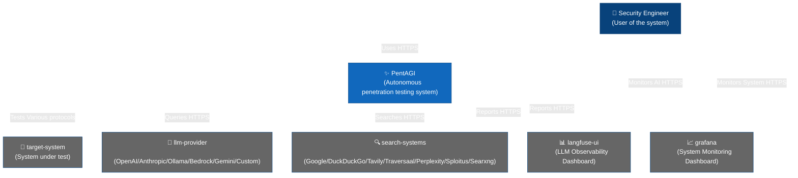
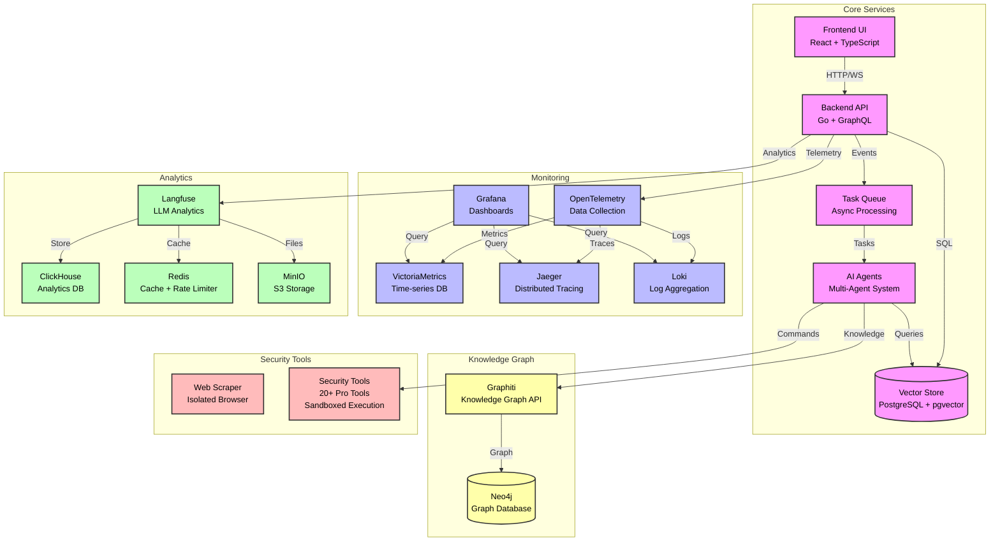

# Missing Repo Summary Source: vxcontrol/pentagi

- URL: https://github.com/vxcontrol/pentagi
- Local Path: core-platform/data/brain_assets/repos/github_stars_missing/vxcontrol__pentagi
- Clone Status: cloned
- Language: Go
- Stars: 16812
- Topics: ai-agents, ai-security-tool, anthropic, autonomous-agents, golang, gpt, graphql, multi-agent-system, offensive-security, open-source, openai, penetration-testing, penetration-testing-tools, react, security-automation, security-testing, security-tools, self-hosted
- Description: Fully autonomous AI Agents system capable of performing complex penetration testing tasks

## Extracted README / Docs / Examples


# FILE: README.md

# PentAGI

<div align="center" style="font-size: 1.5em; margin: 20px 0;">
    <strong>P</strong>enetration testing <strong>A</strong>rtificial <strong>G</strong>eneral <strong>I</strong>ntelligence
</div>
<br>
<div align="center">

> **Join the Community!** Connect with security researchers, AI enthusiasts, and fellow ethical hackers. Get support, share insights, and stay updated with the latest PentAGI developments.

[](https://discord.gg/2xrMh7qX6m)⠀[](https://t.me/+Ka9i6CNwe71hMWQy)

<a href="https://trendshift.io/repositories/15161" target="_blank"></a>

</div>

## Table of Contents

- [Overview](#overview)
- [Features](#features)
- [Architecture](#architecture)
  - [Agent Supervision](#advanced-agent-supervision)
- [Quick Start](#quick-start)
- [API Access](#api-access)
  - [LLM Provider Configuration](#custom-llm-provider-configuration)
    - [Ollama](#ollama-provider-configuration)
    - [OpenAI](#openai-provider-configuration)
    - [Anthropic](#anthropic-provider-configuration)
    - [Google AI (Gemini)](#google-ai-gemini-provider-configuration)
    - [AWS Bedrock](#aws-bedrock-provider-configuration)
    - [DeepSeek](#deepseek-provider-configuration)
    - [GLM](#glm-provider-configuration)
    - [Kimi](#kimi-provider-configuration)
    - [Qwen](#qwen-provider-configuration)
- [Advanced Setup](#advanced-setup)
  - [Langfuse Integration](#langfuse-integration)
  - [Monitoring and Observability](#monitoring-and-observability)
  - [Knowledge Graph (Graphiti)](#knowledge-graph-integration-graphiti)
  - [OAuth Integration](#github-and-google-oauth-integration)
  - [Docker Image Configuration](#docker-image-configuration)
- [Development](#development)
- [Testing LLM Agents](#testing-llm-agents)
- [Embedding Configuration and Testing](#embedding-configuration-and-testing)
- [Function Testing with ftester](#function-testing-with-ftester)
- [Building](#building)
- [Credits](#credits)
- [License](#license)

## Overview

PentAGI is an innovative tool for automated security testing that leverages cutting-edge artificial intelligence technologies. The project is designed for information security professionals, researchers, and enthusiasts who need a powerful and flexible solution for conducting penetration tests.

You can watch the video **PentAGI overview**:
[](https://youtu.be/R70x5Ddzs1o)

## Features

- Secure & Isolated. All operations are performed in a sandboxed Docker environment with complete isolation.
- Fully Autonomous. AI-powered agent that automatically determines and executes penetration testing steps with optional execution monitoring and intelligent task planning for enhanced reliability.
- Professional Pentesting Tools. Built-in suite of 20+ professional security tools including nmap, metasploit, sqlmap, and more.
- Smart Memory System. Long-term storage of research results and successful approaches for future use.
- Knowledge Graph Integration. Graphiti-powered knowledge graph using Neo4j for semantic relationship tracking and advanced context understanding.
- Web Intelligence. Built-in browser via [scraper](https://hub.docker.com/r/vxcontrol/scraper) for gathering latest information from web sources.
- External Search Systems. Integration with advanced search APIs including [Tavily](https://tavily.com), [Traversaal](https://traversaal.ai), [Perplexity](https://www.perplexity.ai), [DuckDuckGo](https://duckduckgo.com/), [Google Custom Search](https://programmablesearchengine.google.com/), [Sploitus Search](https://sploitus.com) and [Searxng](https://searxng.org) for comprehensive information gathering.
- Team of Specialists. Delegation system with specialized AI agents for research, development, and infrastructure tasks, enhanced with optional execution monitoring and intelligent task planning for optimal performance with smaller models.
- Comprehensive Monitoring. Detailed logging and integration with Grafana/Prometheus for real-time system observation.
- Detailed Reporting. Generation of thorough vulnerability reports with exploitation guides.
- Smart Container Management. Automatic Docker image selection based on specific task requirements.
- Modern Interface. Clean and intuitive web UI for system management and monitoring.
- Comprehensive APIs. Full-featured REST and GraphQL APIs with Bearer token authentication for automation and integration.
- Persistent Storage. All commands and outputs are stored in PostgreSQL with [pgvector](https://hub.docker.com/r/vxcontrol/pgvector) extension.
- Scalable Architecture. Microservices-based design supporting horizontal scaling.
- Self-Hosted Solution. Complete control over your deployment and data.
- Flexible Authentication. Support for 10+ LLM providers ([OpenAI](https://platform.openai.com/), [Anthropic](https://www.anthropic.com/), [Google AI/Gemini](https://ai.google.dev/), [AWS Bedrock](https://aws.amazon.com/bedrock/), [Ollama](https://ollama.com/), [DeepSeek](https://www.deepseek.com/en/), [GLM](https://z.ai/), [Kimi](https://platform.moonshot.ai/), [Qwen](https://www.alibabacloud.com/en/), Custom) plus aggregators ([OpenRouter](https://openrouter.ai/), [DeepInfra](https://deepinfra.com/)). For production local deployments, see our [vLLM + Qwen3.5-27B-FP8 guide](examples/guides/vllm-qwen35-27b-fp8.md).
- API Token Authentication. Secure Bearer token system for programmatic access to REST and GraphQL APIs.
- Quick Deployment. Easy setup through [Docker Compose](https://docs.docker.com/compose/) with comprehensive environment configuration.

## Architecture

### System Context



<details>
<summary><b>Container Architecture</b> (click to expand)</summary>



</details>

<details>
<summary><b>Entity Relationship</b> (click to expand)</summary>

```mermaid
erDiagram
    Flow ||--o{ Task : contains
    Task ||--o{ SubTask : contains
    SubTask ||--o{ Action : contains
    Action ||--o{ Artifact : produces
    Action ||--o{ Memory : stores

    Flow {
        string id PK
        string name "Flow name"
        string description "Flow description"
        string status "active/completed/failed"
        json parameters "Flow parameters"
        timestamp created_at
        times

# FILE: examples/tests/deepinfra-report.md

# LLM Agent Testing Report

Generated: Tue, 30 Sep 2025 19:10:56 UTC

## Overall Results

| Agent | Model | Reasoning | Success Rate | Average Latency |
|-------|-------|-----------|--------------|-----------------|
| simple | Qwen/Qwen3-Next-80B-A3B-Instruct | false | 23/23 (100.00%) | 1.284s |
| simple_json | Qwen/Qwen3-Next-80B-A3B-Instruct | false | 5/5 (100.00%) | 1.261s |
| primary_agent | moonshotai/Kimi-K2-Instruct-0905 | false | 22/23 (95.65%) | 1.406s |
| assistant | moonshotai/Kimi-K2-Instruct-0905 | true | 21/23 (91.30%) | 1.397s |
| generator | google/gemini-2.5-pro | true | 22/23 (95.65%) | 7.349s |
| refiner | deepseek-ai/DeepSeek-R1-0528-Turbo | true | 22/23 (95.65%) | 4.424s |
| adviser | google/gemini-2.5-pro | true | 23/23 (100.00%) | 6.986s |
| reflector | Qwen/Qwen3-Next-80B-A3B-Instruct | true | 23/23 (100.00%) | 1.277s |
| searcher | Qwen/Qwen3-32B | true | 23/23 (100.00%) | 6.780s |
| enricher | Qwen/Qwen3-32B | true | 23/23 (100.00%) | 6.705s |
| coder | anthropic/claude-4-sonnet | true | 23/23 (100.00%) | 2.953s |
| installer | google/gemini-2.5-flash | true | 23/23 (100.00%) | 2.703s |
| pentester | moonshotai/Kimi-K2-Instruct-0905 | true | 22/23 (95.65%) | 1.303s |

**Total**: 275/281 (97.86%) successful tests
**Overall average latency**: 3.670s

## Detailed Results

### simple (Qwen/Qwen3-Next-80B-A3B-Instruct)

#### Basic Tests

| Test | Result | Latency | Error |
|------|--------|---------|-------|
| Simple Math | ✅ Pass | 2.578s |  |
| Text Transform Uppercase | ✅ Pass | 2.580s |  |
| Count from 1 to 5 | ✅ Pass | 0.964s |  |
| Math Calculation | ✅ Pass | 0.900s |  |
| Basic Echo Function | ✅ Pass | 1.061s |  |
| Streaming Simple Math Streaming | ✅ Pass | 1.022s |  |
| Streaming Count from 1 to 3 Streaming | ✅ Pass | 0.949s |  |
| Streaming Basic Echo Function Streaming | ✅ Pass | 1.736s |  |

#### Advanced Tests

| Test | Result | Latency | Error |
|------|--------|---------|-------|
| JSON Response Function | ✅ Pass | 1.425s |  |
| Search Query Function | ✅ Pass | 1.348s |  |
| Ask Advice Function | ✅ Pass | 1.016s |  |
| Streaming Search Query Function Streaming | ✅ Pass | 0.939s |  |
| Basic Context Memory Test | ✅ Pass | 1.248s |  |
| Function Argument Memory Test | ✅ Pass | 1.044s |  |
| Function Response Memory Test | ✅ Pass | 0.887s |  |
| Penetration Testing Memory with Tool Call | ✅ Pass | 1.120s |  |
| Cybersecurity Workflow Memory Test | ✅ Pass | 0.931s |  |
| Penetration Testing Methodology | ✅ Pass | 1.612s |  |
| Vulnerability Assessment Tools | ✅ Pass | 1.659s |  |
| SQL Injection Attack Type | ✅ Pass | 0.930s |  |
| Penetration Testing Framework | ✅ Pass | 1.154s |  |
| Web Application Security Scanner | ✅ Pass | 1.297s |  |
| Penetration Testing Tool Selection | ✅ Pass | 1.111s |  |

**Summary**: 23/23 (100.00%) successful tests

**Average latency**: 1.284s

---

### simple_json (Qwen/Qwen3-Next-80B-A3B-Instruct)

#### Advanced Tests

| Test | Result | Latency | Error |
|------|--------|---------|-

# FILE: examples/tests/ollama-cloud-report.md

# LLM Agent Testing Report

Generated: Mon, 23 Mar 2026 16:29:35 UTC

## Overall Results

| Agent | Model | Reasoning | Success Rate | Average Latency |
|-------|-------|-----------|--------------|-----------------|
| simple | nemotron-3-super:cloud | false | 22/23 (95.65%) | 22.627s |
| simple_json | nemotron-3-super:cloud | false | 5/5 (100.00%) | 27.380s |
| primary_agent | qwen3-coder-next:cloud | false | 23/23 (100.00%) | 4.101s |
| assistant | nemotron-3-super:cloud | false | 23/23 (100.00%) | 22.773s |
| generator | qwen3-coder-next:cloud | false | 23/23 (100.00%) | 2.348s |
| refiner | glm-5:cloud | false | 23/23 (100.00%) | 7.964s |
| adviser | minimax-m2.7:cloud | false | 23/23 (100.00%) | 3.990s |
| reflector | glm-5:cloud | false | 23/23 (100.00%) | 9.201s |
| searcher | qwen3.5:397b-cloud | false | 20/23 (86.96%) | 46.174s |
| enricher | minimax-m2.7:cloud | false | 23/23 (100.00%) | 6.153s |
| coder | qwen3-coder-next:cloud | false | 23/23 (100.00%) | 3.223s |
| installer | devstral-2:123b-cloud | false | 23/23 (100.00%) | 8.049s |
| pentester | qwen3-coder-next:cloud | false | 23/23 (100.00%) | 2.227s |

**Total**: 277/281 (98.58%) successful tests
**Overall average latency**: 11.851s

## Detailed Results

### simple (nemotron-3-super:cloud)

#### Basic Tests

| Test | Result | Latency | Error |
|------|--------|---------|-------|
| Simple Math | ✅ Pass | 2.444s |  |
| Text Transform Uppercase | ✅ Pass | 10.749s |  |
| Count from 1 to 5 | ✅ Pass | 19.076s |  |
| Math Calculation | ✅ Pass | 6.549s |  |
| Basic Echo Function | ✅ Pass | 16.980s |  |
| Streaming Simple Math Streaming | ✅ Pass | 18.192s |  |
| Streaming Count from 1 to 3 Streaming | ✅ Pass | 8.274s |  |
| Streaming Basic Echo Function Streaming | ✅ Pass | 10.723s |  |

#### Advanced Tests

| Test | Result | Latency | Error |
|------|--------|---------|-------|
| JSON Response Function | ✅ Pass | 20.851s |  |
| Search Query Function | ✅ Pass | 16.304s |  |
| Ask Advice Function | ✅ Pass | 33.178s |  |
| Streaming Search Query Function Streaming | ✅ Pass | 14.129s |  |
| Basic Context Memory Test | ✅ Pass | 25.373s |  |
| Function Argument Memory Test | ✅ Pass | 34.212s |  |
| Function Response Memory Test | ✅ Pass | 22.402s |  |
| Penetration Testing Memory with Tool Call | ❌ Fail | 39.672s | expected function 'generate\_report' not found in tool calls: expected function generate\_report not found in tool calls |
| Cybersecurity Workflow Memory Test | ✅ Pass | 14.158s |  |
| Penetration Testing Methodology | ✅ Pass | 57.038s |  |
| Vulnerability Assessment Tools | ✅ Pass | 40.968s |  |
| SQL Injection Attack Type | ✅ Pass | 9.713s |  |
| Penetration Testing Framework | ✅ Pass | 65.247s |  |
| Web Application Security Scanner | ✅ Pass | 15.760s |  |
| Penetration Testing Tool Selection | ✅ Pass | 18.418s |  |

**Summary**: 22/23 (95.65%) successful tests

**Average latency**: 22.627s

---

### simple_json (nemotron-3-super:cloud)

#### Advanced Tests

| Test | Result | La

# FILE: examples/tests/openrouter-report.md

# LLM Agent Testing Report

Generated: Tue, 30 Sep 2025 18:46:00 UTC

## Overall Results

| Agent | Model | Reasoning | Success Rate | Average Latency |
|-------|-------|-----------|--------------|-----------------|
| simple | openai/gpt-4.1-mini | false | 23/23 (100.00%) | 1.594s |
| simple_json | openai/gpt-4.1-mini | false | 5/5 (100.00%) | 1.682s |
| primary_agent | openai/gpt-5 | true | 23/23 (100.00%) | 7.285s |
| assistant | openai/gpt-5 | true | 23/23 (100.00%) | 8.135s |
| generator | anthropic/claude-sonnet-4.5 | true | 23/23 (100.00%) | 4.525s |
| refiner | google/gemini-2.5-pro | true | 21/23 (91.30%) | 5.576s |
| adviser | google/gemini-2.5-pro | true | 22/23 (95.65%) | 5.532s |
| reflector | openai/gpt-4.1-mini | false | 23/23 (100.00%) | 1.556s |
| searcher | x-ai/grok-3-mini | true | 22/23 (95.65%) | 4.511s |
| enricher | openai/gpt-4.1-mini | true | 23/23 (100.00%) | 1.597s |
| coder | anthropic/claude-sonnet-4.5 | true | 23/23 (100.00%) | 4.445s |
| installer | google/gemini-2.5-flash | true | 23/23 (100.00%) | 3.276s |
| pentester | moonshotai/kimi-k2-0905 | true | 22/23 (95.65%) | 2.301s |

**Total**: 276/281 (98.22%) successful tests
**Overall average latency**: 4.150s

## Detailed Results

### simple (openai/gpt-4.1-mini)

#### Basic Tests

| Test | Result | Latency | Error |
|------|--------|---------|-------|
| Text Transform Uppercase | ✅ Pass | 2.727s |  |
| Simple Math | ✅ Pass | 2.809s |  |
| Count from 1 to 5 | ✅ Pass | 3.158s |  |
| Math Calculation | ✅ Pass | 1.255s |  |
| Basic Echo Function | ✅ Pass | 1.112s |  |
| Streaming Simple Math Streaming | ✅ Pass | 1.109s |  |
| Streaming Count from 1 to 3 Streaming | ✅ Pass | 1.179s |  |
| Streaming Basic Echo Function Streaming | ✅ Pass | 1.270s |  |

#### Advanced Tests

| Test | Result | Latency | Error |
|------|--------|---------|-------|
| JSON Response Function | ✅ Pass | 1.334s |  |
| Search Query Function | ✅ Pass | 1.375s |  |
| Ask Advice Function | ✅ Pass | 1.433s |  |
| Streaming Search Query Function Streaming | ✅ Pass | 1.436s |  |
| Basic Context Memory Test | ✅ Pass | 1.293s |  |
| Function Argument Memory Test | ✅ Pass | 1.326s |  |
| Function Response Memory Test | ✅ Pass | 1.378s |  |
| Penetration Testing Memory with Tool Call | ✅ Pass | 1.802s |  |
| Cybersecurity Workflow Memory Test | ✅ Pass | 1.454s |  |
| Penetration Testing Methodology | ✅ Pass | 1.216s |  |
| Vulnerability Assessment Tools | ✅ Pass | 1.509s |  |
| SQL Injection Attack Type | ✅ Pass | 2.427s |  |
| Penetration Testing Framework | ✅ Pass | 1.526s |  |
| Web Application Security Scanner | ✅ Pass | 1.093s |  |
| Penetration Testing Tool Selection | ✅ Pass | 1.419s |  |

**Summary**: 23/23 (100.00%) successful tests

**Average latency**: 1.594s

---

### simple_json (openai/gpt-4.1-mini)

#### Advanced Tests

| Test | Result | Latency | Error |
|------|--------|---------|-------|
| Project Information JSON | ✅ Pass | 1.574s |  |
| User Profile JSON | ✅ Pass | 1.531s |  |
| Person I

# FILE: examples/tests/ollama-qwq-32b-fp16-tc-report.md

# LLM Agent Testing Report

Generated: Sat, 19 Jul 2025 20:33:51 UTC

## Overall Results

| Agent | Model | Reasoning | Success Rate | Average Latency |
|-------|-------|-----------|--------------|-----------------|
| simple | qwq:32b-fp16-tc | true | 23/23 (100.00%) | 6.716s |
| simple_json | qwq:32b-fp16-tc | true | 5/5 (100.00%) | 6.216s |
| primary_agent | qwq:32b-fp16-tc | true | 23/23 (100.00%) | 9.193s |
| assistant | qwq:32b-fp16-tc | true | 23/23 (100.00%) | 8.104s |
| generator | qwq:32b-fp16-tc | true | 23/23 (100.00%) | 9.544s |
| refiner | qwq:32b-fp16-tc | true | 23/23 (100.00%) | 9.373s |
| adviser | qwq:32b-fp16-tc | true | 23/23 (100.00%) | 8.474s |
| reflector | qwq:32b-fp16-tc | true | 23/23 (100.00%) | 8.746s |
| searcher | qwq:32b-fp16-tc | true | 23/23 (100.00%) | 8.270s |
| enricher | qwq:32b-fp16-tc | true | 23/23 (100.00%) | 10.131s |
| coder | qwq:32b-fp16-tc | true | 23/23 (100.00%) | 8.886s |
| installer | qwq:32b-fp16-tc | true | 22/23 (95.65%) | 8.990s |
| pentester | qwq:32b-fp16-tc | true | 23/23 (100.00%) | 10.520s |

**Total**: 280/281 (99.64%) successful tests
**Overall average latency**: 8.864s

## Detailed Results

### simple (qwq:32b-fp16-tc)

#### Basic Tests

| Test | Result | Latency | Error |
|------|--------|---------|-------|
| Simple Math | ✅ Pass | 6.681s |  |
| Text Transform Uppercase | ✅ Pass | 4.573s |  |
| Count from 1 to 5 | ✅ Pass | 10.128s |  |
| Math Calculation | ✅ Pass | 5.587s |  |
| Basic Echo Function | ✅ Pass | 2.728s |  |
| Streaming Simple Math Streaming | ✅ Pass | 6.202s |  |
| Streaming Count from 1 to 3 Streaming | ✅ Pass | 3.603s |  |
| Streaming Basic Echo Function Streaming | ✅ Pass | 2.625s |  |

#### Advanced Tests

| Test | Result | Latency | Error |
|------|--------|---------|-------|
| JSON Response Function | ✅ Pass | 4.333s |  |
| Search Query Function | ✅ Pass | 3.209s |  |
| Ask Advice Function | ✅ Pass | 3.321s |  |
| Streaming Search Query Function Streaming | ✅ Pass | 3.065s |  |
| Basic Context Memory Test | ✅ Pass | 3.660s |  |
| Function Argument Memory Test | ✅ Pass | 5.600s |  |
| Function Response Memory Test | ✅ Pass | 3.156s |  |
| Penetration Testing Memory with Tool Call | ✅ Pass | 8.576s |  |
| Cybersecurity Workflow Memory Test | ✅ Pass | 3.602s |  |
| Penetration Testing Methodology | ✅ Pass | 15.436s |  |
| Vulnerability Assessment Tools | ✅ Pass | 21.553s |  |
| SQL Injection Attack Type | ✅ Pass | 7.660s |  |
| Penetration Testing Framework | ✅ Pass | 15.103s |  |
| Web Application Security Scanner | ✅ Pass | 10.527s |  |
| Penetration Testing Tool Selection | ✅ Pass | 3.523s |  |

**Summary**: 23/23 (100.00%) successful tests

**Average latency**: 6.716s

---

### simple_json (qwq:32b-fp16-tc)

#### Advanced Tests

| Test | Result | Latency | Error |
|------|--------|---------|-------|
| Vulnerability Report Memory Test | ✅ Pass | 11.014s |  |
| Person Information JSON | ✅ Pass | 6.958s |  |
| Project Information JSON | ✅ Pass | 4.410s |  |
| User Pr

# FILE: examples/tests/kimi-report.md

# LLM Agent Testing Report

Generated: Wed, 04 Mar 2026 22:36:05 UTC

## Overall Results

| Agent | Model | Reasoning | Success Rate | Average Latency |
|-------|-------|-----------|--------------|-----------------|
| simple | kimi-k2-turbo-preview | false | 23/23 (100.00%) | 1.029s |
| simple_json | kimi-k2-turbo-preview | false | 5/5 (100.00%) | 1.090s |
| primary_agent | kimi-k2.5 | true | 23/23 (100.00%) | 4.379s |
| assistant | kimi-k2.5 | true | 23/23 (100.00%) | 4.599s |
| generator | kimi-k2.5 | true | 23/23 (100.00%) | 4.054s |
| refiner | kimi-k2.5 | true | 23/23 (100.00%) | 4.773s |
| adviser | kimi-k2.5 | true | 23/23 (100.00%) | 4.786s |
| reflector | kimi-k2-0905-preview | true | 23/23 (100.00%) | 2.573s |
| searcher | kimi-k2-0905-preview | true | 22/23 (95.65%) | 2.907s |
| enricher | kimi-k2-0905-preview | true | 23/23 (100.00%) | 2.275s |
| coder | kimi-k2.5 | true | 23/23 (100.00%) | 4.206s |
| installer | kimi-k2-turbo-preview | true | 23/23 (100.00%) | 0.918s |
| pentester | kimi-k2-turbo-preview | true | 23/23 (100.00%) | 0.901s |

**Total**: 280/281 (99.64%) successful tests
**Overall average latency**: 3.081s

## Detailed Results

### simple (kimi-k2-turbo-preview)

#### Basic Tests

| Test | Result | Latency | Error |
|------|--------|---------|-------|
| Simple Math | ✅ Pass | 3.911s |  |
| Text Transform Uppercase | ✅ Pass | 0.743s |  |
| Count from 1 to 5 | ✅ Pass | 0.800s |  |
| Math Calculation | ✅ Pass | 0.691s |  |
| Basic Echo Function | ✅ Pass | 0.943s |  |
| Streaming Simple Math Streaming | ✅ Pass | 0.763s |  |
| Streaming Count from 1 to 3 Streaming | ✅ Pass | 0.610s |  |
| Streaming Basic Echo Function Streaming | ✅ Pass | 1.095s |  |

#### Advanced Tests

| Test | Result | Latency | Error |
|------|--------|---------|-------|
| JSON Response Function | ✅ Pass | 1.258s |  |
| Search Query Function | ✅ Pass | 0.699s |  |
| Ask Advice Function | ✅ Pass | 0.925s |  |
| Streaming Search Query Function Streaming | ✅ Pass | 0.914s |  |
| Basic Context Memory Test | ✅ Pass | 0.908s |  |
| Function Argument Memory Test | ✅ Pass | 0.770s |  |
| Function Response Memory Test | ✅ Pass | 0.750s |  |
| Penetration Testing Memory with Tool Call | ✅ Pass | 1.579s |  |
| Cybersecurity Workflow Memory Test | ✅ Pass | 1.014s |  |
| Penetration Testing Methodology | ✅ Pass | 0.932s |  |
| Vulnerability Assessment Tools | ✅ Pass | 0.830s |  |
| SQL Injection Attack Type | ✅ Pass | 0.853s |  |
| Penetration Testing Framework | ✅ Pass | 1.045s |  |
| Web Application Security Scanner | ✅ Pass | 0.615s |  |
| Penetration Testing Tool Selection | ✅ Pass | 1.001s |  |

**Summary**: 23/23 (100.00%) successful tests

**Average latency**: 1.029s

---

### simple_json (kimi-k2-turbo-preview)

#### Advanced Tests

| Test | Result | Latency | Error |
|------|--------|---------|-------|
| Person Information JSON | ✅ Pass | 0.962s |  |
| Project Information JSON | ✅ Pass | 0.950s |  |
| Streaming Person Information JSON Streaming | ✅ Pass | 0

# FILE: examples/tests/qwen-report.md

# LLM Agent Testing Report

Generated: Thu, 05 Mar 2026 15:23:06 UTC

## Overall Results

| Agent | Model | Reasoning | Success Rate | Average Latency |
|-------|-------|-----------|--------------|-----------------|
| simple | qwen3.5-flash | true | 23/23 (100.00%) | 3.985s |
| simple_json | qwen3.5-flash | true | 5/5 (100.00%) | 7.246s |
| primary_agent | qwen3.5-plus | true | 23/23 (100.00%) | 6.614s |
| assistant | qwen3.5-plus | true | 23/23 (100.00%) | 7.055s |
| generator | qwen3-max | true | 23/23 (100.00%) | 2.869s |
| refiner | qwen3-max | true | 23/23 (100.00%) | 3.214s |
| adviser | qwen3-max | true | 23/23 (100.00%) | 2.760s |
| reflector | qwen3.5-flash | true | 23/23 (100.00%) | 2.902s |
| searcher | qwen3.5-flash | true | 23/23 (100.00%) | 3.041s |
| enricher | qwen3.5-flash | true | 23/23 (100.00%) | 2.903s |
| coder | qwen3.5-plus | true | 23/23 (100.00%) | 6.767s |
| installer | qwen3.5-plus | true | 23/23 (100.00%) | 6.970s |
| pentester | qwen3.5-plus | true | 23/23 (100.00%) | 6.877s |

**Total**: 281/281 (100.00%) successful tests
**Overall average latency**: 4.709s

## Detailed Results

### simple (qwen3.5-flash)

#### Basic Tests

| Test | Result | Latency | Error |
|------|--------|---------|-------|
| Simple Math | ✅ Pass | 2.732s |  |
| Text Transform Uppercase | ✅ Pass | 2.621s |  |
| Count from 1 to 5 | ✅ Pass | 2.621s |  |
| Math Calculation | ✅ Pass | 1.976s |  |
| Basic Echo Function | ✅ Pass | 1.258s |  |
| Streaming Simple Math Streaming | ✅ Pass | 2.289s |  |
| Streaming Count from 1 to 3 Streaming | ✅ Pass | 1.988s |  |
| Streaming Basic Echo Function Streaming | ✅ Pass | 1.438s |  |

#### Advanced Tests

| Test | Result | Latency | Error |
|------|--------|---------|-------|
| JSON Response Function | ✅ Pass | 1.548s |  |
| Search Query Function | ✅ Pass | 1.440s |  |
| Ask Advice Function | ✅ Pass | 1.522s |  |
| Streaming Search Query Function Streaming | ✅ Pass | 1.453s |  |
| Basic Context Memory Test | ✅ Pass | 3.117s |  |
| Function Argument Memory Test | ✅ Pass | 1.429s |  |
| Function Response Memory Test | ✅ Pass | 1.201s |  |
| Penetration Testing Memory with Tool Call | ✅ Pass | 1.852s |  |
| Cybersecurity Workflow Memory Test | ✅ Pass | 1.456s |  |
| Penetration Testing Methodology | ✅ Pass | 8.537s |  |
| SQL Injection Attack Type | ✅ Pass | 2.840s |  |
| Vulnerability Assessment Tools | ✅ Pass | 38.650s |  |
| Penetration Testing Framework | ✅ Pass | 4.082s |  |
| Web Application Security Scanner | ✅ Pass | 3.694s |  |
| Penetration Testing Tool Selection | ✅ Pass | 1.896s |  |

**Summary**: 23/23 (100.00%) successful tests

**Average latency**: 3.985s

---

### simple_json (qwen3.5-flash)

#### Advanced Tests

| Test | Result | Latency | Error |
|------|--------|---------|-------|
| Vulnerability Report Memory Test | ✅ Pass | 5.818s |  |
| Streaming Person Information JSON Streaming | ✅ Pass | 4.840s |  |
| User Profile JSON | ✅ Pass | 6.102s |  |
| Project Information JSON | ✅ Pass | 7.050s |  

# FILE: examples/tests/bedrock-report.md

# LLM Agent Testing Report

Generated: Wed, 04 Mar 2026 14:58:03 UTC

## Overall Results

| Agent | Model | Reasoning | Success Rate | Average Latency |
|-------|-------|-----------|--------------|-----------------|
| simple | openai.gpt-oss-120b-1:0 | true | 23/23 (100.00%) | 0.706s |
| simple_json | openai.gpt-oss-120b-1:0 | true | 5/5 (100.00%) | 0.766s |
| primary_agent | us.anthropic.claude-sonnet-4-5-20250929-v1:0 | true | 23/23 (100.00%) | 4.416s |
| assistant | us.anthropic.claude-sonnet-4-5-20250929-v1:0 | true | 23/23 (100.00%) | 4.147s |
| generator | us.anthropic.claude-sonnet-4-5-20250929-v1:0 | true | 23/23 (100.00%) | 4.768s |
| refiner | us.anthropic.claude-sonnet-4-5-20250929-v1:0 | true | 23/23 (100.00%) | 4.212s |
| adviser | us.anthropic.claude-opus-4-6-v1 | true | 23/23 (100.00%) | 6.599s |
| reflector | us.anthropic.claude-haiku-4-5-20251001-v1:0 | true | 23/23 (100.00%) | 2.272s |
| searcher | us.anthropic.claude-haiku-4-5-20251001-v1:0 | true | 23/23 (100.00%) | 2.303s |
| enricher | us.anthropic.claude-haiku-4-5-20251001-v1:0 | true | 23/23 (100.00%) | 2.467s |
| coder | us.anthropic.claude-sonnet-4-5-20250929-v1:0 | true | 23/23 (100.00%) | 4.197s |
| installer | us.anthropic.claude-sonnet-4-5-20250929-v1:0 | true | 23/23 (100.00%) | 4.483s |
| pentester | us.anthropic.claude-sonnet-4-5-20250929-v1:0 | true | 23/23 (100.00%) | 4.427s |

**Total**: 281/281 (100.00%) successful tests
**Overall average latency**: 3.697s

## Detailed Results

### simple (openai.gpt-oss-120b-1:0)

#### Basic Tests

| Test | Result | Latency | Error |
|------|--------|---------|-------|
| Simple Math | ✅ Pass | 1.618s |  |
| Text Transform Uppercase | ✅ Pass | 0.564s |  |
| Count from 1 to 5 | ✅ Pass | 0.772s |  |
| Math Calculation | ✅ Pass | 0.501s |  |
| Basic Echo Function | ✅ Pass | 0.553s |  |
| Streaming Simple Math Streaming | ✅ Pass | 0.639s |  |
| Streaming Count from 1 to 3 Streaming | ✅ Pass | 0.467s |  |
| Streaming Basic Echo Function Streaming | ✅ Pass | 0.600s |  |

#### Advanced Tests

| Test | Result | Latency | Error |
|------|--------|---------|-------|
| JSON Response Function | ✅ Pass | 0.639s |  |
| Search Query Function | ✅ Pass | 0.968s |  |
| Ask Advice Function | ✅ Pass | 0.628s |  |
| Streaming Search Query Function Streaming | ✅ Pass | 0.657s |  |
| Basic Context Memory Test | ✅ Pass | 0.669s |  |
| Function Argument Memory Test | ✅ Pass | 0.845s |  |
| Function Response Memory Test | ✅ Pass | 0.488s |  |
| Penetration Testing Memory with Tool Call | ✅ Pass | 0.714s |  |
| Cybersecurity Workflow Memory Test | ✅ Pass | 0.738s |  |
| Penetration Testing Methodology | ✅ Pass | 0.619s |  |
| Vulnerability Assessment Tools | ✅ Pass | 0.723s |  |
| SQL Injection Attack Type | ✅ Pass | 0.853s |  |
| Penetration Testing Framework | ✅ Pass | 0.553s |  |
| Web Application Security Scanner | ✅ Pass | 0.661s |  |
| Penetration Testing Tool Selection | ✅ Pass | 0.756s |  |

**Summary**: 23/23 (100.00%) successful tests

**Avera

# FILE: examples/tests/novita-report.md

# LLM Agent Testing Report

Generated: Mon, 02 Mar 2026 15:08:50 UTC

## Overall Results

| Agent | Model | Reasoning | Success Rate | Average Latency |
|-------|-------|-----------|--------------|-----------------|
| simple | deepseek/deepseek-v3.2 | false | 22/23 (95.65%) | 2.458s |
| simple_json | deepseek/deepseek-v3.2 | false | 5/5 (100.00%) | 2.148s |
| primary_agent | moonshotai/kimi-k2.5 | true | 22/23 (95.65%) | 2.658s |
| assistant | moonshotai/kimi-k2.5 | true | 22/23 (95.65%) | 3.286s |
| generator | moonshotai/kimi-k2.5 | true | 22/23 (95.65%) | 2.686s |
| refiner | moonshotai/kimi-k2.5 | true | 22/23 (95.65%) | 3.071s |
| adviser | zai-org/glm-5 | true | 23/23 (100.00%) | 9.204s |
| reflector | qwen/qwen3.5-35b-a3b | true | 23/23 (100.00%) | 3.375s |
| searcher | qwen/qwen3.5-35b-a3b | true | 22/23 (95.65%) | 3.648s |
| enricher | qwen/qwen3.5-35b-a3b | true | 23/23 (100.00%) | 3.332s |
| coder | moonshotai/kimi-k2.5 | true | 23/23 (100.00%) | 3.067s |
| installer | moonshotai/kimi-k2-instruct | true | 20/23 (86.96%) | 1.480s |
| pentester | moonshotai/kimi-k2.5 | true | 23/23 (100.00%) | 2.818s |

**Total**: 272/281 (96.80%) successful tests
**Overall average latency**: 3.401s

## Detailed Results

### simple (deepseek/deepseek-v3.2)

#### Basic Tests

| Test | Result | Latency | Error |
|------|--------|---------|-------|
| Simple Math | ✅ Pass | 1.288s |  |
| Text Transform Uppercase | ✅ Pass | 1.461s |  |
| Count from 1 to 5 | ✅ Pass | 1.353s |  |
| Math Calculation | ✅ Pass | 1.379s |  |
| Basic Echo Function | ✅ Pass | 2.869s |  |
| Streaming Simple Math Streaming | ✅ Pass | 1.182s |  |
| Streaming Count from 1 to 3 Streaming | ✅ Pass | 1.654s |  |
| Streaming Basic Echo Function Streaming | ✅ Pass | 2.997s |  |

#### Advanced Tests

| Test | Result | Latency | Error |
|------|--------|---------|-------|
| JSON Response Function | ✅ Pass | 4.244s |  |
| Search Query Function | ✅ Pass | 2.317s |  |
| Ask Advice Function | ✅ Pass | 3.651s |  |
| Streaming Search Query Function Streaming | ✅ Pass | 3.320s |  |
| Basic Context Memory Test | ✅ Pass | 2.409s |  |
| Function Argument Memory Test | ✅ Pass | 1.077s |  |
| Function Response Memory Test | ✅ Pass | 1.354s |  |
| Penetration Testing Memory with Tool Call | ❌ Fail | 4.833s | expected function 'generate\_report' not found in tool calls: expected function generate\_report not found in tool calls |
| Cybersecurity Workflow Memory Test | ✅ Pass | 1.674s |  |
| Penetration Testing Methodology | ✅ Pass | 2.582s |  |
| Vulnerability Assessment Tools | ✅ Pass | 5.695s |  |
| SQL Injection Attack Type | ✅ Pass | 1.572s |  |
| Penetration Testing Framework | ✅ Pass | 2.639s |  |
| Web Application Security Scanner | ✅ Pass | 1.808s |  |
| Penetration Testing Tool Selection | ✅ Pass | 3.174s |  |

**Summary**: 22/23 (95.65%) successful tests

**Average latency**: 2.458s

---

### simple_json (deepseek/deepseek-v3.2)

#### Advanced Tests

| Test | Result | Latency | Error |
|------|----
