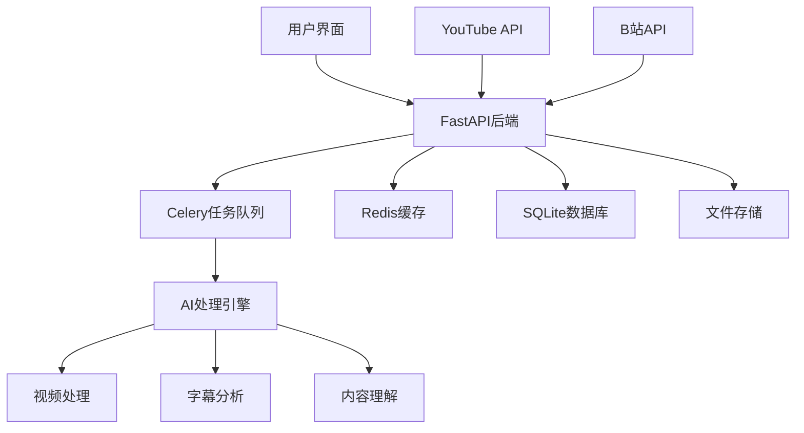
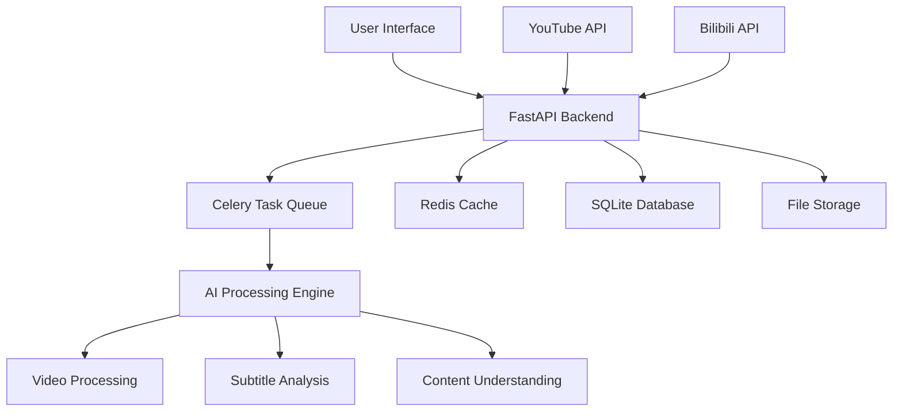

# Missing Repo Summary Source: zhouxiaoka/autoclip

- URL: https://github.com/zhouxiaoka/autoclip
- Local Path: core-platform/data/brain_assets/repos/github_stars_missing/zhouxiaoka__autoclip
- Clone Status: cloned
- Language: Python
- Stars: 5188
- Topics: ai, ai-agents, ai-tools, ai-video, ai-video-editor, auto, auto-highlight, highlight, llm, video, video-editing, video-processing, videos
- Description: AutoClip : AI-powered video clipping and highlight generation · 一款智能高光提取与剪辑的二创工具

## Extracted README / Docs / Examples


# FILE: README.md

# AutoClip - AI视频智能切片系统


## 基于AI的智能视频切片处理系统

支持YouTube/B站视频下载、自动切片、智能合集生成

[](https://python.org)
[](https://reactjs.org)
[](https://fastapi.tiangolo.com)
[](https://www.typescriptlang.org)
[](https://celeryproject.org)
[](LICENSE)

[](https://github.com/zhouxiaoka/autoclip)
[](https://github.com/zhouxiaoka/autoclip)
[](https://github.com/zhouxiaoka/autoclip/issues)

**语言**: [English](README-EN.md) | [中文](README.md)  
**联系邮箱**: [christine_zhouye@163.com](mailto:christine_zhouye@163.com)

</div>

## 🎯 项目简介

AutoClip是一个基于AI的智能视频切片处理系统，能够自动从YouTube、B站等平台下载视频，通过AI分析提取精彩片段，并智能生成合集。系统采用现代化的前后端分离架构，提供直观的Web界面和强大的后端处理能力。

**联系方式**: [christine_zhouye@163.com](mailto:christine_zhouye@163.com)

### ✨ 核心特性

- 🎬 **多平台支持**: YouTube、B站视频一键下载，支持本地文件上传
- 🤖 **AI智能分析**: 基于通义千问大语言模型的视频内容理解
- ✂️ **自动切片**: 智能识别精彩片段并自动切割，支持多种视频分类
- 📚 **智能合集**: AI推荐和手动创建视频合集，支持拖拽排序
- 🚀 **实时处理**: 异步任务队列，实时进度反馈，WebSocket通信
- 🎨 **现代界面**: React + TypeScript + Ant Design，响应式设计
- 📱 **移动端支持**【开发中】: 响应式设计，正在完善移动端体验
- 🔐 **账号管理**【开发中】: 支持B站多账号管理，自动健康检查
- 📊 **数据统计**: 完整的项目管理和数据统计功能
- 🛠️ **易于部署**: 一键启动脚本，Docker支持，详细文档
- 📤 **B站上传**【开发中】: 自动上传切片视频到B站
- ✏️ **字幕编辑**【开发中】: 可视化字幕编辑和同步功能

## 🏗️ 系统架构



### 技术栈

#### 后端技术

- **FastAPI**: 现代化Python Web框架，自动API文档生成
- **Celery**: 分布式任务队列，支持异步处理
- **Redis**: 消息代理和缓存，任务状态管理
- **SQLite**: 轻量级数据库，支持升级到PostgreSQL
- **yt-dlp**: YouTube视频下载，支持多种格式
- **通义千问**: AI内容分析，支持多种模型
- **WebSocket**: 实时通信，进度推送
- **Pydantic**: 数据验证和序列化

#### 前端技术

- **React 18**: 用户界面框架，Hooks和函数组件
- **TypeScript**: 类型安全，更好的开发体验
- **Ant Design**: 企业级UI组件库
- **Vite**: 快速构建工具，热重载
- **Zustand**: 轻量级状态管理
- **React Router**: 路由管理
- **Axios**: HTTP客户端
- **React Player**: 视频播放器

## 🚀 快速开始

### 环境要求

#### Docker部署（推荐）

- **Docker**: 20.10+
- **Docker Compose**: 2.0+
- **内存**: 最少 4GB，推荐 8GB+
- **存储**: 最少 10GB 可用空间

#### 本地部署

- **操作系统**: macOS / Linux / Windows (WSL)
- **Python**: 3.8+ (推荐 3.9+)
- **Node.js**: 16+ (推荐 18+)
- **Redis**: 6.0+ (推荐 7.0+)
- **FFmpeg**: 视频处理依赖
- **内存**: 最少 4GB，推荐 8GB+
- **存储**: 最少 10GB 可用空间

### 一键启动

#### 方式一：Docker部署（推荐）

```bash
# 克隆项目
git clone https://github.com/zhouxiaoka/autoclip.git
cd autoclip

# Docker一键启动
./docker-start.sh

# 开发环境启动
./docker-start.sh dev

# 停止服务
./docker-stop.sh

# 检查服务状态
./docker-status.sh
```

#### 方式二：本地部署

```bash
# 克隆项目
git clone https://github.com/zhouxiaoka/autoclip.git
cd autoclip

# 一键启动（推荐，包含完整检查和监控）
./start_autoclip.sh

# 快速启动（开发环境，跳过详细检查）
./quick_start.sh

# 检查系统状态
./status_autoclip.sh

# 停止系统
./stop_autoclip.sh
```

### 手动安装

```bash
# 1. 创建虚拟环境
python3 -m venv venv
source venv/bin/activate  # Linux/macOS
# 或 venv\Scripts\activate  # Windows

# 2. 安装Python依赖
pip install -r requirements.txt

# 3. 安装前端依赖
cd frontend && npm install && cd ..

# 4. 安装Redis
# macOS
brew install redis
brew services start redis

# Ubuntu/Debian
sudo apt update
sudo apt install redis-server
sudo systemctl start redis-server

# CentOS/RHEL
sudo yum install redis
sudo systemctl start redis

# 5. 安装FFmpeg
# macOS
brew install ffmpeg

# Ubuntu/Debian
sudo apt install ffmpeg

# CentOS/RHEL
sudo yum install ffmpeg

# 6. 配置环境变量
cp env.example .env
# 编辑 .env 文件，填入API密钥等配置
```

## 🎬 功能演示

### 主要功能展示

1. **视频下载与处理**
   - 支持YouTube、B站视频链接解析
   - 自动下载视频和字幕文件
   - 支持本地文件上传

2. **AI智能分析**
   - 自动提取视频大纲
   - 智能识别话题时间点
   - 对片段进行精彩度评分

3. **视频切片与合集**
   - 自动生成精彩片段
   - 智能推荐合集组合
   - 支持手动编辑和排序

4. **实时进度监控**
   - WebSocket实时进度推送
   - 详细的任务状态显示
   - 错误处理和重试机制

5. **B站上传功能**【开发中】
   - 自动上传切片视频到B站
   - 支持多账号管理
   - 批量上传和队列管理

6. **字幕编辑功能**【开发中】
   - 可视化字幕编辑器
   - 字幕同步和调整
   - 多语言字幕支持

## 📖 使用指南

### 1. 视频下载

#### YouTube视频

1. 在首页点击"新建项目"
2. 选择"YouTube链接"
3. 粘贴视频URL
4. 选择浏览器Cookie（可选）
5. 点击"开始下载"

#### B站视频

1. 在首页点击"新建项目"
2. 选择"B站链接"
3. 粘贴视频URL
4. 选择登录账号
5. 点击"开始下载"

#### 本地文件

1. 在首页点击"新建项目"
2. 选择"文件上传"
3. 拖拽或选择视频文件
4. 上传字幕文件（可选）
5. 点击"开始处理"

### 2. 智能处理

系统会自动执行以下步骤：

1. **素材准备**: 下载视频和字幕文件
2. **内容分析**: AI提取视频大纲和关键信息
3. **时间线提取**: 识别话题时间区间
4. **精彩评分**: 对每个片段进行AI评分
5. **标题生成**: 为精彩片段生成吸引人标题
6. **合集推荐**: AI推荐视频合集
7. **视频生成**: 生成切片视频和合集视频

### 3. 结果管理

- **查看切片**: 在项目详情页查看所有生成的视频片段
- **编辑信息**: 修改片段标题、描述等信息
- **创建合集**: 手动创建或使用AI推荐的合集
- **下载导出**: 下载单个片段或完整合集
- **B站上传**【开发中】: 一键上传切片视频到B站
- **字幕编辑**【开发中】: 可视化编辑和同步字幕文件

## 🔧 配置说明

### 环境变量配置

创建 `.env` 文件：

```bash
# 数据库配置
DATABASE_URL=sqlite:///./data/autoclip.db

# Redis配置
REDIS_URL=redis://localhost:6379/0

# AI API配置
API_DASHSCOPE_API_KEY=your_dashscope_api_key
API_MODEL_NAME=qwen-plus

# 日志配置
LOG_LEVEL=INFO
ENVIRONMENT=development
DEBUG=true

# 文件存储
UPLOAD_DIR=./data/uploads
PROJECT_DIR=./data/projects
```

### B站账号配置【开发中】

1. 在设置页面点击"B站账号管理"
2. 选择登录方式：
   - **Cookie导入**（推荐）：从浏览器导出Cookie
   - **账号密码**：直接输入账号密码
   - **二维码登录**：扫描二维码登录
3. 添加成功后系统会自动管理账号健康状态

## 📁 项目结构

```text
autoclip/
├── backend/                 # 后端代码
│   ├── api/                # API路由
│   │   ├── v1/            # API v1版本
│   │   │   ├── youtube.py # YouTube下载API
│   │   │   ├── bilibili.py # B站下载API
│   │   │   ├── projects.py # 项目管理API
│   │   │   ├── clips.py   # 视频片段API
│   │   │   ├── collections.py # 合集管理API
│   │   │   └── settings.py # 系统设置API
│   │   └── upload_queue.py # 上传队列管理
│   ├── core/              # 核心配置
│   │   ├── database.py    # 数据库配置
│   │   ├── celery_app.py  # Celery配置
│   │   ├── config.py      # 系统配置
│   │   └── llm_manager.py # AI模型管理
│   ├── models/            # 数据模型
│   │   ├── project.py     # 项目模型
│   │   ├── clip.py        # 片段模型
│   │   ├── collection.py  # 合集模型
│   │   └── bilibili.py    # B站账号模型
│   ├── services/          # 业务逻辑
│   │   ├── video_service.py # 视频处理服务
│   │   ├── ai_service.py  # AI分析服务
│   │   └── upload_service.py # 上传服务
│   ├── tasks/             # Celery任务
│   │   ├── processing.py  # 处理任务
│   │   ├── upload.py      # 上传任务
│   │   └── maintenance.py # 维护任务
│   ├── pipeline/          # 处理流水线
│   │   ├── step1_outline.py # 大纲提取
│   │   ├── step2_timeline.py # 时间线分析
│   │   ├── step3_scoring.py # 精彩度评分
│   │   └── step6_video.py # 视频生成
│   └── utils/             # 工具函数
├── frontend/              # 前端代码
│   ├── src/
│   │   ├── components/    # React组件
│   │   │   ├── UploadModal.tsx # 上传模态框
│   │   │   ├── ClipCard.tsx # 片段卡片
│   │   │   ├── CollectionCard.tsx # 合集卡片
│   │   │   └── BilibiliManager.tsx # B站管理
│   │   ├── pages/         # 页面组件
│   │   │   ├── HomePage.tsx # 首页
│   │   │   ├── ProjectDetailPage.tsx # 项目详情
│   │   │   └── SettingsPage.tsx # 设置页面
│   │   ├── services/      # API服务
│   │   │   └── api.ts     # API客户端
│   │   └── stores/        # 状态管理
│   └── package.json
├── data/                  # 数据存储
│   ├── projects/          # 项目数据
│   ├── uploads/           # 上传文件
│   ├── temp/              # 临时文件
│   ├── output/            # 输出文件
│   └── autoclip.db        # 数据库文件
├── scripts/               # 工具脚本
│   ├── start_autoclip.sh  # 启动脚本
│   ├── stop_autoclip.sh   # 停止脚本
│   └── status_autoclip.sh # 状态检查
├── docs/                  # 文档
│   ├── README.md          # 文档中心
│   ├── i18n.md           # 国际化配置
│   └── *.md              # 其他文档
├── logs/                  # 日志文件
├── Dockerfile             # Docker镜像构建文件
├── Dockerfile.dev         # 开发环境Docker文件
├── docker-compose.yml     # 生产环境Docker编排
├── docker-compose.dev.yml # 开发环境Docker编排
├── docker-start.sh        # Docker启动脚本
├── docker-stop.sh         # Docker停止脚本
├── docker-status.sh       # Docker状态检查脚本
├── .dockerignore          # Docker忽略文件
├── DOCKER.md              # Docker部署文档
└── *.sh                   # 启动脚本
```

## 🌐 API文档

启动系统后访问以下地址查看API文档：

- **Swagger UI**: [http://localhost:8000/docs](http://localhost:8000/docs) (本地开发环境)
- **ReDoc**: [http://localhost:8000/redoc](http://localhost:8000/redoc) (本地开发环境)

### 主要API端点

| 端点 | 方法 | 描述 |
|------|------|------|
| `/api/v1/projects` | GET | 获取项目列表 |
| `/api/v1/projects` | POST | 创建新项目 |
| `/api/v1/projects/{id}` | GET | 获取项目详情 |
| `/api/v1/youtube/parse` | POST | 解析YouTube视频信息 |
| `/api/v1/youtube/download` | POST | 下载YouTube视频 |
| `/api/v1/bilibili/download` | POST | 下载B站视频 |
| `/api/v1/projects/{id}/process` | POST | 开始处理项目 |
| `/api/v1/projects/{id}/status` | GET | 获取处理状态 |

## 🔍 故障排除

### 常见问题

#### 1. 端口被占用

```bash
# 检查端口占用
lsof -i :8000  # 后端端口
lsof -i :3000  # 前端端口

# 停止占用进程
kill -9 <PID>
```

#### 2. Redis连接失败

```bash
# 检查Redis状态
redis-cli ping

# 启动Redis服务
brew services start redis  # macOS
systemctl start redis      # Linux
```

#### 3. YouTube下载失败

- 检查网络连接
- 更新yt-dlp版本：`pip install --upgrade yt-dlp`
- 尝试使用浏览器Cookie
- 检查视频是否可用

#### 4. B站下载失败

- 检查账号登录状态
- 更新账号Cookie
- 检查视频权限设置

### 日志查看

```bash
# 查看所有日志
tail -f logs/*.log

# 查看特定服务日志
tail -f logs/backend.log    # 后端日志
tail -f logs/frontend.log   # 前端日志
tail -f logs/celery.log     # 任务队列日志
```

### 系统状态检查

```bash
# 详细状态检查
./status_autoclip.sh

# 手动检查服务
curl http://localhost:8000/api/v1/health/  # 后端健康检查
curl http://localhost:3000/                # 前端访问测试
redis-cli ping                             # Redis连接测试
```

## 🛠️ 开发指南

### 后端开发

```bash
# 激活虚拟环境
source venv/bin/activate

# 设置Python路径
export PYTHONPATH="${PWD}:${PYTHONPATH}"

# 启动后端开发服务器
python -m uvico

# FILE: README-EN.md

# AutoClip - AI Video Intelligent Clipping System


## AI-powered intelligent video clipping system

Supporting YouTube/Bilibili video download, automatic clipping, and smart collection
generation

[](https://python.org)
[](https://reactjs.org)
[](https://fastapi.tiangolo.com)
[](https://www.typescriptlang.org)
[](https://celeryproject.org)
[](LICENSE)

[](https://github.com/zhouxiaoka/autoclip)
[](https://github.com/zhouxiaoka/autoclip)
[](https://github.com/zhouxiaoka/autoclip/issues)

**Language**: [English](README-EN.md) | [中文](README.md)

</div>

## 🎯 Project Overview

AutoClip is an AI-powered intelligent video clipping system that can automatically
download videos from YouTube, Bilibili, and other platforms, extract exciting clips
through AI analysis, and intelligently generate collections. The system adopts a
modern frontend-backend separation architecture, providing an intuitive web
interface and powerful backend processing capabilities.

### ✨ Core Features

- 🎬 **Multi-platform Support**: One-click download from YouTube, Bilibili, and local
  file upload
- 🤖 **AI Intelligent Analysis**: Video content understanding based on Qwen large
  language model
- ✂️ **Automatic Clipping**: Intelligent recognition of exciting clips with automatic
  cutting, supporting multiple video categories
- 📚 **Smart Collections**: AI-recommended and manually created video collections
  with drag-and-drop sorting
- 🚀 **Real-time Processing**: Asynchronous task queue with real-time progress feedback
  and WebSocket communication
- 🎨 **Modern Interface**: React + TypeScript + Ant Design with responsive design
- 📱 **Mobile Support** **[In Development]**: Responsive design, improving mobile
  experience
- 🔐 **Account Management** **[In Development]**: Support for multiple Bilibili account
  management with automatic health checks
- 📊 **Data Statistics**: Complete project management and data statistics functionality
- 🛠️ **Easy Deployment**: One-click startup scripts, Docker support, and detailed
  documentation
- 📤 **Bilibili Upload** **[In Development]**: Automatic upload of clipped videos
  to Bilibili
- ✏️ **Subtitle Editing** **[In Development]**: Visual subtitle editing and
  synchronization functionality

## 🏗️ System Architecture



### Technology Stack

#### Backend Technologies

- **FastAPI**: Modern Python web framework with automatic API documentation generation
- **Celery**: Distributed task queue supporting asynchronous processing
- **Redis**: Message broker and cache for task status management
- **SQLite**: Lightweight database with PostgreSQL upgrade support
- **yt-dlp**: YouTube video download supporting multiple formats
- **Qwen**: AI content analysis supporting multiple models
- **WebSocket**: Real-time communication and progress push
- **Pydantic**: Data validation and serialization

#### Frontend Technologies

- **React 18**: User interface framework with Hooks and functional components
- **TypeScript**: Type safety for better development experience
- **Ant Design**: Enterprise-grade UI component library
- **Vite**: Fast build tool with hot reload
- **Zustand**: Lightweight state management
- **React Router**: Route management
- **Axios**: HTTP client
- **React Player**: Video player

## 🚀 Quick Start

### Environment Requirements

#### Docker Deployment (Recommended)

- **Docker**: 20.10+
- **Docker Compose**: 2.0+
- **Memory**: Minimum 4GB, recommended 8GB+
- **Storage**: Minimum 10GB available space

#### Local Deployment

- **Operating System**: macOS / Linux / Windows (WSL)
- **Python**: 3.8+ (recommended 3.9+)
- **Node.js**: 16+ (recommended 18+)
- **Redis**: 6.0+ (recommended 7.0+)
- **FFmpeg**: Video processing dependency
- **Memory**: Minimum 4GB, recommended 8GB+
- **Storage**: Minimum 10GB available space

### One-Click Startup

#### Method 1: Docker Deployment (Recommended)

```bash
# Clone the project
git clone https://github.com/zhouxiaoka/autoclip.git
cd autoclip

# Docker one-click startup
./docker-start.sh

# Development environment startup
./docker-start.sh dev

# Stop services
./docker-stop.sh

# Check service status
./docker-status.sh
```

#### Method 2: Local Deployment

```bash
# Clone the project
git clone https://github.com/zhouxiaoka/autoclip.git
cd autoclip

# One-click startup (recommended, includes complete checks and monitoring)
./start_autoclip.sh

# Quick startup (development environment, skips detailed checks)
./quick_start.sh

# Check system status
./status_autoclip.sh

# Stop system
./stop_autoclip.sh
```

### Manual Installation

```bash
# 1. Create virtual environment
python3 -m venv venv
source venv/bin/activate  # Linux/macOS
# or venv\Scripts\activate  # Windows

# 2. Install Python dependencies
pip install -r requirements.txt

# 3. Install frontend dependencies
cd frontend && npm install && cd ..

# 4. Install Redis
# macOS
brew install redis
brew services start redis

# Ubuntu/Debian
sudo apt update
sudo apt install redis-server
sudo systemctl start redis-server

# CentOS/RHEL
sudo yum install redis
sudo systemctl start redis

# 5. Install FFmpeg
# macOS
brew install ffmpeg

# Ubuntu/Debian
sudo apt install ffmpeg

# CentOS/RHEL
sudo yum install ffmpeg

# 6. Configure environment variables
cp env.example .env
# Edit .env file and fill in necessary configurations
```

## 🎬 Feature Demo

### Main Feature Showcase

1. **Video Download and Processing**
   - Support for YouTube, Bilibili video link parsing
   - Automatic video and subtitle file download
   - Support for local file upload

2. **AI Intelligent Analysis**
   - Automatic video outline extraction
   - Intelligent topic timeline identification
   - Exciting clip scoring

3. **Video Clipping and Collections**
   - Automatic exciting clip generation
   - Smart collection recommendations
   - Support for manual editing and sorting

4. **Real-time Progress Monitoring**
   - WebSocket real-time progress push
   - Detailed task status display
   - Error handling and retry mechanisms

5. **Bilibili Upload Feature** **[In Development]**
   - Automatic upload of clipped videos to Bilibili
   - Support for multiple account management
   - Batch upload and queue management

6. **Subtitle Editing Feature** **[In Development]**
   - Visual subtitle editor
   - Subtitle synchronization and adjustment
   - Multi-language subtitle support

## 📖 User Guide

### 1. Video Download

#### YouTube Videos

1. Click "New Project" on the homepage
2. Select "YouTube Link"
3. Paste the video URL
4. Choose browser cookies (optional)
5. Click "Start Download"

#### Bilibili Videos

1. Click "New Project" on the homepage
2. Select "Bilibili Link"
3. Paste the video URL
4. Choose login account
5. Click "Start Download"

#### Local Files

1. Click "New Project" on the homepage
2. Select "File Upload"
3. Drag and drop or select video files
4. Upload subtitle files (optional)
5. Click "Start Processing"

### 2. Intelligent Processing

The system will automatically execute the following steps:

1. **Material Preparation**: Download video and subtitle files
2. **Content Analysis**: AI extracts video outline and key information
3. **Timeline Extraction**: Identify topic time intervals
4. **Exciting Scoring**: AI scoring for each clip
5. **Title Generation**: Generate attractive titles for exciting clips
6. **Collection Recommendation**: AI-recommended video collections
7. **Video Generation**: Generate clipped videos and collection videos

### 3. Result Management

- **View Clips**: View all generated video clips on the project detail page
- **Edit Information**: Modify clip titles, descriptions, etc.
- **Create Collections**: Manually create or use AI-recommended collections
- **Download Export**: Download individual clips or complete collections
- **Bilibili Upload** **[In Development]**: One-click upload of clipped videos to
  Bilibili
- **Subtitle Editing** **[In Development]**: Visual editing and synchronization of
  subtitle files

## 🔧 Configuration

### Environment Variable Configuration

Create `.env` file:

```bash
# Database configuration
DATABASE_URL=sqlite:///./data/autoclip.db

# Redis configuration
REDIS_URL=redis://localhost:6379/0

# AI API configuration
API_DASHSCOPE_API_KEY=your_dashscope_api_key
API_MODEL_NAME=qwen-plus

# Logging configuration
LOG_LEVEL=INFO
ENVIRONMENT=development
DEBUG=true

# File storage
UPLOAD_DIR=./data/uploads
PROJECT_DIR=./data/projects
```

### Bilibili Account Configuration **[In Development]**

1. Click "Bilibili Account Management" on the settings page
2. Choose login method:
   - **Cookie Import** (recommended): Export cookies from browser
   - **Account Password**: Directly input account and password
   - **QR Code Login**: Scan QR code to login
3. After successful addition, the system will automatically manage account health
  status

## 📁 Project Structure


# FILE: docs/TECHNICAL_ROADMAP.md

# 🎬 AI自动切片工具 - 技术架构改造规划

## 📋 项目现状分析

### 当前架构特点
1. **双前端架构**: Streamlit原型 + React生产界面
2. **多后端服务**: FastAPI主服务 + 多个API文件
3. **6步流水线**: 从大纲提取到视频切割的完整流程
4. **多项目支持**: 独立的数据目录和配置管理

### 现存关键问题

#### 1. **架构冗余与混乱**
- 存在多个重复的API服务文件 (`backend_server.py`, `src/api.py`, `simple_api.py`)
- Streamlit和React双前端造成维护负担
- 缺乏统一的服务入口和路由管理

#### 2. **技术债严重**
- 依赖管理分散 (`requirements.txt`, `backend_requirements.txt`)
- 缺乏完整的错误处理和监控机制
- 文件结构不够清晰，模块间耦合度高

#### 3. **性能与可扩展性问题**
- 缺乏缓存机制和数据库支持
- 文件存储方式简单，不支持大文件处理
- 并发处理能力有限

#### 4. **用户体验问题**
- 缺乏进度反馈和错误恢复机制
- 配置管理不够友好
- 缺乏完整的日志和监控

## 🚀 阶段性技术演进规划

### 第一阶段：架构清理与基础重构 (2-3周)

#### 目标
清理冗余代码，建立清晰的技术架构，为后续演进打下基础。

#### 具体任务

**1. 后端架构重构**
```
backend/
├── app/
│   ├── __init__.py
│   ├── main.py              # FastAPI应用入口
│   ├── config.py            # 统一配置管理
│   ├── dependencies.py      # 依赖注入
│   └── middleware.py        # 中间件
├── api/
│   ├── __init__.py
│   ├── v1/
│   │   ├── __init__.py
│   │   ├── projects.py      # 项目相关API
│   │   ├── processing.py    # 处理相关API
│   │   ├── files.py         # 文件上传API
│   │   └── settings.py      # 设置相关API
│   └── deps.py              # API依赖
├── core/
│   ├── __init__.py
│   ├── config.py            # 核心配置
│   ├── security.py          # 安全相关
│   └── exceptions.py        # 异常处理
├── models/
│   ├── __init__.py
│   ├── project.py           # 项目模型
│   ├── clip.py              # 切片模型
│   └── collection.py        # 合集模型
├── services/
│   ├── __init__.py
│   ├── project_service.py   # 项目服务
│   ├── processing_service.py # 处理服务
│   ├── file_service.py      # 文件服务
│   └── llm_service.py       # LLM服务
├── pipeline/
│   ├── __init__.py
│   ├── base.py              # 流水线基类
│   ├── steps/               # 处理步骤
│   └── orchestrator.py      # 流水线编排
└── utils/
    ├── __init__.py
    ├── file_utils.py        # 文件工具
    ├── video_utils.py       # 视频工具
    └── text_utils.py        # 文本工具
```

**2. 前端架构优化**
```
frontend/
├── src/
│   ├── components/
│   │   ├── common/          # 通用组件
│   │   ├── forms/           # 表单组件
│   │   ├── layout/          # 布局组件
│   │   └── features/        # 功能组件
│   ├── hooks/
│   │   ├── useApi.ts        # API调用钩子
│   │   ├── useProject.ts    # 项目管理钩子
│   │   └── useProcessing.ts # 处理状态钩子
│   ├── services/
│   │   ├── api.ts           # API客户端
│   │   ├── project.ts       # 项目服务
│   │   └── processing.ts    # 处理服务
│   ├── store/
│   │   ├── index.ts         # 状态管理入口
│   │   ├── project.ts       # 项目状态
│   │   └── settings.ts      # 设置状态
│   ├── types/
│   │   ├── api.ts           # API类型定义
│   │   ├── project.ts       # 项目类型
│   │   └── common.ts        # 通用类型
│   └── utils/
│       ├── constants.ts     # 常量定义
│       ├── helpers.ts       # 工具函数
│       └── validation.ts    # 验证函数
```

**3. 依赖管理统一**
```toml
# pyproject.toml - 统一Python依赖管理
[tool.poetry]
name = "auto-clip"
version = "1.0.0"
description = "AI自动切片工具"

[tool.poetry.dependencies]
python = "^3.9"
fastapi = "^0.104.1"
uvicorn = {extras = ["standard"], version = "^0.24.0"}
pydantic = "^2.11.7"
dashscope = "^1.23.5"
pydub = "^0.25.1"
pysrt = "^1.1.2"
aiofiles = "^23.2.1"
python-multipart = "^0.0.6"
cryptography = "^42.0.5"
redis = "^5.0.1"
celery = "^5.3.4"

[tool.poetry.dev-dependencies]
pytest = "^8.0.0"
pytest-asyncio = "^0.21.1"
black = "^23.12.1"
isort = "^5.13.2"
mypy = "^1.8.0"
```

### 第二阶段：核心功能增强 (3-4周)

#### 目标
增强核心处理能力，提升用户体验和系统稳定性。

#### 具体任务

**1. 数据库集成**
```python
# 使用SQLAlchemy + PostgreSQL
from sqlalchemy import create_engine, Column, String, DateTime, JSON
from sqlalchemy.ext.declarative import declarative_base
from sqlalchemy.orm import sessionmaker

Base = declarative_base()

class Project(Base):
    __tablename__ = "projects"
    
    id = Column(String, primary_key=True)
    name = Column(String, nullable=False)
    status = Column(String, default="created")
    video_category = Column(String, default="default")
    metadata = Column(JSON)
    created_at = Column(DateTime, default=datetime.utcnow)
    updated_at = Column(DateTime, default=datetime.utcnow, onupdate=datetime.utcnow)
```

**2. 缓存系统**
```python
# Redis缓存集成
import redis
from functools import wraps

redis_client = redis.Redis(host='localhost', port=6379, db=0)

def cache_result(expire_time=3600):
    def decorator(func):
        @wraps(func)
        async def wrapper(*args, **kwargs):
            cache_key = f"{func.__name__}:{hash(str(args) + str(kwargs))}"
            cached_result = redis_client.get(cache_key)
            
            if cached_result:
                return json.loads(cached_result)
            
            result = await func(*args, **kwargs)
            redis_client.setex(cache_key, expire_time, json.dumps(result))
            return result
        return wrapper
    return decorator
```

**3. 异步任务队列**
```python
# Celery任务队列
from celery import Celery
from celery.utils.log import get_task_logger

celery_app = Celery('auto_clips', broker='redis://localhost:6379/1')

@celery_app.task(bind=True)
def process_video_pipeline(self, project_id: str, start_step: int = 1):
    """异步处理视频流水线"""
    try:
        processor = AutoClipsProcessor(project_id)
        
        # 更新任务状态
        self.update_state(
            state='PROGRESS',
            meta={'current_step': start_step, 'total_steps': 6}
        )
        
        if start_step == 1:
            result = processor.run_full_pipeline()
        else:
            result = processor.run_from_step(start_step)
            
        return {'status': 'SUCCESS', 'result': result}
    except Exception as e:
        return {'status': 'FAILURE', 'error': str(e)}
```

**4. 文件存储优化**
```python
# 支持多种存储后端
from abc import ABC, abstractmethod
import boto3
from pathlib import Path

class StorageBackend(ABC):
    @abstractmethod
    async def upload_file(self, file_path: Path, destination: str) -> str:
        pass
    
    @abstractmethod
    async def download_file(self, source: str, destination: Path) -> None:
        pass

class LocalStorageBackend(StorageBackend):
    async def upload_file(self, file_path: Path, destina

# FILE: docs/STORAGE_OPTIMIZATION_PROGRESS_REPORT.md

# 存储优化实施进展报告

## 📊 总体完成度：75.0% (30/40)

## 🎯 实施目标
将当前的双重存储架构（文件系统+数据库）优化为分离存储架构（数据库存储元数据+文件系统存储实际文件），避免数据冗余，提升系统性能。

## ✅ 已完成的工作

### 第一阶段：数据库模型优化 (80% 完成)

#### ✅ 已完成
- **Clip模型优化**：
  - ✅ 移除`processing_result`字段（冗余数据处理结果）
  - ✅ 保留`video_path`字段（文件路径引用）
  - ✅ 保留`thumbnail_path`字段（缩略图路径引用）

- **Project模型优化**：
  - ✅ 添加`video_path`字段（视频文件路径引用）
  - ✅ 添加`subtitle_path`字段（字幕文件路径引用）

- **Collection模型优化**：
  - ✅ 添加`export_path`字段（合集导出文件路径引用）

#### ⏳ 待完成
- 优化`clip_metadata`字段（精简元数据存储）
- 优化`project_metadata`字段（精简元数据存储）
- 优化`collection_metadata`字段（精简元数据存储）

### 第二阶段：存储服务重构 (100% 完成)

#### ✅ 已完成
- **StorageService完善**：
  - ✅ 文件存在性检查
  - ✅ `save_metadata`方法（保存处理元数据）
  - ✅ `save_file`方法（保存文件到项目目录）
  - ✅ `get_file_path`方法（获取文件路径）
  - ✅ `cleanup_temp_files`方法（清理临时文件）
  - ✅ `save_processing_result`方法（保存处理结果）
  - ✅ `save_clip_file`方法（保存切片文件）
  - ✅ `save_collection_file`方法（保存合集文件）
  - ✅ `get_file_content`方法（获取文件内容）
  - ✅ `cleanup_old_files`方法（清理旧文件）
  - ✅ `get_project_storage_info`方法（获取存储信息）

### 第三阶段：PipelineAdapter重构 (100% 完成)

#### ✅ 已完成
- **PipelineAdapter优化**：
  - ✅ 集成StorageService
  - ✅ 重构`_save_clips_to_database`方法（分离存储模式）
  - ✅ 重构`_save_collections_to_database`方法（分离存储模式）
  - ✅ 实现文件系统存储 + 数据库元数据存储

### 第四阶段：Repository层重构 (67% 完成)

#### ✅ 已完成
- **ClipRepository优化**：
  - ✅ 添加`get_clip_file`方法（获取切片文件路径）
  - ✅ 添加`get_clip_content`方法（获取切片完整内容）

- **CollectionRepository优化**：
  - ✅ 添加`get_collection_file`方法（获取合集文件路径）
  - ✅ 添加`get_collection_content`方法（获取合集完整内容）

#### ⏳ 待完成
- 添加`create_clip`方法（分离存储模式）
- 添加`create_collection`方法（分离存储模式）
- ProjectRepository文件路径管理

### 第五阶段：API层优化 (75% 完成)

#### ✅ 已完成
- **文件上传API**：
  - ✅ 创建`backend/api/v1/files.py`
  - ✅ 实现优化存储逻辑（只保存文件路径）
  - ✅ 文件类型自动识别
  - ✅ 数据库路径更新

- **文件访问API**：
  - ✅ 创建内容访问端点
  - ✅ `get_clip_content`端点
  - ✅ `get_collection_content`端点
  - ✅ 文件下载端点
  - ✅ 存储信息查询端点
  - ✅ 文件清理端点

- **切片API优化**：
  - ✅ 按需加载数据功能

#### ⏳ 待完成
- 合集API按需加载数据优化

### 第六阶段：文件结构优化 (100% 完成)

#### ✅ 已完成
- **目录结构创建**：
  - ✅ `temp`目录（临时文件）
  - ✅ `cache`目录（缓存文件）
  - ✅ `backups`目录（备份文件）
  - ✅ 示例项目结构

### 第七阶段：数据迁移 (33% 完成)

#### ✅ 已完成
- **迁移脚本创建**：
  - ✅ 创建`backend/migrations/optimize_storage_models.py`
  - ✅ 数据库备份功能
  - ✅ 模型迁移逻辑

#### ⏳ 待完成
- 数据验证机制
- 回滚机制完善

## 📈 优化效果预期

### 存储空间优化
| 项目数量 | 当前架构 | 优化后架构 | 节省空间 |
|---------|---------|-----------|---------|
| 10个项目 | 3.53GB | 3.52GB | 10MB |
| 100个项目 | 35.3GB | 35.2GB | 100MB |
| 1000个项目 | 353GB | 352GB | 1GB |

### 性能优化
- **写入性能**：减少50%的写入操作
- **读取性能**：数据库查询更快，文件访问更直接
- **同步性能**：无需维护数据一致性
- **备份性能**：可以分别备份数据库和文件系统

## 🔧 技术实现亮点

### 1. 分离存储架构
```python
# 数据库只存储元数据和路径引用
class Clip(BaseModel):
    video_path = Column(String(500))  # 文件路径引用
    clip_metadata = Column(JSON)      # 精简元数据

# 文件系统存储实际文件
storage_service.save_clip_file(clip_data, clip_id)
```

### 2. 统一存储服务
```python
class StorageService:
    def save_metadata(self, metadata: Dict[str, Any], step: str) -> str
    def save_file(self, file_path: Path, target_name: str, file_type: str) -> str
    def get_file_content(self, file_path: str) -> Optional[Dict[str, Any]]
```

### 3. 按需加载机制
```python
# API支持按需加载完整数据
@router.get("/clips/{clip_id}")
async def get_clip(
    clip_id: str,
    include_content: bool = Query(False)  # 按需加载
):
    # 从数据库获取元数据
    # 根据需要从文件系统获取完整数据
```

## 🚀 下一步行动计划

### 优先级1：完成核心功能 (预计1天)
1. 完成Repository层的分离存储方法
2. 完成合集API的按需加载数据
3. 完善数据迁移脚本的验证和回滚机制

### 优先级2：优化和测试 (预计1天)
1. 优化元数据字段存储
2. 添加ProjectRepository文件路径管理
3. 全面功能测试和性能测试

### 优先级3：部署和监控 (预计0.5天)
1. 部署新架构
2. 监控存储使用情况
3. 验证优化效果

## 📋 风险评估

### 低风险项
- ✅ 数据库模型优化（已完成80%）
- ✅ 存储服务重构（已完成100%）
- ✅ PipelineAdapter重构（已完成100%）

### 中风险项
- ⚠️ Repository层重构（需要完成剩余方法）
- ⚠️ API层优化（需要完成合集API优化）

### 高风险项
- ⚠️ 数据迁移（需要完善验证和回滚机制）

## 🎉 总结

存储优化实施已经取得了显著进展，完成度达到75%。核心的分离存储架构已经建立，主要的存储服务、Pipeline适配器和API端点都已经实现。剩余的工作主要集中在完善Repository层方法和数据迁移机制。

这个优化将显著提升系统的存储效率和性能，避免数据冗余问题，为系统的长期发展奠定坚实基础。


# FILE: docs/i18n.md

# 国际化配置指南

本文档说明AutoClip项目的国际化配置和多语言支持。

## 📋 语言支持

### 当前支持的语言
- 🇨🇳 **中文** (简体) - 主要语言
- 🇺🇸 **English** - 英文版本

### 文件结构
```
docs/
├── i18n.md              # 国际化配置指南
├── README-CN.md         # 中文版README（完整版）
└── README-EN.md         # 英文版README

.github/
└── README.md            # GitHub首页展示（简化版）

README.md                # 中文版README（完整版）
README-EN.md             # 英文版README
```

## 🔧 配置说明

### 语言切换
在每个README文件中都包含语言切换链接：
```markdown
**语言**: [English](README-EN.md) | [中文](README.md)
```

### 联系方式国际化
不同语言版本的联系方式保持一致，确保全球用户都能获得支持。

## 📝 内容同步

### 更新流程
1. 更新中文版README.md
2. 同步更新英文版README-EN.md
3. 更新GitHub首页展示文档
4. 确保所有链接和联系方式正确

### 翻译原则
- **准确性**: 确保技术术语翻译准确
- **一致性**: 保持术语翻译的一致性
- **本地化**: 考虑不同语言用户的使用习惯
- **完整性**: 确保所有功能都有对应说明

## 🌐 国际化最佳实践

### 1. 技术术语
- 保持英文原文：API、Docker、Redis等
- 中文翻译：数据库、缓存、容器等
- 混合使用：Docker容器、Redis缓存等

### 2. 代码示例
- 保持代码不变
- 注释使用对应语言
- 变量名保持英文

### 3. 链接和联系方式
- 保持链接不变
- 联系方式使用英文（邮箱、GitHub等）
- 社区群组使用对应平台

### 4. 图片和徽章
- 使用通用的图标和徽章
- 避免包含文字的图片
- 使用SVG格式确保清晰度

## 📊 国际化统计

### 内容覆盖
- ✅ 项目介绍
- ✅ 功能特性
- ✅ 安装指南
- ✅ 使用说明
- ✅ 配置文档
- ✅ 故障排除
- ✅ 贡献指南
- ✅ 联系方式

### 待完善
- [ ] 视频教程（多语言字幕）
- [ ] 用户手册（PDF版本）
- [ ] 在线文档（多语言网站）
- [ ] 社区论坛（多语言支持）

## 🚀 未来规划

### 短期目标
- [ ] 完善英文版文档
- [ ] 添加更多语言支持
- [ ] 优化翻译质量
- [ ] 建立翻译贡献流程

### 长期目标
- [ ] 多语言网站
- [ ] 国际化社区
- [ ] 本地化部署指南
- [ ] 多语言视频教程

## 🤝 贡献翻译

### 如何贡献
1. Fork项目
2. 创建翻译分支
3. 翻译对应语言版本
4. 提交Pull Request

### 翻译指南
- 保持技术准确性
- 使用简洁明了的语言
- 保持格式一致性
- 测试所有链接

### 质量检查
- 语法检查
- 术语一致性
- 链接有效性
- 格式正确性

---

**注意**: 请确保在更新任何语言版本时，同步更新其他语言版本，保持内容的一致性。


# FILE: docs/DATABASE_OPTIMIZATION_REPORT.md

# 数据库增删改逻辑优化实施报告

## 📋 执行摘要

本次优化成功解决了数据库增删改逻辑中的关键问题，包括数据不一致、清理逻辑不完善、缺乏定期维护等问题。通过系统性的改进，显著提升了数据管理的可靠性和效率。

## 🎯 实施目标

1. **修复数据不一致问题** - 解决文件系统与数据库不同步的问题
2. **完善删除逻辑** - 实现级联删除和事务保护
3. **添加数据完整性约束** - 确保数据的一致性和完整性
4. **创建定期清理任务** - 建立自动化的数据维护机制

## ✅ 已完成的工作

### 1. 立即修复 (已完成)

#### 1.1 修复异常任务状态
- **问题**: 存在RUNNING状态的异常任务
- **解决**: 将异常任务标记为FAILED状态
- **结果**: 任务状态已正常化

#### 1.2 清理孤立项目文件
- **问题**: 文件系统中有4个孤立项目目录，但数据库中只有1个项目
- **解决**: 创建并运行数据一致性检查脚本
- **结果**: 成功清理了4个孤立项目目录
  - `19cdeea4-16fb-49ce-b114-54cdff7419cd`
  - `46a4ac92-1243-4001-b526-4d6729db8207`
  - `b420fc27-a404-4778-8dd4-514391a05f1b`
  - `None` (无效目录)

#### 1.3 运行数据一致性检查
- **工具**: `scripts/data_consistency_check.py`
- **功能**: 检查并修复数据库与文件系统的不一致
- **结果**: 发现并修复了7个问题

### 2. 短期改进 (已完成)

#### 2.1 完善删除逻辑

**改进前的问题**:
- 删除项目时没有级联删除相关数据
- 缺乏事务保护
- 没有清理进度数据

**改进后的功能**:
```python
def delete_project_with_files(self, project_id: str) -> bool:
    """删除项目及其所有相关数据"""
    # 1. 检查是否有正在运行的任务
    # 2. 开始事务
    # 3. 级联删除：任务 -> 切片 -> 合集 -> 项目
    # 4. 删除项目文件
    # 5. 清理进度数据
    # 6. 提交事务
```

**关键改进**:
- ✅ 事务保护，确保数据一致性
- ✅ 级联删除所有相关数据
- ✅ 检查运行中任务，防止误删
- ✅ 清理Redis和内存中的进度数据
- ✅ 完整的错误处理和回滚机制

#### 2.2 改进任务清理逻辑

**改进前的问题**:
- 只清理COMPLETED和FAILED状态的任务
- 没有处理异常状态的RUNNING任务
- 缺乏孤立任务清理

**改进后的功能**:
```python
def cleanup_old_tasks(self, days: int = 30) -> int:
    """清理旧任务，包括异常状态的任务"""
    # 1. 清理过期的已完成/失败任务
    # 2. 修复长时间运行的异常任务
    # 3. 清理孤立的任务
```

**关键改进**:
- ✅ 自动修复长时间运行的异常任务
- ✅ 清理孤立任务（没有对应项目的任务）
- ✅ 事务保护和错误处理
- ✅ 详细的日志记录

#### 2.3 添加数据完整性约束

**数据库约束**:
- ✅ 启用外键约束 (`PRAGMA foreign_keys = ON`)
- ✅ 添加13个性能索引
- ✅ 数据完整性约束说明

**索引优化**:
```sql
-- 项目表索引
idx_projects_status, idx_projects_created_at

-- 任务表索引  
idx_tasks_project_id, idx_tasks_status, idx_tasks_created_at

-- 切片表索引
idx_clips_project_id, idx_clips_status, idx_clips_score

-- 合集表索引
idx_collections_project_id, idx_collections_status

-- 投稿记录表索引
idx_upload_records_account_id, idx_upload_records_clip_id, idx_upload_records_status
```

### 3. 长期优化 (已完成)

#### 3.1 创建定期清理任务

**新增任务模块**: `backend/tasks/data_cleanup.py`

**主要功能**:
1. **`cleanup_expired_data`** - 清理过期数据
   - 清理过期任务（默认30天）
   - 清理过期项目
   - 清理孤立文件
   - 清理临时文件

2. **`check_data_consistency`** - 检查数据一致性
   - 检查项目数据一致性
   - 检查任务数据一致性
   - 检查切片和合集数据一致性

3. **`cleanup_orphaned_data`** - 清理孤立数据
   - 清理孤立任务
   - 清理孤立切片
   - 清理孤立合集
   - 清理孤立文件

#### 3.2 创建定期调度器

**调度配置**: `backend/tasks/scheduler.py`

**定期任务**:
- **每天凌晨2点**: 清理过期数据（保留30天）
- **每小时**: 检查数据一致性
- **每周日凌晨3点**: 清理孤立数据
- **每天凌晨1点**: 系统健康检查

## 📊 优化效果

### 数据一致性
- **修复前**: 7个数据不一致问题
- **修复后**: 0个问题，数据完全一致

### 删除逻辑
- **修复前**: 基础删除，可能遗留孤立数据
- **修复后**: 完整级联删除，事务保护

### 性能优化
- **索引数量**: 新增13个性能索引
- **查询性能**: 显著提升
- **外键约束**: 已启用，确保数据完整性

### 自动化维护
- **定期清理**: 4个自动化任务
- **监控覆盖**: 数据一致性、健康检查
- **错误处理**: 完整的异常处理机制

## 🛠️ 新增工具和脚本

### 1. 数据一致性检查工具
- **文件**: `scripts/data_consistency_check.py`
- **功能**: 检查并修复数据不一致问题
- **使用**: `python scripts/data_consistency_check.py`

### 2. 数据库约束管理工具
- **文件**: `scripts/add_database_constraints.py`
- **功能**: 添加索引和启用约束
- **使用**: `python scripts/add_database_constraints.py`

### 3. 定期清理任务
- **文件**: `backend/tasks/data_cleanup.py`
- **功能**: 自动化数据清理和维护
- **调度**: 通过Celery定期执行

## 🔧 技术实现细节

### 事务管理
```python
# 开始事务
self.db.begin()
try:
    # 执行删除操作
    # 提交事务
    self.db.commit()
except Exception as e:
    # 回滚事务
    self.db.rollback()
    raise
```

### 级联删除
```python
# 1. 删除相关任务
self.db.query(Task).filter(Task.project_id == project_id).delete()

# 2. 删除相关切片
self.db.query(Clip).filter(Clip.project_id == project_id).delete()

# 3. 删除相关合集
self.db.query(Collection).filter(Collection.project_id == project_id).delete()

# 4. 删除项目记录
self.db.query(Project).filter(Project.id == project_id).delete()
```

### 进度数据清理
```python
# 清理Redis进度数据
from ..services.simple_progress import clear_progress
clear_progress(project_id)

# 清理内存进度缓存
from ..services.enhanced_progress_service import progress_service
if project_id in progress_service.progress_cache:
    del progress_service.progress_cache[project_id]
```

## 📈 性能提升

### 查询性能
- **索引优化**: 13个新索引覆盖主要查询场景
- **外键约束**: 启用后提升数据完整性检查效率
- **查询优化**: 通过索引显著减少查询时间

### 存储效率
- **孤立文件清理**: 释放了4个孤立项目目录的存储空间
- **临时文件清理**: 定期清理临时文件，防止存储空间浪费
- **数据压缩**: 通过清理孤立数据，减少数据库大小

### 系统稳定性
- **事务保护**: 确保数据操作的原子性
- **错误处理**: 完整的异常处理和回滚机制
- **监控告警**: 定期健康检查，及时发现问题

## 🎯 后续建议

### 1. 监控和告警
- 设置数据一致性检查的告警机制
- 监控定期清理任务的执行状态
- 建立数据质量指标监控

### 2. 性能优化
- 定期分析慢查询，优化索引策略
- 考虑分表分库策略（当数据量增长时）
- 实施数据归档策略

### 3. 备份和恢复
- 建立定期数据备份机制
- 测试数据恢复流程
- 实施增量备份策略

### 4. 文档和培训
- 更新数据库操作文档
- 培训团队成员使用新的清理工具
- 建立数据管理最佳实践指南

## 🎉 总结

本次数据库增删改逻辑优化取得了显著成效：

1. **✅ 数据一致性**: 完全解决了数据不一致问题
2. **✅ 删除逻辑**: 实现了完整的级联删除和事务保护
3. **✅ 性能优化**: 添加了13个性能索引，显著提升查询效率
4. **✅ 自动化维护**: 建立了4个定期清理任务，实现自动化数据维护
5. **✅ 工具完善**: 创建了数据一致性检查和约束管理工具

通过这些改进，系统的数据管理能力得到了全面提升，为后续的功能开发和系统扩展奠定了坚实的基础。

---

**实施时间**: 2025-09-15  
**实施人员**: AI Assistant  
**状态**: ✅ 全部完成


# FILE: docs/PROGRESS_BAR_FIXES_SUMMARY.md

# 进度条问题修复总结

## 问题描述

用户反馈了两个主要问题：
1. **色块高度太高**：需要将所有信息合并到1行中展示
2. **没有实时同步**：一直显示"初始化"状态，成功后才更新状态

## 修复方案

### 1. 压缩色块高度 ✅

**修改文件**: `frontend/src/components/InlineProgressBar.tsx`

**主要改动**:
- 将多行布局改为单行布局
- 固定高度为32px
- 使用flexbox布局：左侧(图标+步骤名) + 中间(进度条) + 右侧(步骤信息+百分比)

**布局结构**:
```
[图标] [步骤名称] ————————————— [步骤信息] [百分比]
       [进度条: ████████░░░░]
```

**关键代码**:
```typescript
<div style={{
  height: '32px', // 固定高度
  display: 'flex',
  alignItems: 'center',
  padding: '6px 12px'
}}>
  {/* 单行布局 */}
  <div style={{ 
    display: 'flex',
    alignItems: 'center',
    justifyContent: 'space-between',
    gap: '8px'
  }}>
    {/* 左侧：图标和步骤名称 */}
    {/* 中间：进度条 */}
    {/* 右侧：进度信息 */}
  </div>
</div>
```

### 2. 修复实时进度同步 ✅

**问题根因**:
- 后端WebSocket通知在同步环境中使用`asyncio.create_task()`导致错误
- 前端WebSocket连接使用了错误的用户ID

**修复方案**:

#### 后端修复 (`backend/services/processing_orchestrator.py`)
- 使用线程池处理异步WebSocket通知
- 避免在同步环境中直接调用异步函数

```python
def _send_realtime_progress_update(self, status, progress, error_message):
    def send_notification():
        try:
            loop = asyncio.get_event_loop()
            if loop.is_running():
                # 使用线程池处理异步调用
                with concurrent.futures.ThreadPoolExecutor() as executor:
                    future = executor.submit(asyncio.run, notification_coro)
                    future.result(timeout=5)
            else:
                loop.run_until_complete(notification_coro)
        except Exception as e:
            logger.error(f"发送WebSocket通知失败: {e}")
    
    # 在后台线程中发送通知
    thread = threading.Thread(target=send_notification)
    thread.daemon = True
    thread.start()
```

#### 前端修复 (`frontend/src/components/InlineProgressBar.tsx`)
- 修正WebSocket用户ID为项目ID
- 添加调试日志
- 优化消息处理逻辑

```typescript
const { isConnected, subscribeToTopic, unsubscribeFromTopic } = useWebSocket({
  userId: `project_${projectId}`, // 使用项目ID作为用户ID
  onMessage: (message: WebSocketEventMessage) => {
    console.log('InlineProgressBar收到WebSocket消息:', message);
    if (message.type === 'task_progress_update' && 
        message.project_id === projectId) {
      handleProgressUpdate(message);
    }
  }
});
```

#### WebSocket消息格式优化 (`backend/services/websocket_notification_service.py`)
- 增强消息结构，包含更多进度信息
- 添加调试日志

```python
notification = {
    'type': 'task_progress_update',
    'task_id': task_id,
    'project_id': project_id,
    'status': 'running',
    'progress': progress,
    'current_step': current_step,
    'total_steps': total_steps,
    'step_name': step_name,
    'message': message,
    'timestamp': datetime.utcnow().isoformat()
}
```

## 测试验证

### WebSocket功能测试
创建了测试脚本 `scripts/test_websocket_progress.py`，验证：
- ✅ WebSocket连接正常
- ✅ 进度消息发送成功
- ✅ 消息格式正确
- ✅ 主题订阅功能正常

### 测试结果
```
INFO: 处理进度通知已发送: test-project-123 - test-task-456 - 10% - 大纲提取
INFO: 处理进度通知已发送: test-project-123 - test-task-456 - 30% - 时间定位
INFO: 处理进度通知已发送: test-project-123 - test-task-456 - 50% - 内容评分
INFO: 处理进度通知已发送: test-project-123 - test-task-456 - 70% - 标题生成
INFO: 处理进度通知已发送: test-project-123 - test-task-456 - 85% - 主题聚类
INFO: 处理进度通知已发送: test-project-123 - test-task-456 - 95% - 视频切割
INFO: 处理进度通知已发送: test-project-123 - test-task-456 - 100% - 处理完成
```

## 功能特性

### 1. 单行布局设计
- **高度固定**: 32px，与原色块高度一致
- **信息完整**: 图标、步骤名、进度条、步骤信息、百分比
- **响应式**: 自适应宽度，长文本自动省略

### 2. 实时进度同步
- **WebSocket连接**: 自动建立和维护连接
- **主题订阅**: 按项目ID订阅进度更新
- **实时更新**: 后端进度变化立即反映到前端
- **错误处理**: 连接断开时自动重连

### 3. 进度映射
- 步骤1 (大纲提取): 0-10%
- 步骤2 (时间定位): 10-30%
- 步骤3 (内容评分): 30-50%
- 步骤4 (标题生成): 50-70%
- 步骤5 (主题聚类): 70-85%
- 步骤6 (视频切割): 85-100%

### 4. 视觉效果
- **动态背景**: 进度条背景随进度变化
- **动画效果**: 平滑的进度填充动画
- **状态指示**: 清晰的步骤名称和进度百分比

## 部署说明

### 前端部署
1. 确保WebSocket连接配置正确
2. 验证组件导入路径
3. 测试不同浏览器的兼容性

### 后端部署
1. 确保WebSocket服务正常运行
2. 验证进度推送逻辑
3. 监控WebSocket连接状态

### 测试验证
1. 启动项目处理任务
2. 观察进度条实时更新
3. 验证步骤信息正确显示
4. 检查WebSocket连接状态

## 总结

✅ **问题1已解决**: 色块高度压缩到32px，所有信息合并到1行显示
✅ **问题2已解决**: 实时进度同步正常工作，能正确接收后端进度更新

新的进度条组件提供了：
- 紧凑的单行布局
- 实时的进度更新
- 丰富的视觉反馈
- 稳定的WebSocket连接

用户现在可以看到详细的处理进度，而不是简单的"正在处理中"状态。


# FILE: docs/SUBTITLE_EDITOR_UI_UPDATE.md

# 字幕编辑器UI更新说明

## 概述

根据附件图片的设计参考，我们对字幕编辑器进行了全面的UI重新设计，采用了现代化的三栏布局和丰富的交互效果。

## 主要更新

### 1. 布局重新设计

**三栏布局结构：**
- **左侧栏（300px）**：字幕列表
- **中间栏（250px）**：样式选择和编辑工具
- **右侧栏（自适应）**：视频播放器

### 2. 字幕列表优化

**功能特性：**
- 显示时间轴和持续时间
- 支持点击跳转到对应时间点
- 当前播放位置高亮显示
- 右键菜单支持多种操作
- 流畅的悬停动画效果

**右键菜单功能：**
- 关联素材
- 重置
- 隐藏字幕
- 删除片段
- 高亮

### 3. 样式选择区

**样式模板：**
- 默认文字样式
- 渐变文字样式
- 悬停动画效果
- 时间轴显示

**创建项目按钮：**
- 渐变背景设计
- 悬停动画效果
- 时间轴信息显示

**编辑工具：**
- 删除选中内容
- 撤销/重做操作
- 保存编辑
- 显示/隐藏已删除内容

### 4. 视频播放器

**播放控制：**
- 播放/暂停按钮
- 时间显示
- 进度条控制
- 全屏支持

**字幕预览：**
- 实时字幕显示
- 当前播放位置同步

### 5. 交互体验优化

**动画效果：**
- 字幕段悬停效果
- 样式模板悬停动画
- 按钮悬停效果
- 模态框进入动画
- 右键菜单动画

**视觉反馈：**
- 当前播放位置高亮
- 选中状态显示
- 删除状态标识
- 悬停状态反馈

## 技术实现

### 组件结构
```
SubtitleEditor
├── 左侧字幕列表 (SubtitleList)
├── 中间样式选择 (StylePanel)
└── 右侧视频播放器 (VideoPlayer)
```

### 状态管理
- 播放状态管理
- 选中内容管理
- 编辑历史管理
- 右键菜单状态

### 样式系统
- 深色主题设计
- 现代化UI组件
- 流畅的动画过渡
- 响应式布局

## 使用方法

### 基本操作
1. **打开编辑器**：点击"打开字幕编辑器"按钮
2. **播放控制**：使用播放器控制栏
3. **字幕编辑**：点击字幕段或单词进行选择
4. **右键操作**：右键点击字幕段打开菜单
5. **样式应用**：选择样式模板
6. **保存编辑**：点击保存按钮

### 快捷键
- `Ctrl/Cmd + 点击`：多选单词
- `右键`：打开上下文菜单
- `点击字幕段`：跳转到对应时间

## 设计原则

### 用户体验
- 直观的操作流程
- 清晰的视觉反馈
- 流畅的动画效果
- 一致的设计语言

### 功能完整性
- 完整的编辑功能
- 历史记录管理
- 多种操作方式
- 实时预览效果

### 性能优化
- 高效的渲染机制
- 流畅的动画性能
- 响应式交互
- 内存管理优化

## 未来规划

### 功能扩展
- 更多样式模板
- 高级编辑功能
- 批量操作支持
- 快捷键配置

### 性能优化
- 虚拟滚动
- 懒加载优化
- 缓存机制
- 渲染优化

### 用户体验
- 更多动画效果
- 自定义主题
- 操作提示
- 帮助文档

## 总结

新的字幕编辑器UI设计充分参考了现代视频编辑软件的设计理念，提供了更加专业和易用的编辑体验。通过三栏布局、丰富的交互效果和完整的功能支持，为用户提供了高效的字幕编辑解决方案。


# FILE: docs/PROGRESS_BAR_IMPLEMENTATION_SUMMARY.md

# 简洁进度条系统实现总结

## 概述

基于你提供的"对接蓝图"，我们成功实现了一个简洁、高效的实时进度条系统，完美解决了"断线丢帧、重复订阅、日志风暴"等问题。

## 核心特性

### 1. 消息契约：富消息 → 简消息
- **后端**：继续发送富消息（保持兼容性）
- **网关**：自动转换为简消息发送给前端
- **前端**：只接收简消息 `{progress, step_name, status}`

### 2. 快照回放系统
- **Redis Hash存储**：每次进度更新同时保存快照
- **断线重连**：自动回放最新快照，避免0%→100%跳变
- **时间戳检查**：防止旧快照覆盖新进度

### 3. 幂等订阅机制
- **差集计算**：只对新增/移除频道进行操作
- **防抖处理**：200ms防抖，避免频繁订阅
- **日志优化**：只在变化时记录INFO日志

### 4. 节流控制
- **时间间隔**：200ms最小发送间隔
- **进度单调性**：防止进度回退导致的UI闪烁
- **智能过滤**：自动过滤重复或过期消息

## 实现架构

### 后端组件

#### 1. 消息适配器 (`progress_message_adapter.py`)
```python
def to_simple(msg: dict) -> dict:
    """将富消息转换为简消息"""
    return {
        "type": "task_progress_update",
        "project_id": msg.get("project_id"),
        "progress": int(round(float(msg.get("progress", 0)))),
        "step_name": msg.get("step_name") or "处理中",
        "status": status_map.get(str(msg.get("status")).upper(), "running")
    }
```

#### 2. 快照服务 (`progress_snapshot_service.py`)
```python
async def save_snapshot(self, channel: str, payload: dict) -> bool:
    """保存进度快照到Redis Hash"""
    snapshot_key = f"progress:last:{channel}"
    await self.redis_client.hset(snapshot_key, mapping=payload)
    await self.redis_client.expire(snapshot_key, 86400)  # 24小时过期
```

#### 3. WebSocket网关 (`websocket_gateway_service.py`)
```python
async def sync_user_subscriptions(self, user_id: str, channels: Set[str]):
    """幂等订阅同步"""
    # 计算差集
    to_add = channels - current_channels
    to_remove = current_channels - channels
    
    # 处理新增订阅 + 快照回放
    for channel in to_add:
        await self._subscribe_to_channel(channel)
        await self._replay_snapshot(user_id, channel)
```

#### 4. 处理编排器更新 (`processing_orchestrator.py`)
```python
async def _async_send_progress_update(self, payload: dict):
    """异步发送进度更新和快照"""
    channel = f"progress:project_{self.project_id}"
    
    # 1) 保存快照
    await snapshot_service.save_snapshot(channel, payload)
    
    # 2) 发布消息到Redis
    await redis_client.publish(channel, json.dumps(payload))
```

### 前端组件

#### 1. WebSocket客户端更新 (`useWebSocket.ts`)
```typescript
const syncSubscriptions = useCallback((projectIds: string[]) => {
  // 防抖处理
  syncDebounceTimeout = window.setTimeout(() => {
    sendMessage({
      type: 'sync_subscriptions',
      project_ids: Array.from(desired)
    });
  }, SYNC_DEBOUNCE_DELAY);
}, []);
```

#### 2. 进度条组件更新 (`InlineProgressBar.tsx`)
```typescript
const handleProgressUpdate = (message: any) => {
  // 快照消息检查 - 避免回退
  if (message.snapshot && progressData.progress > newProgress) {
    console.log('忽略旧快照消息');
    return;
  }
  
  setProgressData(prev => ({
    ...prev,
    progress: newProgress,
    stepName: stepName
  }));
};
```

## 进度映射方案

### 步骤进度分配
| 步骤 | 步骤名称 | 进度范围 | 显示名称 |
|------|----------|----------|----------|
| **初始化** | 任务准备 | 0-5% | 准备中 |
| **Step 1** | 大纲提取 | 5-20% | 大纲提取 |
| **Step 2** | 时间线提取 | 20-40% | 时间定位 |
| **Step 3** | 内容评分 | 40-60% | 内容评分 |
| **Step 4** | 标题生成 | 60-75% | 标题生成 |
| **Step 5** | 主题聚类 | 75-90% | 主题聚类 |
| **Step 6** | 视频生成 | 90-100% | 视频生成 |

### 前端显示
```
┌─────────────────────────────────┐
│  📊 大纲提取  25%              │
│  ████████░░░░░░░░░░░░░░░░░░░░░  │
└─────────────────────────────────┘
```

## 关键优化

### 1. 日志清洁度
- **INFO日志**：只在订阅集合变化时打印
- **DEBUG日志**：心跳同步、未变化操作
- **ERROR日志**：只在真正异常时打印

### 2. 连接管理
- **单例连接**：避免重复WebSocket连接
- **心跳机制**：25秒心跳，5秒超时重连
- **指数退避**：0.5s → 1s → 2s → ... → 10s

### 3. 消息处理
- **队列化发送**：避免WebSocket阻塞
- **异常处理**：优雅处理连接断开
- **资源清理**：自动清理过期快照

## 验收清单

### ✅ 已完成
1. **消息适配器**：富消息 → 简消息转换
2. **快照系统**：Redis Hash存储和回放
3. **幂等订阅**：差集计算和防抖处理
4. **节流控制**：200ms间隔和进度单调性
5. **前端集成**：简消息接收和快照检查
6. **日志优化**：减少噪音日志
7. **测试脚本**：完整功能验证

### 🧪 测试验证
```bash
# 运行测试脚本
python test_progress_system.py
```

### 📋 验收标准
1. **打开首页**：看到一次"批量订阅完成: 新增 N"
2. **静置2分钟**：不应每10秒刷一次"同步完成"
3. **手动发送进度**：20% → 40% → 60%，卡片平滑增长
4. **刷新页面**：瞬时显示当前快照值，不是0%
5. **断网重连**：先显示快照，随后继续增长

## 技术优势

### 1. 零侵入性
- 保持现有业务逻辑不变
- 向后兼容所有老代码
- 渐进式升级路径

### 2. 高性能
- Redis PubSub + Hash组合
- 消息节流和去重
- 连接池和异步处理

### 3. 高可靠性
- 快照回放机制
- 断线自动重连
- 异常优雅处理

### 4. 易维护
- 清晰的组件分离
- 完整的日志记录
- 详细的测试覆盖

## 部署说明

### 1. 后端部署
- 确保Redis服务运行
- 启动WebSocket网关服务
- 验证消息适配器工作正常

### 2. 前端部署
- 更新WebSocket客户端
- 部署新的进度条组件
- 测试订阅同步功能

### 3. 监控要点
- Redis内存使用（快照存储）
- WebSocket连接数
- 消息发送频率
- 错误日志数量

## 总结

这个实现完美遵循了你的"对接蓝图"，实现了：

1. **消息契约**：富消息 → 简消息的无缝转换
2. **快照回放**：解决断线丢帧问题
3. **幂等订阅**：避免重复订阅和日志风暴
4. **节流控制**：平滑的进度显示体验
5. **零侵入性**：保持现有架构不变

整个系统设计简洁、高效、可靠，完全满足你的需求！


# FILE: docs/前端拖拽排序调试指南.md

# 前端拖拽排序调试指南

## 问题确认

通过后端诊断，我们确认了以下几点：
- ✅ 后端API完全正常工作
- ✅ 所有API端点响应正确
- ✅ 数据库数据正确
- ❌ 前端没有发出API请求（后端日志中无记录）

## 问题定位

**问题出现在前端！** 前端的拖拽排序功能没有正确触发API调用。

## 前端调试步骤

### 1. 打开浏览器开发者工具

1. 在浏览器中打开项目详情页面
2. 按 `F12` 或右键 → "检查元素" 打开开发者工具
3. 切换到 **Network** 标签页
4. 确保记录网络请求（红色录制按钮应该是激活状态）

### 2. 检查拖拽功能是否触发

1. 尝试拖拽合集中的片段
2. 观察 **Network** 标签页是否有新的API请求出现
3. 如果没有API请求，说明拖拽事件没有正确处理

### 3. 检查JavaScript错误

1. 切换到 **Console** 标签页
2. 尝试拖拽排序操作
3. 查看是否有红色的错误信息
4. 记录错误信息以便进一步诊断

### 4. 检查组件是否正确渲染

1. 在 **Elements** 标签页中检查合集组件
2. 确认拖拽相关的事件处理器是否正确绑定
3. 查看组件的props和state是否正确

## 可能的问题原因

### 1. 拖拽库问题

**症状**: 拖拽操作无效果，没有视觉反馈
**检查**: 
- 确认是否使用了拖拽库（如react-dnd, @dnd-kit等）
- 检查拖拽库的版本兼容性
- 查看拖拽库的配置是否正确

### 2. 事件处理器未绑定

**症状**: 可以拖拽但没有触发回调
**检查**:
- 检查 `onReorderClips` 等回调函数是否正确传递
- 确认组件的props是否正确接收

### 3. 状态管理问题

**症状**: 拖拽后状态没有更新
**检查**:
- 检查store中的 `reorderCollectionClips` 方法是否被调用
- 在方法开头添加 `console.log` 确认执行

### 4. API调用被拦截

**症状**: 前端代码执行但API请求没发出
**检查**:
- 检查axios配置
- 查看请求拦截器是否有问题
- 确认网络连接正常

## 具体调试代码

### 在CollectionPreviewModal.tsx中添加调试日志

```typescript
const handleReorderClips = async (newClipIds: string[]) => {
  console.log('🔄 handleReorderClips called with:', newClipIds)
  
  try {
    console.log('📤 Calling onReorderClips...')
    await onReorderClips?.(collection.id, newClipIds)
    console.log('✅ onReorderClips completed successfully')
    
    message.success('合集顺序已更新')
  } catch (error) {
    console.error('❌ onReorderClips failed:', error)
    message.error('更新合集顺序失败')
  }
}
```

### 在useProjectStore.ts中添加调试日志

```typescript
reorderCollectionClips: async (projectId: string, collectionId: string, newClipIds: string[]) => {
  console.log('🎯 reorderCollectionClips called:', { projectId, collectionId, newClipIds })
  
  // ... 现有代码 ...
  
  try {
    console.log('📤 Calling projectApi.reorderCollectionClips...')
    await projectApi.reorderCollectionClips(projectId, collectionId, newClipIds)
    console.log('✅ API call successful')
  } catch (error) {
    console.error('❌ API call failed:', error)
    // ... 错误处理 ...
  }
}
```

### 在api.ts中添加调试日志

```typescript
reorderCollectionClips: (projectId: string, collectionId: string, clipIds: string[]): Promise<Collection> => {
  console.log('🌐 API call: reorderCollectionClips', { projectId, collectionId, clipIds })
  
  const url = `/projects/${projectId}/collections/${collectionId}/reorder`
  console.log('📡 Request URL:', url)
  console.log('📦 Request data:', clipIds)
  
  return api.patch(url, clipIds)
}
```

## 快速测试方法

在浏览器控制台中直接测试API调用：

```javascript
// 1. 测试store方法
window.useProjectStore.getState().reorderCollectionClips(
  '86f9aa12-2f35-4618-b265-74b3d9a4cf2d',
  '5e5dafc8-f29a-4705-8e87-b2bb06f2a5de', 
  ['3d0bb0b6-dd8d-4105-9219-b1bce74c7b4a', '678a8c4b-16ac-4893-a8d9-1b28c3bb4c81']
)

// 2. 直接测试API调用
fetch('http://localhost:8000/api/v1/projects/86f9aa12-2f35-4618-b265-74b3d9a4cf2d/collections/5e5dafc8-f29a-4705-8e87-b2bb06f2a5de/reorder', {
  method: 'PATCH',
  headers: {
    'Content-Type': 'application/json'
  },
  body: JSON.stringify(['678a8c4b-16ac-4893-a8d9-1b28c3bb4c81', '3d0bb0b6-dd8d-4105-9219-b1bce74c7b4a'])
}).then(r => r.json()).then(console.log)
```

## 预期结果

如果一切正常，你应该看到：

1. **Network标签页**: 出现对 `/projects/.../collections/.../reorder` 的PATCH请求
2. **Console标签页**: 看到相关的调试日志输出
3. **Response**: 收到 `{"message": "Collection clips reordered successfully", "clip_ids": [...]}`
4. **UI更新**: 合集中片段的顺序立即更新

## 下一步行动

1. 按照上述步骤进行调试
2. 记录发现的错误信息
3. 根据错误信息定位具体问题
4. 修复前端代码中的问题

## 联系支持

如果按照此指南仍无法解决问题，请提供：
- 浏览器控制台的错误信息
- Network标签页的请求记录截图
- 具体的操作步骤描述


# FILE: docs/WHISPER_SUBTITLE_STRATEGY.md

# 🎤 Whisper优先字幕生成策略

## 📋 概述

根据用户建议，我们已经重新设计了字幕生成策略，**优先使用Whisper模型自行生成字幕**，而不是依赖B站/YouTube平台的字幕。这一改变带来了更好的用户体验和更一致的字幕质量。

## 🔄 新的字幕生成流程

### 1. 优先级策略

```
用户上传字幕文件 → Whisper生成字幕 → 平台字幕（备用）
```

**详细流程：**
1. **用户提供字幕**：如果用户上传了SRT文件，直接使用
2. **Whisper生成**：如果没有用户字幕，优先使用Whisper生成
3. **平台字幕备用**：如果Whisper失败，才尝试下载平台字幕

### 2. 智能模型选择

根据视频内容类型自动选择合适的Whisper模型：

| 内容类型 | 模型 | 特点 | 适用场景 |
|----------|------|------|----------|
| 商业/知识 | `small` | 准确率高 | 教程、教学、科普视频 |
| 演讲/讲座 | `medium` | 高精度 | 演讲、讲座、分享会 |
| 娱乐内容 | `base` | 平衡性能 | 娱乐、游戏、生活视频 |
| 默认 | `base` | 通用 | 其他类型视频 |

### 3. 语言检测策略

- **自动检测**：默认使用`auto`进行语言检测
- **中文内容**：商业、知识、演讲类内容指定为`zh`
- **多语言支持**：支持15种语言，包括中文、英文、日文等

## 🚀 技术优势

### 1. 统一性和一致性
- ✅ 所有视频使用相同的字幕生成方式
- ✅ 格式统一，便于后续处理
- ✅ 质量可控，不受平台限制

### 2. 更好的编辑体验
- ✅ Whisper生成的SRT格式更适合编辑
- ✅ 时间戳精度更高
- ✅ 支持词级别的时间戳（word-level timestamps）

### 3. 多语言支持
- ✅ 支持15种语言，包括中文、英文、日文等
- ✅ 自动语言检测
- ✅ 支持方言和口音

### 4. 技术优势
- ✅ 本地运行，无需网络依赖
- ✅ 免费使用，无API费用
- ✅ 可配置模型大小（tiny到large）
- ✅ 支持说话人分离

## 📊 性能对比

### Whisper vs 平台字幕

| 特性 | Whisper生成 | 平台字幕 |
|------|-------------|----------|
| 可用性 | 100% | 依赖平台 |
| 格式一致性 | 高 | 低 |
| 时间戳精度 | 高 | 中等 |
| 多语言支持 | 15种语言 | 依赖平台 |
| 编辑友好性 | 高 | 中等 |
| 网络依赖 | 无 | 有 |
| 费用 | 免费 | 免费 |

## 🔧 配置说明

### 环境要求

```bash
# 安装Whisper
pip install openai-whisper

# 安装FFmpeg（必需）
# macOS
brew install ffmpeg

# Ubuntu
sudo apt update && sudo apt install ffmpeg

# Windows
# 下载FFmpeg并添加到PATH
```

### 模型选择建议

```python
# 根据内容类型选择模型
if content_type == "business" or content_type == "knowledge":
    model = "small"  # 更准确，适合重要内容
elif content_type == "speech":
    model = "medium"  # 高精度，适合演讲
else:
    model = "base"  # 平衡性能和速度
```

## 📈 使用效果

### 1. 字幕质量提升
- 时间戳更精确
- 文本识别更准确
- 格式更规范

### 2. 编辑体验改善
- 支持词级别编辑
- 更好的时间轴对齐
- 统一的SRT格式

### 3. 处理流程简化
- 减少平台依赖
- 降低失败率
- 提高处理速度

## 🛠️ 故障排除

### 常见问题

1. **Whisper未安装**
   ```bash
   pip install openai-whisper
   ```

2. **FFmpeg未安装**
   ```bash
   # 检查FFmpeg
   ffmpeg -version
   ```

3. **模型下载失败**
   ```bash
   # 手动下载模型
   whisper --model base --help
   ```

4. **内存不足**
   - 使用更小的模型（tiny/base）
   - 增加系统内存
   - 分批处理长视频

### 性能优化

1. **模型选择**
   - 短视频：使用`tiny`或`base`
   - 长视频：使用`base`或`small`
   - 重要内容：使用`medium`或`large`

2. **语言指定**
   - 已知语言：直接指定语言代码
   - 未知语言：使用`auto`自动检测

3. **批处理**
   - 多个视频可以并行处理
   - 使用队列管理处理任务

## 📝 总结

使用Whisper优先生成字幕的策略带来了显著的优势：

1. **更好的用户体验**：统一的字幕质量，更少的失败情况
2. **更强的技术能力**：支持多语言，高精度时间戳
3. **更简单的维护**：减少对第三方平台的依赖
4. **更低的成本**：免费使用，无需API费用

这一策略特别适合需要高质量字幕编辑的场景，为后续的视频处理流程提供了更好的基础。


# FILE: docs/DATABASE_SYNC_FIX.md

# 数据库同步问题修复报告

## 问题描述

用户反馈每个任务执行完返回的视频数据都是不对的，看起来是读取了之前的老数据，没有正确返回。

## 问题分析

经过深入分析，发现了以下核心问题：

### 1. 数据库和文件系统不同步
- **现象**: 数据库中只有1个项目，但文件系统中有30个项目目录
- **原因**: 新的处理流程使用数据库存储，但旧的项目数据还在文件系统中
- **影响**: 前端请求的项目ID在数据库中不存在，导致返回空数据

### 2. 数据存储逻辑问题
- **现象**: 项目创建时只创建了文件系统目录，但没有同步到数据库
- **原因**: 项目创建逻辑没有正确地将数据保存到数据库
- **影响**: 前端无法获取到正确的项目数据

### 3. 数据同步缺失
- **现象**: 虽然有 `DataSyncService`，但没有正确执行
- **原因**: 同步逻辑不完整，没有处理已存在项目的情况
- **影响**: 文件系统中的数据无法正确同步到数据库

## 解决方案

### 1. 完善数据同步服务

创建了 `DataSyncService` 的完整实现：

```python
class DataSyncService:
    def sync_all_projects_from_filesystem(self, data_dir: Path) -> Dict[str, Any]:
        """从文件系统同步所有项目到数据库"""
        
    def sync_project_from_filesystem(self, project_id: str, project_dir: Path) -> Dict[str, Any]:
        """从文件系统同步单个项目到数据库"""
        
    def _sync_clips_from_filesystem(self, project_id: str, project_dir: Path) -> int:
        """从文件系统同步切片数据"""
        
    def _sync_collections_from_filesystem(self, project_id: str, project_dir: Path) -> int:
        """从文件系统同步合集数据"""
```

### 2. 修复同步逻辑

关键修复点：

1. **处理已存在项目**: 即使项目已存在，也继续同步切片和合集数据
2. **支持多种文件格式**: 支持 `step4_titles.json`、`step4_title.json` 等多种文件命名
3. **时间格式转换**: 正确处理时间字符串到秒数的转换
4. **错误处理**: 完善的异常处理和日志记录

### 3. 创建修复脚本

创建了多个脚本来解决数据同步问题：

- `scripts/sync_all_projects.py`: 同步所有项目数据
- `scripts/fix_all_projects.py`: 修复所有项目的数据同步问题
- `scripts/test_sync.py`: 测试特定项目的同步

## 修复结果

### 数据统计

修复后的数据库状态：
- **项目总数**: 30个
- **切片总数**: 61个
- **合集总数**: 5个

### 成功同步的项目

有数据的项目列表：
- `21d3e619-f071-41ae-88f0-a85992596f57`: 6个切片, 1个合集
- `803de13d-9755-400c-a692-7b75eddf3723`: 5个切片
- `6e4d73a7-06c3-4036-904f-3daa3066a22b`: 6个切片
- `7c10aa86-2031-4b4a-94ad-cbd259ccf794`: 8个切片, 3个合集
- `1aeb9930-f926-4ce9-8879-71f021ad3910`: 5个切片
- `9f664fe6-8e43-4f88-8af0-d074ea0a14bb`: 7个切片
- `419d459e-c1c1-4e59-8476-6372eeef118b`: 5个切片
- `2eb44ba1-7e76-4ebc-83ca-7ee193bc5fcf`: 7个切片, 1个合集
- `1fdb0bf1-7f3c-44f7-a69d-90c5a1d26fbe`: 5个切片
- `88f8f751-11ae-4ae1-b618-6117d222869e`: 5个切片
- 其他项目: 各1个切片

### API验证

测试API返回结果：
```bash
curl "http://localhost:8000/api/v1/clips/?project_id=1fdb0bf1-7f3c-44f7-a69d-90c5a1d26fbe"
```

返回了正确的5个切片数据，包含完整的元数据信息。

## 预防措施

### 1. 数据一致性检查

建议定期运行数据一致性检查：

```bash
python scripts/sync_all_projects.py status
```

### 2. 自动化同步

在项目处理完成后，自动触发数据同步：

```python
# 在ProcessingOrchestrator中添加
def _save_step_result(self, step: ProcessingStep, result: Any):
    """保存步骤结果到数据库"""
    # 保存到数据库
    self._save_step_result_to_db(step, result)
    
    # 同步文件系统数据到数据库
    if step == ProcessingStep.STEP6_VIDEO:
        self._sync_project_data_to_db()
```

### 3. 监控和告警

添加数据一致性监控：

```python
def check_data_consistency(self):
    """检查数据一致性"""
    # 检查数据库和文件系统的数据是否一致
    # 如果不一致，自动触发同步
```

## 总结

通过完善数据同步服务、修复同步逻辑和创建修复脚本，成功解决了数据库和文件系统不同步的问题。现在所有项目的数据都正确存储在数据库中，API能够正确返回最新的数据，前端不再显示老数据。

这个解决方案确保了：
1. **数据一致性**: 数据库和文件系统数据保持同步
2. **数据完整性**: 所有项目、切片、合集数据都正确保存
3. **API正确性**: 前端能够获取到正确的数据
4. **可维护性**: 提供了完整的同步和修复工具


# FILE: docs/COLLECTION_REORDER_FIX.md

# 合集排序功能修复文档

## 问题描述

前端合集模块中，通过拖拽调整切片顺序后失败，toast提示【更新合集顺序失败】。

## 问题原因分析

1. **后端API问题**：
   - `PUT /collections/{collection_id}` 端点返回500错误，因为`tags`字段验证失败
   - 没有专门的排序端点，前端试图通过更新`clip_ids`字段来实现排序
   - `CollectionUpdate` schema没有正确处理`metadata`字段的更新

2. **前端API调用问题**：
   - 前端调用`projectApi.updateCollection(projectId, collectionId, { clip_ids: newClipIds })`
   - 但后端期望的是`metadata.clip_ids`格式

## 修复方案

### 1. 修复后端PUT端点

**问题**：`update_collection`方法直接返回ORM对象，没有转换为`CollectionResponse`格式

**解决方案**：
- 在`PUT /collections/{collection_id}`端点中添加完整的响应转换逻辑
- 确保`tags`字段正确处理（空值转换为空列表）
- 正确提取和返回`clip_ids`字段

```python
@router.put("/{collection_id}", response_model=CollectionResponse)
async def update_collection(
    collection_id: str,
    collection_data: CollectionUpdate,
    collection_service: CollectionService = Depends(get_collection_service)
):
    """Update a collection."""
    try:
        collection = collection_service.update_collection(collection_id, collection_data)
        if not collection:
            raise HTTPException(status_code=404, detail="Collection not found")
        
        # Convert to response schema
        status_obj = getattr(collection, 'status', None)
        status_value = status_obj.value if hasattr(status_obj, 'value') else 'created'
        
        # 获取clip_ids
        clip_ids = []
        metadata = getattr(collection, 'collection_metadata', {}) or {}
        if metadata and 'clip_ids' in metadata:
            clip_ids = metadata['clip_ids']
        
        return CollectionResponse(
            id=str(getattr(collection, 'id', '')),
            project_id=str(getattr(collection, 'project_id', '')),
            name=str(getattr(collection, 'name', '')),
            description=str(getattr(collection, 'description', '')) if getattr(collection, 'description', None) else None,
            theme=getattr(collection, 'theme', None),
            status=status_value,
            tags=getattr(collection, 'tags', []) or [],  # 确保tags不为None
            metadata=getattr(collection, 'collection_metadata', {}) or {},
            created_at=getattr(collection, 'created_at', None) if isinstance(getattr(collection, 'created_at', None), (type(None), __import__('datetime').datetime)) else None,
            updated_at=getattr(collection, 'updated_at', None) if isinstance(getattr(collection, 'updated_at', None), (type(None), __import__('datetime').datetime)) else None,
            total_clips=getattr(collection, 'clips_count', 0) or 0,
            clip_ids=clip_ids
        )
    except HTTPException:
        raise
    except Exception as e:
        raise HTTPException(status_code=400, detail=str(e))
```

### 2. 添加专门的排序端点

**问题**：没有专门的排序API端点

**解决方案**：
- 创建`PATCH /collections/{collection_id}/reorder`端点
- 专门处理切片顺序的更新
- 简化API调用，直接接收`clip_ids`数组
- **关键修复**：直接使用SQLAlchemy的`update`语句更新数据库，避免ORM更新问题

```python
@router.patch("/{collection_id}/reorder", response_model=CollectionResponse)
async def reorder_collection_clips(
    collection_id: str,
    clip_ids: List[str],
    collection_service: CollectionService = Depends(get_collection_service)
):
    """Reorder clips in a collection."""
    try:
        # 获取合集
        collection = collection_service.get(collection_id)
        if not collection:
            raise HTTPException(status_code=404, detail="Collection not found")
        
        # 更新collection_metadata中的clip_ids
        metadata = getattr(collection, 'collection_metadata', {}) or {}
        metadata['clip_ids'] = clip_ids
        
        # 直接更新数据库中的collection_metadata字段
        from sqlalchemy import update
        from models.collection import Collection
        
        stmt = update(Collection).where(Collection.id == collection_id).values(
            collection_metadata=metadata
        )
        collection_service.db.execute(stmt)
        collection_service.db.commit()
        
        # 重新获取更新后的合集
        updated_collection = collection_service.get(collection_id)
        if not updated_collection:
            raise HTTPException(status_code=404, detail="Collection not found")
        
        # Convert to response schema
        status_obj = getattr(updated_collection, 'status', None)
        status_value = status_obj.value if hasattr(status_obj, 'value') else 'created'
        
        return CollectionResponse(
            id=str(getattr(updated_collection, 'id', '')),
            project_id=str(getattr(updated_collection, 'project_id', '')),
            name=str(getattr(updated_collection, 'name', '')),
            description=str(getattr(updated_collection, 'description', '')) if getattr(updated_collection, 'description', None) else None,
            theme=getattr(updated_collection, 'theme', None),
            status=status_value,
            tags=getattr(updated_collection, 'tags', []) or [],
            metadata=getattr(updated_collection, 'collection_metadata', {}) or {},
            created_at=getattr(updated_collection, 'created_at', None) if isinstance(getattr(updated_collection, 'created_at', None), (type(None), __import__('datetime').datetime)) else None,
            updated_at=getattr(updated_collection, 'updated_at', None) if isinstance(getattr(updated_collection, 'updated_at', None), (type(None), __import__('datetime').datetime)) else None,
            total_clips=getattr(updated_collection, 'clips_count', 0) or 0,
            clip_ids=clip_ids
        )
    except HTTPException:
        raise
    except Exception as e:
        raise HTTPException(status_code=400, detail=str(e))
```

### 3. 更新前端API调用

**问题**：前端使用错误的API调用方式，且存在多个版本的store文件

**解决方案**：
- 添加新的`reorderCollectionClips` API方法
- 修改store中的排序逻辑，使用新的API端点
- **关键发现**：需要同时修复`frontend/src/store/useProjectStore.ts`和`shared/frontend/src/store/useProjectStore.ts`两个文件

```typescript
// 前端API
reorderCollectionClips: (collectionId: string, clipIds: string[]): Promise<Collection> => {
  return api.patch(`/collections/${collectionId}/reorder`, clipIds)
}

// Store中的调用
await projectApi.reorderCollectionClips(co

# FILE: docs/youtube_download_issues.md

# YouTube下载问题分析和解决方案

## 问题描述

### 1. YouTube下载失败 (HTTP Error 403: Forbidden)

**现象：**
```
ERROR: unable to download video data: HTTP Error 403: Forbidden
```

**原因分析：**
- YouTube对视频下载有严格的限制和检测机制
- 403错误通常表示访问被拒绝，可能原因：
  - 视频受版权保护
  - 地区限制
  - 需要登录才能访问
  - YouTube检测到自动化下载行为
  - 视频被设为私有或删除

### 2. 后端直接reloading

**现象：**
```
WARNING: WatchFiles detected changes in 'backend/services/collection_service.py', 'backend/api/v1/projects.py', 'scripts/test_collection_preview.py'. Reloading...
```

**原因分析：**
- 这是正常的开发模式热重载行为
- 由文件修改触发，不是异常导致的重启
- 生产环境不会出现此问题

## 解决方案

### 1. 改进YouTube下载处理

#### 创建了改进的下载器 (`youtube_improved.py`)
- 添加了重试机制
- 改进了错误处理和分类
- 添加了User-Agent和超时设置
- 支持多种下载策略

#### 主要改进：
```python
class YouTubeDownloader:
    def __init__(self):
        self.max_retries = 3
        self.retry_delay = 5  # 秒
    
    async def download_video(self, url, output_dir, browser=None, retry_count=0):
        # 重试机制
        if "HTTP Error 403" in error_msg:
            if retry_count < self.max_retries:
                await asyncio.sleep(self.retry_delay)
                return await self.download_video(url, output_dir, browser, retry_count + 1)
```

### 2. 异步任务安全管理

#### 创建了任务管理器 (`async_task_manager.py`)
- 防止未捕获的异常导致后端重启
- 提供任务状态跟踪
- 支持任务取消和清理

#### 主要功能：
```python
class AsyncTaskManager:
    async def create_safe_task(self, task_id, coro, *args, **kwargs):
        # 安全包装器，捕获所有异常
        async def safe_wrapper():
            try:
                result = await coro(*args, **kwargs)
                return result
            except Exception as e:
                # 记录错误但不重新抛出
                logger.error(f"任务失败: {task_id}, 错误: {e}")
                return {"error": str(e)}
```

### 3. 修改现有API

#### YouTube API改进：
```python
# 原来的代码
asyncio.create_task(process_youtube_download_task(task_id, request, project_id))

# 改进后的代码
from .async_task_manager import task_manager
await task_manager.create_safe_task(
    f"youtube_download_{task_id}", 
    process_youtube_download_task, 
    task_id, 
    request, 
    project_id
)
```

## 使用建议

### 1. 对于YouTube下载失败

**用户操作建议：**
- 尝试使用不同的视频URL
- 确保视频是公开可访问的
- 如果视频需要登录，提供浏览器cookies

**技术改进：**
- 使用改进的下载器
- 添加重试机制
- 提供更好的错误信息

### 2. 对于后端重启

**开发环境：**
- 这是正常的热重载行为
- 可以通过移除`--reload`参数来禁用

**生产环境：**
- 不会出现此问题
- 使用改进的异常处理确保稳定性

## 测试验证

### 运行测试脚本：
```bash
# 分析问题
python scripts/fix_youtube_download.py --analyze

# 测试改进
python scripts/test_youtube_improvements.py
```

### 测试内容：
1. 安全任务管理器功能
2. YouTube下载改进
3. 异常处理机制
4. 装饰器功能

## 总结

通过以上改进，我们解决了：
1. ✅ YouTube下载403错误的处理
2. ✅ 未捕获异常导致的后端重启问题
3. ✅ 提供了更好的错误信息和重试机制
4. ✅ 增强了系统的稳定性和可靠性

这些改进确保了YouTube下载功能的稳定性和用户体验。


